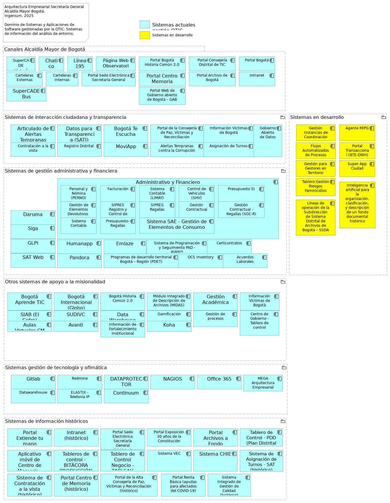

# Entregables Fase I de la Visión AE de SG
* [Documento de Visión](#documento-de-visión)

\newpage

# Documento de Visión

## Visión del Dominio de Sistemas de Información

> 

 

La Fase Tres (3) de la arquitectura empresarial (AE) de SG se divide en dos partes principales: Arquitectura de Datos y Arquitectura de Aplicaciones.

#### Objetivo de la Arquitectura de Aplicaciones:

El objetivo principal de la Arquitectura de Aplicaciones es desarrollar las arquitecturas de sistemas de información objetivo (tanto de datos como de aplicaciones) que soporten la arquitectura de negocio (desarrollada en la Fase B) y que implementen la visión de arquitectura inicial (establecida en la Fase A).

En términos más específicos, la arquitectura de aplicaciones busca:

* Definir la arquitectura de las aplicaciones (software) necesarias para soportar los procesos de negocio.
* Identificar las funciones de negocio que deben ser soportadas por las aplicaciones.
* Establecer la interacción y el flujo de información entre las diferentes aplicaciones.
* Considerar aspectos como la escalabilidad, el rendimiento, la mantenibilidad y la seguridad de las aplicaciones.
* Listar los capacidades de negocio (servicios de aplicación) relacionadas con las arquitecturas de aplicaciones de SG.

#### Relación con las Fases del Proyecto
La Arquitectura de Aplicaciones no opera de forma aislada; está intrínsecamente conectada con las fases anteriores y posteriores de la arquitectura empresarial de $CLIENTE:

* Relación con la Fase A (Visión de la Arquitectura): La Fase C toma como entrada principal la Visión de la Arquitectura, que establece el alcance, los objetivos de alto nivel, los principios de la arquitectura y la visión del negocio. La Arquitectura de Sistemas de Información debe alinearse y contribuir a la consecución de esta visión.
* Relación con la Fase B (Arquitectura de Negocio): La Arquitectura de Negocio (procesos de negocio, funciones, organización, etc.) es el motor principal para la Fase C. La Arquitectura de Sistemas de Información se construye para soportar y habilitar los requisitos definidos en la Arquitectura de Negocio. Por ejemplo, los procesos de negocio definidos en la Fase B informarán las necesidades de datos y las funcionalidades de las aplicaciones en la Fase C.
* Relación con la Fase D (Arquitectura Tecnológica): La Fase C proporciona los requisitos para la Fase D. La Arquitectura de Sistemas de Información (datos y aplicaciones) determina la tecnología subyacente (hardware, software de infraestructura, middleware, redes) que se necesitará para soportar las aplicaciones y gestionar los datos. La Fase D, por lo tanto, desarrollará la Arquitectura Tecnológica basándose en las necesidades identificadas en la Fase C.
* Relación con la Fase E (Oportunidades y Soluciones) y Fase F (Planificación de la Migración): Las arquitecturas de datos y aplicaciones desarrolladas en la Fase C son insumos críticos para identificar oportunidades de implementación (Fase E) y para desarrollar el plan de migración (Fase F) de las arquitecturas actuales a las arquitecturas objetivo.
* Relación con la Gestión de Requisitos (Requirements Management): La Gestión de Requisitos es una capacidad continua que atraviesa todas las fases del ADM. Los requisitos de los sistemas de información, capturados y gestionados, son fundamentales para guiar el desarrollo de las arquitecturas en la Fase C y para asegurar que la arquitectura final cumpla con las necesidades del negocio.

#### Requisitos Necesarios para su Realización (Entradas Clave):
Para llevar a cabo la Fase C de manera efectiva, una empresa debe contar con ciertos requisitos y entradas esenciales, que provienen principalmente de las fases previas del proceso de AE:

* Requisitos de Negocio: Una comprensión clara y detallada de los requisitos de negocio, procesos de negocio, funciones y estructuras organizacionales definidos en la Fase B. Esto incluye, por ejemplo, el Catálogo de Requisitos (como se menciona en el documento "TOGAF Catalogs Matrices and Diagrams.pdf", página 60), que "captura las cosas que la empresa necesita hacer para cumplir sus objetivos".
* Visión de la Arquitectura: La "Visión de la Arquitectura" (Architectural Vision) y los "Principios de la Arquitectura" establecidos en la Fase A, que guiarán las decisiones de diseño en la Fase C.
* Arquitectura de Negocio de Línea Base y Objetivo: Los modelos de Arquitectura de Negocio actual y deseada (definidos en la Fase B), que servirán como punto de partida y destino para la Arquitectura de Sistemas de Información.
* Metamodelo de Contenidos de la Arquitectura: Una comprensión y aplicación del metamodelo de contenidos de TOGAF (referenciado en "TOGAF 9.2 - Content Metamodel.pdf"), que proporciona un marco estructurado para describir los artefactos de la arquitectura.
* Principios de Arquitectura de Sistemas de Información: Principios específicos que guiarán el diseño de los datos y las aplicaciones, asegurando la coherencia y la alineación con los objetivos empresariales.
* Capacidad de Arquitectura Empresarial: La infraestructura y los recursos necesarios para realizar actividades de arquitectura, incluyendo herramientas de modelado (como ArchiMate, Draw.io, compatible con TOGAF) y personal con las habilidades adecuadas.
* Planes de Iteración y Nivel de Detalle: El alcance y el nivel de detalle requerido para la arquitectura de sistemas de información, que a menudo se define en la Fase de Visión y se refina a medida que avanza el proceso de AE. Esto puede incluir un enfoque iterativo para el desarrollo de la arquitectura, según lo discutido en "ADM Guidelines & Techniques.pdf" (Capítulo 19: Applying Iteration to the ADM).

La arquitectura de aplicaciones es un pilar fundamental en la transformación empresarial, traduciendo las necesidades de negocio en soluciones tangibles de datos y aplicaciones, y preparando el terreno para la selección de la tecnología subyacente.

{#fig:id-f46748634baa4f87afc7a9ab40892964 width= height=}

### Contexto de Arquitectura de Sistemas de Información SG
Desde el dominio de aplicaciones y sistemas de información de la Secretaría General, llamada en adelante “la arquitectura de sistemas de Información de SG”, buscamos adelantar las especificaciones de las arquitecturas objetivo de los sistemas de información de $CLIENTE que soporten la arquitectura de negocio y datos, en línea y dentro del alcance de la visión establecida en el primer entregable de este ejercicio de arquitectura empresarial de SG (AESG).

En particular, la arquitectura de sistemas de información de SG se plantea, dentro del alcance de la visión del ejercicio:

* Definir la arquitectura de las aplicaciones (SI) necesarias para soportar los procesos de negocio de SG.
* Identificar las funciones de negocio que deben ser soportadas por las aplicaciones de SG.
* Establecer la interacción y el flujo de información entre las diferentes aplicaciones de SG.
* Considerar aspectos sistémicos como la escalabilidad, el rendimiento, la mantenibilidad y la seguridad de las aplicaciones de SG.
* Listar los capacidades de negocio (servicios de aplicación) relacionadas con las arquitecturas de aplicaciones de SG.

De esta manera, la arquitectura de sistemas de SG contribuye a la consecución de la visión de este ejercicio de arquitectura empresarial SG (AESG); y en lo específico, contribuye a los fines de la arquitectura de negocio y tecnológica de SG, a delinear oportunidades y soluciones, y a soportar la planeación de la migración. Todo lo anterior dentro del alcance consignado en este ejercicio.

#### Alcance
El presente ejercicio de la arquitectura dominio de aplicaciones toma como alcance horizontal las áreas o unidades siguientes de la SG (_fuente: sesiones de levantamiento, entrevistas, y cuestionarios compartidos en el mes de julio del 2025, junto con la recopilación estructurada de las fuentes de información y organigramas_):

Unidades de negocio del alcance del dominio:

* Secretaría Privada
    * Oficina Consejería Distrital de Comunicación. César Augusto Castro Rodríguez
    * Oficina Consejería Distrital de Tecnologías de la Información y las Comunicaciones -TIC. Diana Celis Mora
* Despacho del Secretario General. Miguel Andrés Silva Moyano
    * Oficina de Tecnologías de la Información y las Comunicaciones. Arleth Patricia Saurith Contreras
    * Subsecretaría Distrital de Fortalecimiento Institucional. Alejandra Rodas Gaiter
        * Dirección Distrital de Desarrollo Institucional. Sebastian Estrada Jaramillo
            * Subdirección Técnica de Desarrollo Institucional. Diego Canesco Arenas
    * Subsecretaría de Servicio a la Ciudadanía . Adriana Vargas Tamayo
        * Dirección del Sistema Distrital de Servicio a la Ciudadanía. Enrique Cusba García
    * Subsecretaría Corporativa. Henry Villamarín Serrano
    * Subsecreataría de Servicios Ciudadanos (…)
    * Subsecreataría de Inversión y FF (…)
    * Subsecreataría de Operaciones
    * Subsecreataría de Relaciones Internacionales (…)

En cuanto al alcance vertical, las aplicaciones de software que están consignadas en este ejercicio son las siguientes (_fuente: sesiones de levantamiento, entrevistas, y cuestionarios compartidos en el mes de julio del 2025, junto con la recopilación estructurada de las fuentes de información_):

* Administrativo y Financiero: Soporta la gestión financiera, gestión de servicios administrativos y tecnológicos, y gestión de recursos físicos
* Bogotá Te Escucha: Es fundamental para el proceso de Gobierno abierto y relacionamiento con la ciudadanía5. También se menciona como el Sistema Distrital para la Gestión de Peticiones Ciudadanas, a través del cual se evalúa la calidad de las respuestas emitidas a la ciudadanía
* Bogotá Aprende TIC: Apoya los procesos de Gobierno abierto y relacionamiento con la ciudadanía, y Fortalecimiento de la Gestión Pública
* DARUMA: Se utiliza en el proceso de Fortalecimiento de la Gestión Pública5. También es el aplicativo donde se encuentran definidas las fichas técnicas de productos y servicios de la Secretaría General8 y se gestionan los riesgos estratégicos
* SIGA: Interviene en la gestión de contratación, gestión financiera, gestión de servicios administrativos y tecnológicos, y gestión de recursos físicos
* SAT Web: Relacionado con la gestión de servicios administrativos y tecnológicos
* GLOBO: Utilizado en el proceso de Fortalecimiento de la Gestión Pública
* Datos para la Transparencia (SATI): Soporta el proceso de Gobierno abierto y relacionamiento con la ciudadanía
* SUDIVC: Se aplica en los procesos de Gobierno abierto y relacionamiento con la ciudadanía, Paz, víctimas y reconciliación, y Fortalecimiento de la Gestión Pública
* HUMANAPP: Apoya la gestión del talento humano
* SIAB (El COFRE): Utilizado en los procesos de Gobierno abierto y relacionamiento con la ciudadanía, y Fortalecimiento de la Gestión Pública
* KOHA: Relacionado con la Gestión del conocimiento
* SIVIC: Interviene en los procesos de Paz, víctimas y reconciliación, y Fortalecimiento de la Gestión Pública
* Data Warehouse AVANTI: Apoya la Gestión del conocimiento
* Gestión Académica: Relacionado con la Gestión del conocimiento
* EMLAZE: Utilizado en los procesos de Gobierno abierto y relacionamiento con la ciudadanía, y Fortalecimiento de la Gestión Pública
* GLPI: Soporta la gestión de servicios administrativos y tecnológicos
* GitLab: Se relaciona con la Gestión de alianzas e internacionalización de Bogotá

### Vistas y Artefactos del Dominio
A continuación, presentamos las vistas y artefactos del dominio de sistemas de información consignados en el alcance del proyecto.

### Matriz de Sistemas de Información vs Procesos de Negocio
Las matrices del dominio de aplicaciones de software y sistemas de información (SI) de SG son herramientas para el relacionamiento con otros dominios del ejercicio de arquitectura empresarial de SG. Con esto conseguimos soportar la toma decisiones de lo que debe ser compartido de los SI dentro de la Secretaría, y entre sus aplicaciones de software. Las matrices de este ejercicio sirven además para comunicar el grado de relacionamiento de los elementos.

En resumen,

* Las matrices son cruciales para especificar cómo debe relacionarse la información entre los sistemas y otros dominios
* proporcionan información crítica para los proyectos que involucren a los sistemas de SG.
* Contribuye a la determinación de brechas (gaps) en las necesidades de compartir información (o funciones de los sistemas) ente los elementos de la matriz. 
* La matriz ayuda a definir el nivel de detalle de lo que se comparte.
* Se deben establecer medidas similares para la interoperabilidad de servicios/negocios y la infraestructura (tecnología física).
* Sintetizan la información de las arquitecturas, y son simples para compartir documentos.

Las matrices de este dominio (procesos e interoperabilidad) actúan como una hoja de ruta para la conectividad y el intercambio de información; inician desde una perspectiva de negocio de alto nivel y van hasta una especificación técnica detallada del la interacción con los sistemas. Sirven como herramienta de comunicación para los demás dominios de la arquitectura empresarial de SG, y contribuyen a que las interacciones relevantes entre servicios, canales, y procesos estén definidas y sean compatibles.

### Catálogo de Sistemas de Información
En el contexto de TOGAF, El Catálogo de sistemas de información es un inventario detallado y documentado que actúa como ficha técnica de los sistemas de información o aplicaciones de software de SG. 

Es un producto entregable clave de la fase de Arquitectura de Aplicaciones dentro de la Fase 3 de este ejercicio de arquitectura empresarial (AE). Forma parte del Marco de Referencia del Contenido Arquitectónico de TOGAF y del Marco de Arquitectura de Referencia del MinTIC (MAE 3.0, Colombia).

La construcción del catálogo de aplicaciones implican a las sesiones de levantamiento, entrevistas, y cuestionarios compartidos en el mes de julio, junto con la recopilación estructurada de las fuentes de información sobre cada sistema.

#### Contenido Mínimo del Catálogo

* ID de Aplicación. Código de identificación de la aplicación de software.
* Nombre de la Aplicación. Nombre de identificación de la aplicación de software.
* Descripción. Funcionamiento básico de la aplicación de software.
* Estado: [En producción, en desmantelamiento, en implementación, Inactiva]
* Categoría: [Sistema de apoyo al negocio (misional), herramienta de gestión, Ofimática, Seguridad] 
* Proceso(s) de Negocio Clave(s)
* Capacidad: Capacidades de nivel 2 relacionadas con la aplicación de software.
* Tipo de aplicación: Web, Móvil, Cliente Servidor 
* Método de despliegue: on-premises, cloud SAAS, cloud PAAS, cloud IAAS 
* Tecnología. Aspectos técnicos de la aplicación de software.
* Versión actual de la tecnología
* Responsable técnico en la entidad
* Responsable funcional en la entidad
* Fabricante
* Proveedor de soporte externo
* Fecha de vigencia de soporte externo
* Nombre de servidor. Nombre de red del entorno o nodo contenedor de la aplicación de software. 
* Criticidad de negocio

El Catálogo de aplicaciones de SG procura beneficios estratégicos y operativos:

* Unifica la documentación y la comunicación: Es un artefacto clave para documentar, comprender y comunicar el panorama actual y futuro de las aplicaciones.
* Base para la toma de decisiones: Sirve como base para la toma de decisiones en la gestión y gobierno de las capacidades de los sistemas de SG, y del portafolio y ciclo de vida de las aplicaciones.
* Facilita la actualización continua: Permite la actualización continua de las características y atributos relevantes de los sistemas de información.

### Necesidades SI de SG
La construcción de lista de necesidades, preocupaciones y oportunidades implican a las sesiones de levantamiento, entrevistas, y cuestionarios compartidos en el mes de julio, junto con la recopilación estructurada de las fuentes de información sobre cada sistema.

#### Necesidades de Transformación Digital y Tecnológica
La transformación digital (objetivo estratégico de SG)  es un motor fundamental para alinear las estrategias, procesos y tecnologías de la Secretaría General. Esta transformación busca:

* Impulsar la transformación digital para alinear estrategias, procesos y tecnologías, que resulte en el aumento de eficiencia de la gestión pública.
* Cerrar las brechas en la Política de Gobierno Digital, de la cual la Arquitectura Empresarial es un habilitador clave.
* Modernizar la infraestructura tecnológica que resulte del análisis de obsolescencia para asegurar su continuidad y disponibilidad.
* Integrar plataformas y ecosistemas digitales y superar la falta de interoperabilidad.
* Aumentar la automatización de los trámites digitales.
* Estandarizar la gestión y gobernanza de datos públicos.
* Mejorar el soporte que los SI dan a la toma de decisiones basada en evidencia.
* Generar análisis predictivos y prospectivos de resultados de gestión, que son insumos para la toma de decisiones.
* Contar con disponibilidad de personal adecuado para actualizar plataformas tecnológicas y gestionar las cargas de trabajo.
* Aprovechar nuevas tecnologías como la Inteligencia Artificial, la minería de datos, el procesamiento del lenguaje, para mejorar los procesos y la relación con la ciudadanía.

* Abordar los altos costos de la tecnología que limitan la implementación de sistemas avanzados.
* Fortalecer la ciberseguridad y seguridad de la información para proteger la integridad, disponibilidad y confidencialidad de los datos y prevenir ataques.

#### Necesidades Específicas del Dominio de Aplicaciones de software
Esta tipo de necesidades refiere al comportamiento de las aplicaciones que apoyan la misionalidad, a su estructura, y su relación con los objetos de datos que utilizan.

Para los Componentes de Aplicación (Application Component) y Servicios de Aplicación (Application Service) de SG:

* Adquirir software especializado en análisis de datos: implica la necesidad de incorporar de nuevos componentes de aplicación (Application Component).
* Integrar plataformas y ecosistemas digitales: requiere reforzar la relación entre componentes de aplicación y la exposición de servicios de aplicación (Application Service), y clicar los lineamientos del Marco de Referencia de AE, versión 3.0 al momento, del MinTIC.
* Mejorar la capacidad de las herramientas tecnológicas para el soporte a la toma de decisiones y la gestión: requiere la mejora de las Funcionalidad (Application Function) y Componentes de Aplicación actuales asociadas a esta capacidad.

### Preocupaciones SI de SG
Con base en el estudio de las sesiones de levantamiento, entrevistas, y cuestionarios compartidos en el mes de julio, junto con la recopilación estructurada de las fuentes de información sobre cada sistema, identificamos las siguientes preocupaciones (y debilidades) de SG relacionadas con el dominio de sistemas de información, dentro del alcance de este ejercicio.

Las preocupaciones tecnológicas respecto de los sistemas de información de SG mencionadas en estas fuentes señalan:

* Deficiente apropiación del conocimiento en procesos de tecnologías de la información, lo que genera demora en la solución de los servicios de tecnologías de la información.
* Equipos tecnológicos en proceso de mitigar la obsolescencia, que generan dificultad en la ejecución de las actividades que desarrolla la entidad.
* Fallas recurrentes en el funcionamiento de los sistemas de información y plataformas tecnológicas de la entidad, que afectan la continuidad del servicio y generan retrasos y reprocesos en la ejecución de las actividades.
* Insuficiencia en la capacidad de las herramientas tecnológicas de la entidad que pueden obstaculizar el avance de los iniciativas en marcha de la SG.
* Debilidad en la capacidad de extraer información dinámica que sirva como insumo para la toma de decisiones basado en evidencia.
* Se realizan análisis de datos descriptivos aislados, pero no predictivos y prospectivos de los resultados de la gestión de la entidad, lo que dificulta la toma de decisiones basada en evidencia.
* Falta de personal para actualizar las plataformas tecnológicas, lo que genera retrasos en la operación de la entidad.
* Deficiente conectividad y falta de interoperabilidad de las plataformas tecnológicas.
* Cambios en las plataformas tecnológicas que no interactúan con las anteriores, lo cual expone a la SG a posibles pérdidas de información y reprocesos.
* Apostar más en la mejora continua de la inestabilidad de la conectividad, indisponibilidad de servidores de información y vulnerabilidad en la seguridad informática; lo contrario puede comprometer la operatividad, la integridad de los datos críticos de la entidad y el cumplimiento de las metas.
* Potencial y rápida obsolescencia tecnológica que implica la necesidad de renovación de los equipos y dificulta la prestación de los servicios de la entidad.
* Los altos costos de la tecnología pueden limitar la capacidad de la entidad para implementar y mantener sistemas avanzados y eficientes.

### Oportunidades SI de SG
La construcción de lista de oportunidades mencionadas implica el estudio de las sesiones de levantamiento, entrevistas, y cuestionarios compartidos en el mes de julio, junto con la recopilación estructurada de las fuentes de información al respecto de cada sistema de SG.

Las oportunidades tecnológicas y de mejora de sistemas de información mencionadas indicadas en estas fuentes se centran en:

* Modernización de la infraestructura y sistemas tecnológicos
    * Las nuevas tecnologías, especialmente la Inteligencia Artificial (IA), ofrecen la oportunidad de mejorar los procesos y herramientas de relacionamiento con la ciudadanía. La Secretaría General ya ha empezado a incorporar tecnologías como IA, Big Data, pero debe seguir ampliando ese despliegue, así como incorporar otras, como el Internet de las Cosas (IoT), o la minería de datos en la planificación urbana y la prestación de servicios.
    * Una oportunidad es la adquisición y puesta en producción de software especializado en análisis de datos para la toma de decisiones que ya poseen otras entidades.

* Integración y automatización de procesos
    * Se identifican oportunidades para contar con herramientas que evalúen el soporte tecnológico personalizado, flexible y configurable para las operaciones de los procesos jurídicos.
    * Se buscan mejores controles e integración de sistemas distritales con los canales de la Secretaría General.
    * También se necesitan mejores controles e integración de los sistemas de gestión como los sistemas GLOBO (de gestión internacional), el sistema de proyectos GLPI.

* Mejora de la comunicación pública a través de medios digitales
    * Se busca la consolidación de herramientas, canales e información para fortalecer la oferta y celeridad de servicios y la participación ciudadana. Esto incluye el seguimiento a canales de atención virtual como SuperCADE Virtual, chat, chat-Bot y (video) llamadas de la línea 195.
    * Se busca optimizar los procesos de recolección, análisis y divulgación de la información mediante la implementación de sistemas de información que incluyan la automatización de la recolección de datos y el uso de herramientas analíticas.
    * Es destacado que el Distrito unifica en el portal Bogotá su oferta de trámites y servicios, como el realizar pagos en línea (no tributarios) y agendamiento de citas en la RedCADE desde casa; esfuerzo que debe continuar y extenderse a los  más de 1.400 trámites y servicios. Esto representa una mejora significativa en la accesibilidad y eficiencia de los servicios digitales para la ciudadanía.

* capacitación en nuevas tecnologías y 

* Implementación de la Arquitectura Empresarial como estrategia para impulsar la transformación digital y la eficiencia en la gestión pública de la SG
    * Se espera que la Arquitectura Empresarial fortalezca la transparencia, y aumente la eficiencia de la gestión pública y la rendición de cuentas al estandarizar procesos y sistemas de información. La AE busca realmente impactar el objetivo de aumentar la confianza de la ciudadanía en la Gestión Pública.
    * Es requerido que este ejercicio beneficie a la SG con la entrega de activos como hojas de ruta, catálogos y caracterización de los sistemas de información, matrices de interacción, entre otros.

### Diagnóstico de Debilidades Tecnológicas
Basado en el análisis de las matrices DOFA (Matriz de Evaluación de Factores Internos - MEFI y Matriz de Evaluación de Factores Externos - MEFE) [5, 6], se han identificado las siguientes debilidades tecnológicas:

* Sistemas de Información y Datos:
    * Fallas recurrentes en el funcionamiento de los sistemas de información y plataformas tecnológicas, que afectan la continuidad del servicio y generan retrasos y reprocesos [7].
    * Falta de un software que permita extraer información dinámica para la toma de decisiones [9].
    * Se realizan análisis descriptivos, pero no predictivos y prospectivos de los resultados de la gestión, dificultando la toma de decisiones basada en evidencia [10].
    * Cambios en las plataformas tecnológicas que no interactúan con las anteriores, generando posibles pérdidas de información y reprocesos [11].

* Infraestructura Tecnológica:
    * Equipos tecnológicos obsoletos que dificultan la ejecución de las actividades [12].
    * Deficiente conectividad y falta de interoperabilidad de las plataformas tecnológicas [13].
    * Inestabilidad de la conectividad e indisponibilidad de servidores de información, comprometiendo la operatividad y el cumplimiento de metas [14].
    * Obsolescencia tecnológica generalizada que implica la necesidad de renovación de equipos y dificulta la prestación de servicios [15].
    * Los altos costos de la tecnología pueden limitar la capacidad para implementar y mantener sistemas avanzados.

* Seguridad Informática:
    * Vulnerabilidad en la seguridad informática, que puede comprometer la integridad de los datos críticos y la continuidad operativa [14].
    * Vulneración de la inviolabilidad de acceso a cuentas de correo institucionales y aplicativos, afectando la reserva de la información [14].
    * Materialización de riesgos asociados a ataques cibernéticos, ingeniería social y suplantación de identidad, poniendo en riesgo la seguridad de la información y los documentos (pérdida de confidencialidad, integridad y disponibilidad) [16].

* Gestión del Conocimiento y Capacidades Humanas:
    * Deficiente apropiación del conocimiento en procesos de tecnologías de la información, generando demora en la solución de servicios [17].
    * Falta de personal para actualizar las plataformas tecnológicas, lo que genera retrasos en la operación.

### Planteamiento de Arquitectura Empresarial
La implementación de un ejercicio de Arquitectura Empresarial es clave para abordar estas debilidades [4].

* Propósito y Alcance de la AE:
    * Comprender la misión, objetivos y metas estratégicas, y definir el camino para materializar la visión mediante la alineación de estrategias, procesos, talento humano, cultura, información, sistemas de información, tecnologías y seguridad [18].
    * Incluye un diagnóstico del estado actual (línea base), la definición de la arquitectura objetivo (línea destino o meta), el análisis de su brecha y la elaboración de una hoja de ruta [18, 19].
    * La AE es una práctica estratégica que impulsa las transformaciones necesarias para fortalecer la gestión de las entidades y alcanzar sus objetivos [20].

* Dominios Clave que aborda la AE:
    * Arquitectura Institucional: Modelo de capacidades, modelo operativo y catálogo de servicios institucionales [21].
    * Arquitectura de Información: Definición de flujos y arquitectura de información, intercambio de información entre entidades y modelo de información institucional, incluyendo la aplicación de Inteligencia Artificial.
    * Arquitectura de Sistemas de Información: Definición de arquitecturas de referencia para soluciones (SOA), arquitecturas de solución para proyectos de SI y caracterización de sistemas de información existentes [24, 25].
    * Arquitectura de Tecnología: Catálogo de elementos de infraestructura, plataforma de interoperabilidad, continuidad y disponibilidad de infraestructura, y arquitecturas de referencia tecnológica [26-28].
    * Arquitectura de Seguridad: Catálogo de servicios de seguridad de la información y ciberseguridad, análisis de impacto del negocio, arquitectura de seguridad alineada e integrada, y diseño de controles de seguridad informática para la gestión de riesgos [28-30].

---
lang: en
titlepage: true
titlepage-rule-color: 360049
todo: aun no está lista
...

## Análisis de Entorno Sistemas de Información SG

> Arquitectura Empresarial Secretaría General Alcaldía Mayor Bogotá.  Ingenium. 2025  Dominio de Sistemas y Aplicaciones de Software. Sistemas de información del análisis de entorno.   

 

La consultoría de arquitectura empresarial busca fortalecer la alineación de estrategias, procesos y tecnologías, así como impulsar la transformación digital y una gestión pública más eficiente. Esta iniciativa se enmarca en la necesidad de mejorar la satisfacción de los grupos de interés internos y externos.

Las relaciones entre los sistemas de información (Anexo Técnico) y el contexto del Análisis de Entorno (Resumen Ejecutivo FASE I.pdf) son las siguientes:

* Sistemas de gestión administrativa y financiera (ADMON, Administrativo y Financiero, SIGA, SAT Web, GLPI):
    - Estos sistemas son cruciales para la "Gestión financiera", "Gestión de servicios administrativos y tecnológicos" y "Gestión de recursos físicos".
    - Relación con objetivos: El "Resumen Ejecutivo FASE I.pdf" aborda la necesidad de una gestión pública más eficiente y transparente, la optimización de recursos y la rendición de cuentas. Estos sistemas son habilitadores directos de dichas metas.
    - Relación con problemas: El documento también señala desafíos en el "Entorno Económico" como el déficit fiscal y la necesidad de eficiencia en la inversión pública. Los sistemas administrativos y financieros son fundamentales para una planificación financiera adecuada y una gestión fiscal sostenible.
    - Relación con oportunidades: La recomendación de "simplificación administrativa y coordinación intersectorial" implica la mejora de estos sistemas para reducir duplicidades y estandarizar prácticas, lo que contribuye a una "arquitectura institucional más coherente y eficiente".

* Sistemas de interacción ciudadana y transparencia (Bogotá Te Escucha, Datos para la Transparencia (SATI), EMLAZE):
    - Estos sistemas soportan directamente el proceso de "Gobierno abierto y relacionamiento con la ciudadanía".
    - Objetivos: El "Resumen Ejecutivo FASE I.pdf" destaca el objetivo estratégico "Bogotá confía en su gobierno", que busca ofrecer "servicios amables, ágiles y oportunos". Bogotá Te Escucha es el sistema distrital clave para la gestión de peticiones ciudadanas y la evaluación de la calidad de las respuestas.
    - Problemas: Se reconoce que, si bien hay avances en la atención institucional, persisten desafíos en la "eficiencia operativa, tiempos de respuesta y digitalización de servicios". Estos sistemas son vitales para abordar estas brechas mediante la digitalización de servicios públicos y la automatización de trámites.
    - Oportunidad: "Datos para la Transparencia (SATI)" es clave para la política de "Transparencia, acceso a la información pública y lucha contra la corrupción". La estandarización de procesos y sistemas de información a través de estos sistemas fortalece la confianza ciudadana.

* Sistemas de fortalecimiento de capacidades y conocimiento (Bogotá Aprende TIC, DARUMA, GLOBO, SUDIVC, HUMANAPP, SIAB (El COFRE), KOHA, SIVIC, Data Warehouse AVANTI, Gestión Académica):

#### Relación con Objetivos

- Bogotá Aprende TIC y Gestión Académica abordan la necesidad de "alfabetización digital" y la escasez de talento humano especializado en tecnologías emergentes, como se menciona en el "Entorno Tecnológico".
- DARUMA es el aplicativo donde se gestionan las fichas técnicas de productos y servicios y los riesgos estratégicos. Esto se alinea con la necesidad de una "Gestión del riesgo" efectiva y el "Fortalecimiento de la Gestión Pública" para la toma de decisiones basada en evidencia.
- HUMANAPP es fundamental para la "Gestión del talento humano". El "Resumen Ejecutivo FASE I.pdf" subraya la importancia de la "profesionalización del servicio público" y el "fortalecimiento de capacidades" de los servidores públicos.
- SIAB (El COFRE), KOHA, Data Warehouse AVANTI son cruciales para la "Gestión del conocimiento" y la "Gestión documental y soporte archivístico". El documento enfatiza el "fortalecimiento de las capacidades de generación, análisis y uso estratégico de información" y la necesidad de "sistemas integrados de datos" para la toma de decisiones basada en evidencia. Data Warehouse AVANTI, en particular, facilita el análisis descriptivo, predictivo y prospectivo de los resultados de la gestión.
- SUDIVC y SIVIC apoyan los procesos de "Paz, víctimas y reconciliación" y "Fortalecimiento de la Gestión Pública", abordando las "profundas desigualdades que afectan de manera desproporcionada a poblaciones vulnerables" y contribuyendo a que Bogotá sea un "territorio de paz y reconciliación".

#### Relación con Oportunidades

- OPORT1. No existe una sistema de información para el desarrollo y colaboración vinculada con la "Gestión de alianzas e internacionalización de Bogotá".
- OPORT2. (Resumen Ejecutivo FASE I.pdf) menciona a Bogotá como una ciudad con "vocación internacional, atractiva a profesionales, diplomáticos, académicos y organizaciones" y la necesidad de "fortalecer la arquitectura Internacional del Distrito". No existe una herramienta de software para facilitar la colaboración en proyectos y la gestión de información tendientes a estas alianzas.
- OPORT3. También se alinea con la necesidad de "integración entre plataformas digitales institucionales" y la adopción de nuevas tecnologías para la "transformación digital".

{#fig:id-097745511d984e7eaf02b5ad5a93e7a8 width= height=}

### Elementos del Modelo

| Nombre  | Tipo | Documentación |
|---------|------|---------------|
| Canales Alcaldía | Grouping |  |
| SuperCADE Virtual | Application Component | Red de canales presenciales de atención a ciudadanía.
 |
| Chat-Bot | Application Component | Canal web de atención a ciudadanía.
 |
| Línea 195 | Application Component | Canal telefónico de atención a ciudadanía.
 |
| Portal Bogotá Capital Digital | Application Component | Plataforma de Trámites en línea. Portal Integrador de trámites y servicios ofrecidos a la ciudadanía. Componente de aplicación que permite la realización de trámites digitales.
 |
| Sistema de Participación Ciudadana | Application Component | Componente de aplicación para facilitar la interacción y el acercamiento (realimentación) de los ciudadanos.
 |
| Sistemas de interacción ciudadana y transparencia | Grouping |  |
| Bogotá Te Escucha | Application Component | Sistema de información para la administración, registro, atención, seguimiento y control de las peticiones, quejas, reclamos, solicitudes de información, denuncias y sugerencias que reciban las entidades del distrito capital por los diferentes canales. Fundamental para el proceso de Gobierno abierto y relacionamiento con la ciudadanía. También se menciona como el Sistema Distrital para la Gestión de Peticiones Ciudadanas, a través del cual se evalúa la calidad de las respuestas emitidas a la ciudadanía.
 |
| Datos para Transparencia (SATI) | Application Component | Sistem de tableros de control con datos relevantes, actualizados y comprensibles, incluyendo alertas tempranas contra la corrupción. Plataforma que facilita el acceso a datos e información gubernamental. Soporta el proceso de Gobierno abierto y relacionamiento con la ciudadanía.
 |
| EMLAZE | Application Component | Sistema para la planeación de recursos empresariales (ERP) de la Imprenta Distrital y control de ejecución y consumo de insumos en el ejercicio de imprenta.
 |
| MoviApp | Application Component | Canal móvil de atención a ciudadanía. Sesión levantamiento no. 2.
 |
| Sistemas en Desarrollo | Grouping |  |
| Gestión Instancias de Coordinación | Application Component | Componente de aplicación para facilitar la interacción y el acercamiento (realimentación) de los ciudadanos.
 |
| Agente MIPG | Application Component | Componente de aplicación para facilitar la interacción y el acercamiento (realimentación) de los ciudadanos.
 |
| Flujos Automatizados de Procesos Empleado con TH y Contratistas | Application Component | Componente de aplicación para facilitar la interacción y el acercamiento (realimentación) de los ciudadanos.
 |
| Portal Transaccional | Application Component | Componente de aplicación para facilitar la interacción y el acercamiento (realimentación) de los ciudadanos.
 |
| Gestión para Gestores en Territorio | Application Component | Componente de aplicación para facilitar la interacción y el acercamiento (realimentación) de los ciudadanos.
 |
| Super App Ciudad | Application Component | Componente de aplicación para facilitar la interacción y el acercamiento (realimentación) de los ciudadanos.
 |
| Tablero Gestión Riesgos Feminicidios | Application Component | Componente de aplicación para facilitar la interacción y el acercamiento (realimentación) de los ciudadanos.
 |
| Sistemas de gestión administrativa y financiera | Grouping |  |
| ADMON | Application Component | Se relaciona con la gestión financiera, gestión de servicios administrativos y tecnológicos, y gestión de recursos físicos.
 |
| Administrativo y Financiero | Application Component | Grupo de sistema de soporte a la gestión financiera, gestión de servicios administrativos, tecnológicos, y gestión de recursos físicos.
 |
| PERNO (Personal y Nómina) | Application Component | Módulo de Personal y Nómina (PERNO, heredado de SICAPITAL).
 |
| Facturación | Application Component | Administración de costos y facturación de los Cades y Supercades (FACTURACIÓN).
 |
| Libro Mayor | Application Component | LIMAY, heredado de SICAPITAL).
 |
| Gestión de Elementos Devolutivos  | Application Component | Sistema control de gestión de elementos devolutivos (SAI, heredado de SICAPITAL)
 |
| SIPRES Registro y Control de Presupuesto  | Application Component | Registro y control de la información de presupuesto de la Secretaría General (SIPRES).
 |
| SIPRES Regalías | Application Component | Sistema para manejo y control del presupuesto de regalías (SIPRES REGALIAS)Registro y control de la información contractual de la Secretaría General (CONTRACTUAL)Sistema para manejo de contratos con presupuesto de regalías (CONTRACTUAL REGALIAS).
 |
| DARUMA | Application Component | Sistema para el registro de documentos de procesos, procedimientos, formatos, entre otros, como insumos de la Gestión de Calidad.
 |
| Comisiones | Application Component | Sesión levantamiento no. 1.
 |
| SIGA | Application Component | Sistema Integrado de Gestión Documental, Archivo y Correspondencia.
 |
| Sistema Gestión Documental | Application Component | Componente de aplicación para la gestión electrónica de documentos.
 |
| GLPI | Application Component | Sistema de soporta a la gestión de servicios administrativos y tecnológicos, donde se registran y gestionan las solicitudes de servicios TIC.
 |
| PANDORA | Application Component | Implementación de temas precontractual y planeación.
 |
| SAT Web | Application Component | Sistema de Asignación de Turnos en los puntos de atención a la ciudadanía (Red Cade).
 |
| Expediente Digital | Data Object | Objeto de datos en la capa de aplicación que representa un expediente electrónico. |
| 4233100-CR-033 Gestión de servicios  | Artifact | 4233100-CR-033 Gestión de servicios administrativos y tecnológicos.
 |
| 2213200-PR-101 Gestión de Incidentes | Artifact | 2213200-PR-101 Gestión de Incidentes, Requerimientos y Problemas Tecnológicos.
 |
| 4204000-PR-106 Desarrollo de soluciones | Artifact | 4204000-PR-106 Desarrollo de soluciones.
 |
| 4204000-GS-110 Metodología gestión proyectos TI | Artifact | 4204000-GS-110 Metodología gestión proyectos TI.
 |
| Sistemas de fortalecimiento de capacidades y conocimiento | Grouping |  |
| Bogotá Aprende TIC | Application Component | Portal de apoya los procesos de Gobierno abierto y relacionamiento con la ciudadanía, y Fortalecimiento de la Gestión Pública.
 |
| GLOBO | Application Component | Registro de acciones de cooperación internacional. Utilizado en el proceso de Fortalecimiento de la Gestión Pública.
 |
| SUDIVC | Application Component | Sistema Unificado Distrital de Inspección, Vigilancia y Control – SUDIVC.
 |
| HUMANAPP | Application Component | Apoya la gestión del talento humano. Aplicativo de generación de desprendibles de pago para funcionarios y certificaciones laborales, de seguridad social y de ingresos y retenciones.
 |
| SIAB (El COFRE) | Application Component | Sistema de Información del Archivo de Bogotá SIAB. Permite automatizar los procesos archivísticos y técnicos que realiza el Archivo, tales como llevar un registro de los Ingresos Documentales (antes área de acopio), para la descripción y catalogación de la documentación, propios del proceso de Gestión de la Función Archivística y del Patrimonio Documental, para su custodia y conservación permanente. Utilizado en los procesos de Gobierno abierto y relacionamiento con la ciudadanía, y Fortalecimiento de la Gestión Pública.
 |
| KOHA | Application Component | Sistema Integrado de Gestión de Bibliotecas. Relacionado con la Gestión del conocimiento.
 |
| Data Warehouse | Application Component | Almacenes de datos de trabajo de SG. Bodega de datos con diversas fuentes de información para el análisis y transformación de datos de interés.
 |
| Gestión Académica | Application Component | Moodle para capacitación de servidores de la Entidad en diferentes temas. Relacionado con la Gestión del conocimiento.
 |
| SIVIC | Application Component | Sistema de Información de Víctimas de Bogotá para registrar la gestión de atención integral a las víctimas. Interviene en los procesos de Paz, víctimas y reconciliación, y Fortalecimiento de la Gestión Pública. Interviene en los procesos de Paz, víctimas y reconciliación, y Fortalecimiento de la Gestión Pública.
 |
| AVANTI | Application Component | Sistema de Información para registrar avance de programación y seguimiento de metas plan de desarrollo de las entidades distritales SDARIV relacionadas con atención integral a las víctimas.
 |
| 4204000-GS-006 Guía de Arquitectura | Artifact | 4204000-GS-006 Guía de Arquitectura de Software para Soluciones Tecnológicas.
 |
| 4204000-OT-047 Estándares nomenclatura | Artifact | 4204000-OT-047 Estándares de nomenclatura para el desarrollo de aplicaciones en ambientes de bases de datos.
 |
| 4204000-GS-108 Guía desarrollo y mantenimiento | Artifact | 4204000-GS-108 Guía Metodológica para el desarrollo y mantenimiento de soluciones de software.
 |
| Sistemas de desarrollo | Grouping |  |
| Gitlab | Application Component | Plataforma de desarrollo de software y colaboración.
 |
| Ofimática y colaboración | Grouping |  |
| Office 365 | Application Component | Herramientas de ofimática y colaboración SG.
 |

Table: Elementos de la vista. {#tbl:tblelement-06.2n2.1a.SIdelAnalisisdeEntorno-id}

 

---
lang: en
titlepage: true
titlepage-rule-color: 360049
todo: aun no está lista
...

## Alineación de aplicaciones de software con los procesos SG

> 

 

La Secretaría General cuenta con sistemas de información que soportan las actividades gestionadas por los procesos misionales, estratégicos, de apoyo y de evaluación y control. Del análisis de fuentes y levantamientos de información presentamos la alineación entre las aplicaciones de software de SG, los procesos de negocio y el estado actual.

| Proceso                                              | Sistema de Información                                                        | Oportunidad de Mejora                                                                                                             |
|------------------------------------------------------|-------------------------------------------------------------------------------|-----------------------------------------------------------------------------------------------------------------------------------|
| Control Disciplinario                                | Gestión Documental - SIGA                                                     | Actualización de la versión de la aplicación y su infraestructura                                                                 |
| Evaluación del Sistema de Control Interno            | Gestión Documental - SIGA                                                     | Actualización de la versión de la aplicación y su infraestructura                                                                 |
| Gestión Jurídica                                     | Gestión Documental - SIGA                                                     | Actualización de la versión de la aplicación y su infraestructura                                                                 |
| Gestión de contratación                              | Administrativo y Financiero (Gestión Contractual)                             | Actualización tecnológica para optimizar el rendimiento y acceso al sistema de información y atención de requerimientos a demanda |
| Gestión Financiera                                   | Administrativo y Financiero (Facturación, LIMAY, Gestión Contractual, SIPRES) | Actualización tecnológica para optimizar el rendimiento y acceso al sistema de información y atención de requerimientos a demanda |
| Gestión de servicios administrativos y tecnológicos  | GitLab, GLPI                                                                  | Atención de requerimientos a demanda                                                                                              |
| Gestión de servicios administrativos y tecnológicos  | Administrativo y Financiero (Inventario, SAI, SAE, Control de vehículos)      | Actualización tecnológica para optimizar el rendimiento y acceso al sistema de información y atención de requerimientos a demanda |
| Gestión de recursos físicos                          | Administrativo y Financiero (Inventario, SAI SAE, Control de vehículos)       | Actualización tecnológica para optimizar el rendimiento y acceso al sistema de información y atención de requerimientos a demanda |
| Gestión del Talento Humano                           | Administrativo y Financiero (PERNO)                                           | Actualización tecnológica para optimizar el rendimiento y acceso al sistema de información y atención de requerimientos a demanda |
| Gestión del Talento Humano                           | HUMANAPP                                                                      | Actualización tecnológica para optimizar el rendimiento y acceso al sistema de información y atención de requerimientos a demanda |
| Gobierno abierto y relacionamiento con la ciudadanía | Bogotá Te Escucha                                                             | Actualización de la versión de la aplicación y su infraestructura                                                                 |
| Gobierno abierto y relacionamiento con la ciudadanía | Data Warehouse                                                                | Vincular más Fuentes de información                                                                                               |
| Gobierno abierto y relacionamiento con la ciudadanía | SAT Web                                                                       | Actualización de su infraestructura                                                                                               |
| Gobierno abierto y relacionamiento con la ciudadanía | SUDIVC                                                                        | Atención de requerimientos a demanda                                                                                              |
| Paz, víctimas y reconciliación                       | SIVIC                                                                         | Atención de requerimientos a demanda                                                                                              |
| Paz, víctimas y reconciliación                       | AVANTI                                                                        | Atención de requerimientos a demanda                                                                                              |
| Fortalecimiento de la Gestión Pública                | SIAB (Cofre)                                                                  | Atención de requerimientos a demanda                                                                                              |
| Fortalecimiento de la Gestión Pública                | KOHA                                                                          | Atención de requerimientos a demanda                                                                                              |
| Fortalecimiento de la Gestión Pública                | Datos para la transparencia (SATI)                                            | Atención de requerimientos a demanda                                                                                              |
| Fortalecimiento de la Gestión Pública                | EMLAZE                                                                        | Atención de requerimientos a demanda y con proveedor externo para el caso de Emlaze                                               |
| Direccionamiento Estratégico                         | DARUMA                                                                        | Atención de requerimientos a demanda con proveedor externo                                                                        |
| Gestión estratégica de comunicación e información    | Gestión Documental - SIGA                                                     | Actualización de la versión de la aplicación y su infraestructura                                                                 |
| Fortalecimiento Institucional                        | Gestión académica                                                             | Atención de requerimientos a demanda                                                                                              |
| Gestión de alianzas e internacionalización de Bogotá | Globo                                                                         | Atención de requerimientos a demanda                                                                                              |
| Gestión del conocimiento                             | Bogotá Aprende TIC                                                            | Atención de requerimientos a demanda                                                                                              |

Es importante destacar que el sistema Integrado de Gestión de Calidad DARUMA, el Sistema de Gestión de Incidentes y Solicitudes GLPI, y el Sistema de Gestión Documental SIGA, son sistemas transversales que soportan todos los procesos de la Secretaría General de la Alcaldía Mayor de Bogotá D.C.

{#fig:id-7812cd6a3a0d4d5783b00f16f2c5826b width= height=}

### Elementos del Modelo

| Nombre  | Tipo | Documentación |
|---------|------|---------------|
| Divulgación de Información Pública | Business Process | Proceso de negocio para la difusión optimizada de información a través de sistemas digitales.
 |
| Evaluación del sistema de control interno | Business Process | Evaluar de manera independiente y objetiva el Sistema de Control Interno de la Secretaría General de la Alcaldía Mayor de Bogotá, mediante la realización de auditorías internas de gestión, seguimientos e informes regulatorios programados en el Plan de Anual de Auditorías, y la atención a organismos de control, con el propósito de contribuir al mejoramiento continuo de la gestión institucional.
 |
| Direccionamiento Estratégico | Business Process | Formular, implementar, hacer monitoreo y seguimiento a las políticas públicas competencia de la Secretaría General, a los planes institucionales, a los proyectos de inversión, y gestionar el presupuesto de inversión mediante la definición de orientaciones, metodologías, la retroalimentación, acompañamiento y articulación a las dependencias de la entidad con el fin de cumplir el logro de la misión y los objetivos institucionales, en el marco de una cultura de transparencia.
 |
| Control Disciplinario | Business Process |  Adelantar los procesos disciplinarios contra los(as) servidores(as) y exservidores(as) de la Secretaría General de la Alcaldía Mayor de Bogotá D.C., y prevenir las conductas disciplinarias mediante la aplicación de las normas vigentes en materia disciplinaria y el desarrollo de la estrategia preventiva con el fin determinar la posible responsabilidad disciplinaria, y evitar la ocurrencia de faltas disciplinarias por parte de estos.
 |
| Gestión del Conocimiento | Business Process | Gestionar el conocimiento y la innovación de la Secretaría General de la Alcaldía Mayor de Bogotá, mediante la identificación, generación, sistematización, análisis, transferencia y conservación del conocimiento estratégico y la promoción de la innovación, con el fin de fortalecer el aprendizaje, el mejoramiento organizacional y la toma de decisiones basada en evidencias.
 |
| Gestión del Talento Humano | Business Process | Gestionar el capital humano de la Secretaría General, y vincular y administrar el Gabinete distrital y jefatura del talento humano interno mediante el Plan Estratégico de Talento Humano para la Secretaría General y el trámite de situaciones administrativas con el fin de fortalecer el sentido de pertenencia y contribuir a la calidad de vida del talento humano de la entidad.
 |
| Prestación de trámites y servicios a la ciudadanía | Business Process | Proceso central para la interacción con los ciudadanos.
 |
| Gestión estratégica de comunicación e información | Business Process | Mantener informados a los distintos grupos de valor e interés acerca de los programas, proyectos y gestión de la Administración Distrital a través de la formulación y la implementación de estrategias de comunicación pública con el propósito de interactuar y mantener la confianza por parte de la entidad y de la ciudadanía en general.
 |
| Gestión Financiera | Business Process | Gestionar las operaciones financieras con cargo al presupuesto asignado a la entidad, a través del registro de las operaciones económicas en contabilidad para garantizar la elaboración y reporte de los estados financieros a los entes de control en forma comprensible, relevante y confiable, para que sean consultados por los ciudadanos y por los interesados en la información financiera.
 |
| Gestión de Contratación | Business Process | Gestionar la contratación de bienes, servicios y obras, mediante el desarrollo de procesos contractuales transparentes y conforme a la normativa legal vigente para satisfacer las necesidades de contratación de las dependencias de la Secretaría General de la Alcaldía Mayor de Bogotá, y contribuir al cumplimento de sus metas y objetivos.
 |
| Gobierno Abierto y Relacionamiento con la Ciudadanía | Business Process | Fortalecer relación entre la administración distrital y la ciudadanía mediante la formulación de lineamientos, desarrollo de estrategias y proyectos, fortalecimiento de capacidades, seguimiento y evaluación en materia de servicio a la ciudadanía, gobierno abierto y transformación digital de la Secretaría General y de las entidades distritales, para el acceso oportuno, efectivo y de calidad a la oferta institucional de bienes y servicios.
 |
| Gestión de Recursos Físicos | Business Process | Administrar los bienes que legalmente están a cargo de la Secretaría General de la Alcaldía Mayor de Bogotá D.C. mediante su recepción, asignación, mantenimiento, control, baja y/o destinación final con el fin de cubrir las necesidades de recursos físicos de las dependencias.
 |
| Procesos de apoyo a la gestión | Business Process | Procesos internos que facilitan la operación de la entidad.
 |
| Gestión Jurídica | Business Process | Asesorar y representar jurídicamente a la Secretaría General de la Alcaldía Mayor Bogotá D.C. mediante el análisis, trámite, defensa, solución y respuesta de asuntos de carácter jurídico que surjan en el desarrollo de las funciones de acuerdo con la normatividad vigente.
 |
| Análisis de Datos para Toma de Decisiones | Business Process | Proceso de negocio que utiliza software especializado para el análisis de datos.
 |
| Gestión de Servicios Administrativos y Tecnológicos | Business Process | Apoyar la gestión de la Entidad a través de la prestación de los servicios administrativos y tecnológicos, así como, de la gestión documental, con el fin de satisfacer las necesidades de las dependencias en la materia, al igual que conservar y preservar la memoria institucional.
 |
| Paz, Víctimas y Reconciliación | Business Process | Gestionar políticas, programas y estrategias dirigidas a las víctimas, población en proceso de reintegración, reincorporación, comparecientes de fuerza pública y ciudadanía en general por medio de la asistencia, atención, reparación, y acciones de memoria, reconciliación y construcción de paz territorial con el propósito de que Bogotá sea un territorio de paz y reconciliación, donde todos puedan volver a empezar.
 |
| Fortalecimiento de la Gestión Pública | Business Process | Generar capacidades institucionales en las entidades distritales a través del desarrollo de estudios, investigaciones y estrategias relacionadas con el fortalecimiento de la gestión, impresión de artes gráficas y la publicación de la Gaceta Pública en el registro distrital; con el fin, de modernizar y mejorar el desempeño de la administración distrital.
 |
| Gestión de alianzas e internacionalización de Bogotá | Business Process |  Facilitar acciones estratégicas de cooperación, relacionamiento y posicionamiento internacional, mediante la gestión de interacciones con actores nacionales e internacionales, con el fin de movilizar recursos técnicos y financieros, generar alianzas estratégicas y posicionar a Bogotá como un referente global. De esta manera, se contribuirá a la implementación del Plan de Desarrollo Distrital, fortalecerá las políticas públicas y la gestión del Distrito, y se alineará con iniciativas globales como la Agenda 2030.
 |
| Gestión de Información Interna | Business Process | Proceso de recolección, procesamiento y distribución de información dentro de la entidad.
 |
| Gestión de Trámites Ciudadanos | Business Process | Proceso de atención y resolución de solicitudes y gestiones de los ciudadanos.
 |
| HUMANAPP | Application Component | Apoya la gestión del talento humano. Aplicativo de generación de desprendibles de pago para funcionarios y certificaciones laborales, de seguridad social y de ingresos y retenciones.
 |
| ADMON | Application Component | Se relaciona con la gestión financiera, gestión de servicios administrativos y tecnológicos, y gestión de recursos físicos.
 |
| Datos para Transparencia (SATI) | Application Component | Sistem de tableros de control con datos relevantes, actualizados y comprensibles, incluyendo alertas tempranas contra la corrupción. Plataforma que facilita el acceso a datos e información gubernamental. Soporta el proceso de Gobierno abierto y relacionamiento con la ciudadanía.
 |
| SIAB (El COFRE) | Application Component | Sistema de Información del Archivo de Bogotá SIAB. Permite automatizar los procesos archivísticos y técnicos que realiza el Archivo, tales como llevar un registro de los Ingresos Documentales (antes área de acopio), para la descripción y catalogación de la documentación, propios del proceso de Gestión de la Función Archivística y del Patrimonio Documental, para su custodia y conservación permanente. Utilizado en los procesos de Gobierno abierto y relacionamiento con la ciudadanía, y Fortalecimiento de la Gestión Pública.
 |
| EMLAZE | Application Component | Sistema para la planeación de recursos empresariales (ERP) de la Imprenta Distrital y control de ejecución y consumo de insumos en el ejercicio de imprenta.
 |
| SIVIC | Application Component | Sistema de Información de Víctimas de Bogotá para registrar la gestión de atención integral a las víctimas. Interviene en los procesos de Paz, víctimas y reconciliación, y Fortalecimiento de la Gestión Pública. Interviene en los procesos de Paz, víctimas y reconciliación, y Fortalecimiento de la Gestión Pública.
 |
| SUDIVC | Application Component | Sistema Unificado Distrital de Inspección, Vigilancia y Control – SUDIVC.
 |
| GLOBO | Application Component | Registro de acciones de cooperación internacional. Utilizado en el proceso de Fortalecimiento de la Gestión Pública.
 |
| SAT Web | Application Component | Sistema de Asignación de Turnos en los puntos de atención a la ciudadanía (Red Cade).
 |
| Data Warehouse | Application Component | Almacenes de datos de trabajo de SG. Bodega de datos con diversas fuentes de información para el análisis y transformación de datos de interés.
 |
| GLPI | Application Component | Sistema de soporta a la gestión de servicios administrativos y tecnológicos, donde se registran y gestionan las solicitudes de servicios TIC.
 |
| Gestión Académica | Application Component | Moodle para capacitación de servidores de la Entidad en diferentes temas. Relacionado con la Gestión del conocimiento.
 |
| Bogotá Aprende TIC | Application Component | Portal de apoya los procesos de Gobierno abierto y relacionamiento con la ciudadanía, y Fortalecimiento de la Gestión Pública.
 |
| Bogotá Te Escucha | Application Component | Sistema de información para la administración, registro, atención, seguimiento y control de las peticiones, quejas, reclamos, solicitudes de información, denuncias y sugerencias que reciban las entidades del distrito capital por los diferentes canales. Fundamental para el proceso de Gobierno abierto y relacionamiento con la ciudadanía. También se menciona como el Sistema Distrital para la Gestión de Peticiones Ciudadanas, a través del cual se evalúa la calidad de las respuestas emitidas a la ciudadanía.
 |
| Administrativo y Financiero | Application Component | Grupo de sistema de soporte a la gestión financiera, gestión de servicios administrativos, tecnológicos, y gestión de recursos físicos.
 |
| SIGA | Application Component | Sistema Integrado de Gestión Documental, Archivo y Correspondencia.
 |
| DARUMA | Application Component | Sistema para el registro de documentos de procesos, procedimientos, formatos, entre otros, como insumos de la Gestión de Calidad.
 |
| KOHA | Application Component | Sistema Integrado de Gestión de Bibliotecas. Relacionado con la Gestión del conocimiento.
 |
| AVANTI | Application Component | Sistema de Información para registrar avance de programación y seguimiento de metas plan de desarrollo de las entidades distritales SDARIV relacionadas con atención integral a las víctimas.
 |
| Chat-Bot | Application Component | Canal web de atención a ciudadanía.
 |
| Comisiones | Application Component | Sesión levantamiento no. 1.
 |
| Integrador de Servicios Ciudadanos | Application Component | Plataforma unificada para acceder a servicios y trámites ciudadanos.
 |
| Línea 195 | Application Component | Canal telefónico de atención a ciudadanía.
 |
| MoviApp | Application Component | Canal móvil de atención a ciudadanía. Sesión levantamiento no. 2.
 |
| Office 365 | Application Component | Herramientas de ofimática y colaboración SG.
 |
| PANDORA | Application Component | Implementación de temas precontractual y planeación.
 |
| Portal Bogotá Capital Digital | Application Component | Plataforma de Trámites en línea. Portal Integrador de trámites y servicios ofrecidos a la ciudadanía. Componente de aplicación que permite la realización de trámites digitales.
 |
| Portal Bogotá Capital Digital | Application Component | Plataforma de Trámites en línea. Portal Integrador de trámites y servicios ofrecidos a la ciudadanía. Componente de aplicación que permite la realización de trámites digitales.
 |
| Datos para Transparencia (SATI) | Application Component | Sistem de tableros de control con datos relevantes, actualizados y comprensibles, incluyendo alertas tempranas contra la corrupción. Plataforma que facilita el acceso a datos e información gubernamental. Soporta el proceso de Gobierno abierto y relacionamiento con la ciudadanía.
 |
| Sistema de Participación Ciudadana | Application Component | Componente de aplicación para facilitar la interacción y el acercamiento (realimentación) de los ciudadanos.
 |
| Sistema Gestión Documental | Application Component | Componente de aplicación para la gestión electrónica de documentos.
 |
| SuperCADE Virtual | Application Component | Red de canales presenciales de atención a ciudadanía.
 |

Table: Elementos de la vista. {#tbl:tblelement-06.2n3.a.AplicacionesyProcesos-id}

 

---
lang: en
titlepage: true
titlepage-rule-color: 360049
todo: aun no está lista
...

