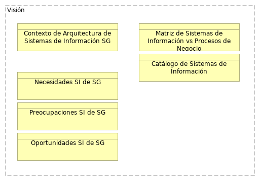

## 03. Entregables de la Vision

> 

 

{#fig:id-0993b3b264144f84abe5c7031666fede width= height=}

### Elementos del Modelo

| Nombre  | Tipo | Documentación |
|---------|------|---------------|
| Matriz de Sistemas de Información | Business Object | Las matrices del dominio de aplicaciones de software y sistemas de información (SI) de SG son herramientas para el relacionamiento con otros dominios del ejercicio de arquitectura empresarial de SG. Con esto conseguimos soportar la toma decisiones de lo que debe ser compartido de los SI dentro de la Secretaría, y entre sus aplicaciones de software. Las matrices de este ejercicio sirven además para comunicar el grado de relacionamiento de los elementos.

En resumen,

* Las matrices son cruciales para especificar cómo debe relacionarse la información entre los sistemas y otros dominios
* proporcionan información crítica para los proyectos que involucren a los sistemas de SG.
* Contribuye a la determinación de brechas (gaps) en las necesidades de compartir información (o funciones de los sistemas) ente los elementos de la matriz. 
* La matriz ayuda a definir el nivel de detalle de lo que se comparte.
* Se deben establecer medidas similares para la interoperabilidad de servicios/negocios y la infraestructura (tecnología física).
* Sintetizan la información de las arquitecturas, y son simples para compartir documentos.

Las matrices de este dominio (procesos e interoperabilidad) actúan como una hoja de ruta para la conectividad y el intercambio de información; inician desde una perspectiva de negocio de alto nivel y van hasta una especificación técnica detallada del la interacción con los sistemas. Sirven como herramienta de comunicación para los demás dominios de la arquitectura empresarial de SG, y contribuyen a que las interacciones relevantes entre servicios, canales, y procesos estén definidas y sean compatibles.
 |
| Matriz de Sistemas de Información vs Procesos de Negocio  | Business Object | Las matrices del dominio de aplicaciones de software y sistemas de información (SI) de SG son herramientas para el relacionamiento con otros dominios del ejercicio de arquitectura empresarial de SG. Con esto conseguimos soportar la toma decisiones de lo que debe ser compartido de los SI dentro de la Secretaría, y entre sus aplicaciones de software. Las matrices de este ejercicio sirven además para comunicar el grado de relacionamiento de los elementos.

En resumen,

* Las matrices son cruciales para especificar cómo debe relacionarse la información entre los sistemas y otros dominios
* proporcionan información crítica para los proyectos que involucren a los sistemas de SG.
* Contribuye a la determinación de brechas (gaps) en las necesidades de compartir información (o funciones de los sistemas) ente los elementos de la matriz. 
* La matriz ayuda a definir el nivel de detalle de lo que se comparte.
* Se deben establecer medidas similares para la interoperabilidad de servicios/negocios y la infraestructura (tecnología física).
* Sintetizan la información de las arquitecturas, y son simples para compartir documentos.

Las matrices de este dominio (procesos e interoperabilidad) actúan como una hoja de ruta para la conectividad y el intercambio de información; inician desde una perspectiva de negocio de alto nivel y van hasta una especificación técnica detallada del la interacción con los sistemas. Sirven como herramienta de comunicación para los demás dominios de la arquitectura empresarial de SG, y contribuyen a que las interacciones relevantes entre servicios, canales, y procesos estén definidas y sean compatibles.
 |
| Catálogo de Sistemas de Información | Business Object | En el contexto de TOGAF, El Catálogo de sistemas de información es un inventario detallado y documentado que actúa como ficha técnica de los sistemas de información o aplicaciones de software de SG. 

Es un producto entregable clave de la fase de Arquitectura de Aplicaciones dentro de la Fase 3 de este ejercicio de arquitectura empresarial (AE). Forma parte del Marco de Referencia del Contenido Arquitectónico de TOGAF y del Marco de Arquitectura de Referencia del MinTIC (MAE 3.0, Colombia).

La construcción del catálogo de aplicaciones implican a las sesiones de levantamiento, entrevistas, y cuestionarios compartidos en el mes de julio, junto con la recopilación estructurada de las fuentes de información sobre cada sistema.

## Contenido Mínimo del Catálogo

* ID de Aplicación. Código de identificación de la aplicación de software.
* Nombre de la Aplicación. Nombre de identificación de la aplicación de software.
* Descripción. Funcionamiento básico de la aplicación de software.
* Estado: [En producción, en desmantelamiento, en implementación, Inactiva]
* Categoría: [Sistema de apoyo al negocio (misional), herramienta de gestión, Ofimática, Seguridad] 
* Proceso(s) de Negocio Clave(s)
* Capacidad: Capacidades de nivel 2 relacionadas con la aplicación de software.
* Tipo de aplicación: Web, Móvil, Cliente Servidor 
* Método de despliegue: on-premises, cloud SAAS, cloud PAAS, cloud IAAS 
* Tecnología. Aspectos técnicos de la aplicación de software.
* Versión actual de la tecnología
* Responsable técnico en la entidad
* Responsable funcional en la entidad
* Fabricante
* Proveedor de soporte externo
* Fecha de vigencia de soporte externo
* Nombre de servidor. Nombre de red del entorno o nodo contenedor de la aplicación de software. 
* Criticidad de negocio

El Catálogo de aplicaciones de SG procura beneficios estratégicos y operativos:

* Unifica la documentación y la comunicación: Es un artefacto clave para documentar, comprender y comunicar el panorama actual y futuro de las aplicaciones.
* Base para la toma de decisiones: Sirve como base para la toma de decisiones en la gestión y gobierno de las capacidades de los sistemas de SG, y del portafolio y ciclo de vida de las aplicaciones.
* Facilita la actualización continua: Permite la actualización continua de las características y atributos relevantes de los sistemas de información.
 |
| Identificar Necesidades TI en SG | Business Object | La construcción de lista de necesidades, preocupaciones y oportunidades implican a las sesiones de levantamiento, entrevistas, y cuestionarios compartidos en el mes de julio, junto con la recopilación estructurada de las fuentes de información sobre cada sistema.

Necesidades de Transformación Digital y Tecnológica
La transformación digital (objetivo estratégico de SG)  es un motor fundamental para alinear las estrategias, procesos y tecnologías de la Secretaría General. Esta transformación busca:

* Impulsar la transformación digital para alinear estrategias, procesos y tecnologías
* (Necesidad) la Modernización y Eficiencia Pública (Driver)
* Cerrar las brechas en la Política de Gobierno Digital, de la cual la Arquitectura Empresarial es un habilitador clave.
* Modernizar la infraestructura tecnológica obsoleta para asegurar su continuidad y disponibilidad.
* Integrar plataformas y ecosistemas digitales y superar la falta de interoperabilidad.
* Automatizar trámites y estandarizar la gestión y gobernanza de datos públicos.
* Adquirir software especializado en análisis de datos para mejorar la toma de decisiones basada en evidencia.
* Generar análisis predictivos y prospectivos de resultados de gestión, que son insumos para la toma de decisiones.
* Contar con disponibilidad de personal adecuado para actualizar plataformas tecnológicas y la gstión de las cargas de trabajo es una necesidad identificada para este eje.
* Aprovechar nuevas tecnologías como la Inteligencia Artificial, la minería de datos, el procesamiento del lenguaje, para mejorar los procesos y la relación con la ciudadanía.

* Abordar los altos costos de la tecnología que limitan la implementación de sistemas avanzados. (??)
* Fortalecer la ciberseguridad y seguridad de la información para proteger la integridad, disponibilidad y confidencialidad de los datos y prevenir ataques.

Necesidades Específicas del Dominio de Aplicaciones de software
Esta capa se refiere al comportamiento de las aplicaciones que apoyan el negocio, la estructura de esas aplicaciones y su relación con los objetos de datos que utilizan.

Para los Componentes de Aplicación (Application Component) y Servicios de Aplicación (Application Service) de SG:

* Adquirir software especializado en análisis de datos: implica la necesidad de incorporar de nuevos componentes de aplicación (Application Component).
* Integrar plataformas y ecosistemas digitales :requiere reforzar la relación entre componentes de aplicación y la exposición de servicios de aplicación (Application Service), y clicar los lineamientos del Marco de Referencia de AE, versión 3.0 al momento, del MinTIC.
* Mejorar la capacidad de las herramientas tecnológicas para el soporte a la toma de decisiones y la gestión: requiere la mejora de las Funcionalidad (Application Function) y Componentes de Aplicación actuales asociadas a esta capacidad.
 |

Table: Elementos de la vista. {#tbl:tblelement-03.EntregablesdelaVision-id}

 

---
lang: en
titlepage: true
titlepage-rule-color: 360049
todo: aun no está lista
...

