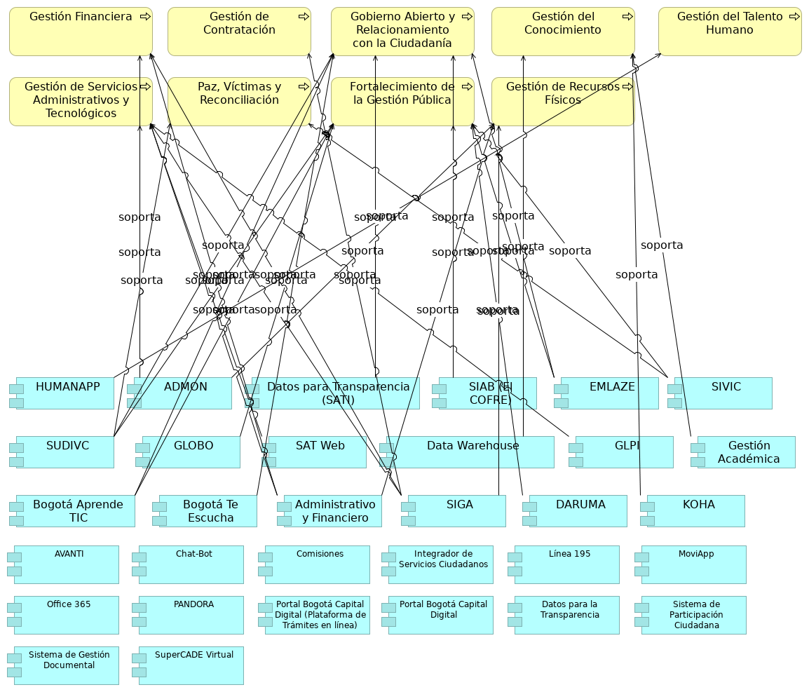

## Aplicaciones y Procesos SG

> 

 

{#fig:id-7812cd6a3a0d4d5783b00f16f2c5826b width= height=}

### HUMANAPP
Apoya la gestión del talento humano.

### ADMON
Se relaciona con la gestión financiera, gestión de servicios administrativos y tecnológicos, y gestión de recursos físicos.

### Datos para Transparencia (SATI)
Plataforma que facilita el acceso público a datos e información gubernamental.. Soporta el proceso de Gobierno abierto y relacionamiento con la ciudadanía.

### SIAB (El COFRE)
Sistema de Información del Archivo de Bogotá SIAB. Permite automatizar los procesos archivísticos y técnicos que realiza el Archivo, tales como llevar un registro de los Ingresos Documentales (antes área de acopio), para la descripción y catalogación de la documentación, propios del proceso de Gestión de la Función Archivística y del Patrimonio Documental, para su custodia y conservación permanente.

Utilizado en los procesos de Gobierno abierto y relacionamiento con la ciudadanía, y Fortalecimiento de la Gestión Pública.

### EMLAZE
Utilizado en los procesos de Gobierno abierto y relacionamiento con la ciudadanía, y Fortalecimiento de la Gestión Pública.

### SIVIC
Interviene en los procesos de Paz, víctimas y reconciliación, y Fortalecimiento de la Gestión Pública.

### SUDIVC
Se aplica en los procesos de Gobierno abierto y relacionamiento con la ciudadanía, Paz, víctimas y reconciliación, y Fortalecimiento de la Gestión Pública.

### GLOBO
Utilizado en el proceso de Fortalecimiento de la Gestión Pública.

### SAT Web
Relacionado con la gestión de servicios administrativos y tecnológicos.

### Data Warehouse
Almacenes de datos de trabajo de SG.

### GLPI
Soporta la gestión de servicios administrativos y tecnológicos.

### Gestión Académica
Relacionado con la Gestión del conocimiento.

### Bogotá Aprende TIC
Apoya los procesos de Gobierno abierto y relacionamiento con la ciudadanía, y Fortalecimiento de la Gestión Pública.

### Bogotá Te Escucha
Es fundamental para el proceso de Gobierno abierto y relacionamiento con la ciudadanía. También se menciona como el Sistema Distrital para la Gestión de Peticiones Ciudadanas, a través del cual se evalúa la calidad de las respuestas emitidas a la ciudadanía.

### Administrativo y Financiero
Soporta la gestión financiera, gestión de servicios administrativos y tecnológicos, y gestión de recursos físicos.

### SIGA
Interviene en la gestión de contratación, gestión financiera, gestión de servicios administrativos y tecnológicos, y gestión de recursos físicos.

### DARUMA
Se utiliza en el proceso de Fortalecimiento de la Gestión Pública. También es el aplicativo donde se encuentran definidas las fichas técnicas de productos y servicios de la Secretaría General y se gestionan los riesgos estratégicos.

### KOHA
Relacionado con la Gestión del conocimiento.

### AVANTI
Apoya la Gestión del conocimiento.

### Chat-Bot
Canal web de atención a ciudadanía.

### Comisiones
Sesión levantamiento no. 1.

### Integrador de Servicios Ciudadanos
Plataforma unificada para acceder a diversos servicios y trámites ciudadanos.

### Línea 195
Canal telefónico de atención a ciudadanía.

### MoviApp
Canal movil de atención a ciudadanía. Sesión levantamiento no. 2.

### Office 365
Ofimática y colaboración SG.

### PANDORA
Implementación de temas precontractual y planeación.

### Portal Bogotá Capital Digital (Plataforma de Trámites en línea)
Portal Integrador de trámites y servicios ofrecidos a la ciudadanía. Componente de aplicación que permite la realización de trámites digitales.

### Portal Bogotá Capital Digital
Portal Integrador de trámites y servicios ofrecidos a la ciudadanía.

### Datos para la Transparencia
Plataforma que facilita el acceso público a datos e información gubernamental.

### Sistema de Participación Ciudadana
Componente de aplicación para facilitar la interacción y el acercamiento (realimentación) de los ciudadanos.

### Sistema de Gestión Documental
Componente de aplicación para la gestión electrónica de documentos.

### SuperCADE Virtual
Red de canales presenciales de atención a ciudadanía.

---
lang: en
titlepage: true
titlepage-rule-color: 360049
todo: aun no está lista
...

