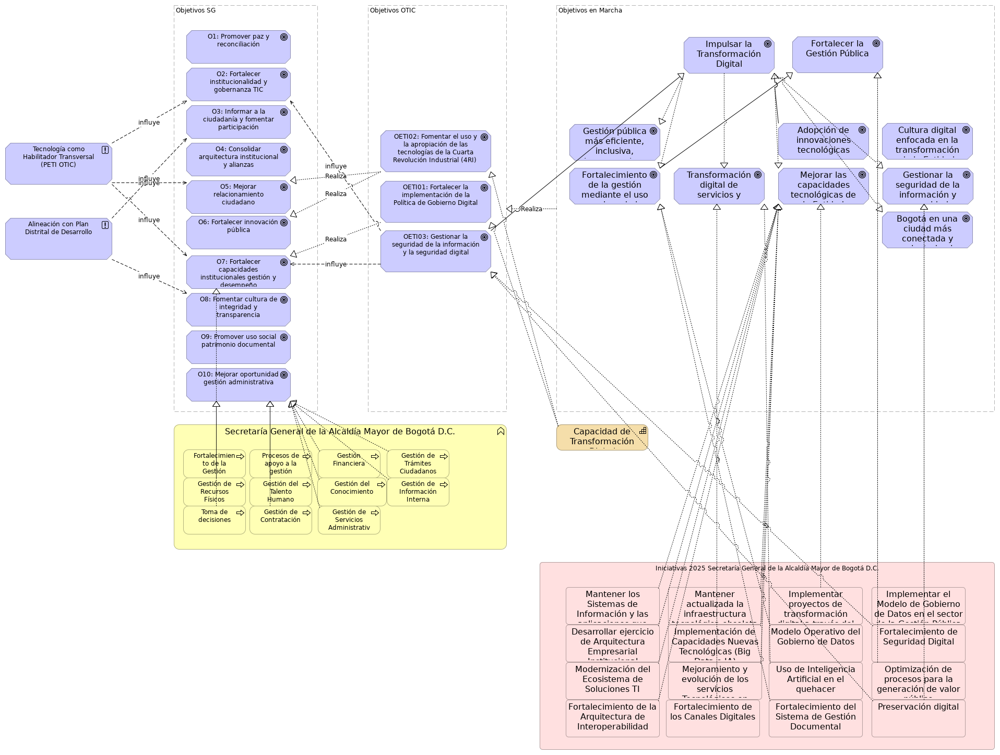

## Objetivos Estratégicos SG-OTIC

> 

 

Este modelo representa la alineación entre los objetivos estratégicos de la Secretaría General de la Alcaldía Mayor de Bogotá D.C. y los objetivos de la Oficina de Tecnologías de la Información y las Comunicaciones (OTIC), mostrando cómo los esfuerzos de TI habilitan las metas institucionales de alto nivel.

{#fig:id-257a9a842fe0459c88cf09c4ebd37805 width= height=}

### Objetivos SG

### O1: Promover paz y reconciliación
Promover la paz y la reconciliación en Bogotá a través de la integración local de las poblaciones afectadas por el conflicto armado, buscando la superación de sus condiciones de vulnerabilidad y la reconstrucción del tejido social en la ciudad.
### O2: Fortalecer institucionalidad y gobernanza TIC
Fortalecer la institucionalidad y gobernanza para impulsar y coordinar el uso de las Tecnologías de la Información y las Comunicaciones (TIC), con el fin de establecer un marco normativo, habilitar la infraestructura, promover el talento digital y crear procesos eficientes para la prestación de servicios ciudadanos y la transformación de la administración pública.
### O3: Informar a la ciudadanía y fomentar participación
Informar a la ciudadanía mediante campañas y estrategias de comunicación sobre temas de ciudad, para fomentar la participación ciudadana y la transparencia de la gestión pública.
### O4: Consolidar arquitectura institucional y alianzas
Desarrollar y consolidar la arquitectura institucional, los instrumentos de política pública y las alianzas estratégicas necesarias para posicionar a Bogotá como una ciudad globalmente accesible y abierta al mundo.
### O5: Mejorar relacionamiento ciudadano
Mejorar el relacionamiento de la ciudadanía con el gobierno distrital a través del fortalecimiento de la oferta institucional, la modernización de los canales de atención y la cualificación del talento humano, contribuyendo al aumento de la confianza y satisfacción ciudadana.
### O6: Fortalecer innovación pública
Fortalecer los procesos de innovación pública en las entidades distritales, facilitando habilitadores, desarrollando capacidades en intraemprendimiento, promoviendo el trabajo colaborativo y la articulación entre actores públicos y privados.
### O7: Fortalecer capacidades institucionales gestión y desempeño
Fortalecer las capacidades institucionales para la implementación de las políticas de gestión y desempeño, con el objetivo de generar valor público, contribuir a la solución de los retos de la ciudad y promover la participación ciudadana.
### O8: Fomentar cultura de integridad y transparencia
Fomentar una cultura de integridad, transparencia y ética pública en la Administración Distrital.
### O9: Promover uso social patrimonio documental
Promover la apropiación y uso social del patrimonio documental del Distrito Capital, mediante su protección, conservación, adecuada gestión y fácil acceso por parte de la ciudadanía.
### O10: Mejorar oportunidad gestión administrativa
Mejorar la oportunidad en la gestión administrativa, garantizando la adquisición de bienes y servicios que satisfagan las necesidades de la entidad y la ciudadanía, en el marco de la optimización de los recursos asignados.
### Objetivos OTIC

### OETI02: Fomentar el uso y la apropiación de las tecnologías de la Cuarta Revolución Industrial (4RI) 
Fomentar el uso y la apropiación de las tecnologías de la Cuarta Revolución Industrial (4RI) para impulsar la transformación digital en la Secretaría General, integrando tecnologías emergentes que optimicen los procesos, promuevan la innovación y mejoren la eficiencia en la gestión pública.
### OETI01: Fortalecer la implementación de la Política de Gobierno Digital
Fortalecer la implementación de la Política de Gobierno Digital para promover la transformación digital en la Secretaría General, y optimizar las capacidades tecnológicas, con el fin de garantizar una gestión pública eficiente, transparente y accesible para la ciudadanía.
### OETI03: Gestionar la seguridad de la información y la seguridad digital
Gestionar la seguridad de la información y la seguridad digital mediante la adopción de políticas, controles y campañas de concienciación que fomenten una cultura digital segura, así como la implementación de estrategias para asegurar la continuidad de los servicios de TIC.
### Tecnología como Habilitador Transversal (PETI OTIC)
El PETI de la OTIC busca que la tecnología sea un habilitador transversal para una gestión pública más eficiente, inclusiva, transparente y confiable, optimizando los trámites y servicios ofrecidos a la ciudadanía. Para ello, la integración de las tecnologías debe estar alineada con el direccionamiento estratégico y la planeación institucional de la Entidad.
### Alineación con Plan Distrital de Desarrollo
El PETI está alineado con las políticas y lineamientos del Plan Distrital de Desarrollo “Bogotá camina segura 2024-2027”, especialmente con su Objetivo 5: "Bogotá confía en su gobierno", que busca promover la confianza en la administración distrital.
### Procesos de apoyo a la gestión
Procesos internos que facilitan la operación de la entidad.
### Gestión de Trámites Ciudadanos
Proceso de atención y resolución de solicitudes y gestiones de los ciudadanos.
### Capacidad de Transformación Digital
Habilidad de la entidad para adaptarse y evolucionar digitalmente.
### Gestión de Información Interna
Proceso de recolección, procesamiento y distribución de información dentro de la entidad.
### Toma de decisiones
Proceso fundamental para la dirección estratégica y operativa de la entidad.

---
lang: en
titlepage: true
titlepage-rule-color: 360049
todo: aun no está lista
...

