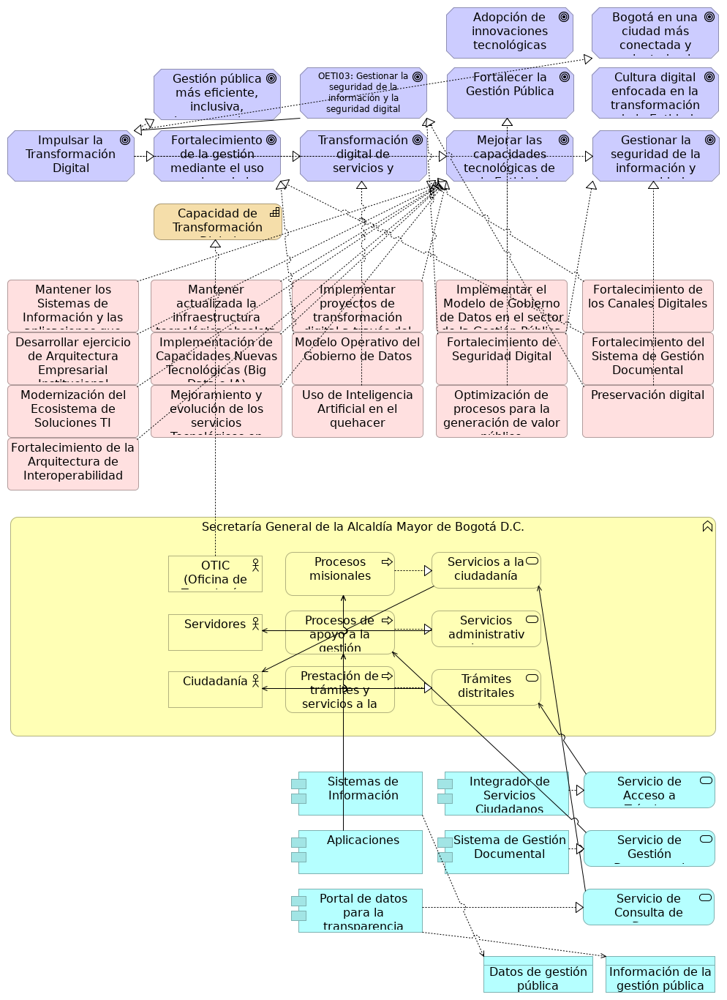

## Objetivos e Iniciativas. PETI SG

> 

 

Diagrama que muestra la alineación estratégica, los actores de negocio y los principales componentes de aplicación relacionados con la Transformación Digital de la Alcaldía Mayor de Bogotá D.C. Se enfoca en la trazabilidad desde las metas estratégicas hasta los proyectos y los sistemas de información.

{#fig:id-710b67ee56954bd891264181bf9a408f width= height=}

### Elementos del Modelo

| Nombre  | Tipo | Documentación |
|---------|------|---------------|
| Adopción de innovaciones tecnológicas para apoyar áreas misionales clave | Goal | Objetivo de integrar nuevas tecnologías para mejorar funciones principales. |
| Bogotá en una ciudad más conectada y orientada al bienestar de la ciudadanía | Goal | Visión a largo plazo para la ciudad impulsada por la digitalización. |
| Fortalecer la Gestión Pública | Goal | Objetivo de TI de alto nivel optimizar (mejorar la eficiencia y eficacia) los procesos y servicios de la administración pública.
 |
| Cultura digital enfocada en la transformación de la Entidad | Goal | Meta de fomentar una mentalidad y habilidades digitales dentro de la organización. |
| Gestionar la seguridad de la información y seguridad digital (objetivo estratégico de TI) | Goal | Objetivo de TI para proteger los activos de información y garantizar la ciberseguridad. |
| Gestión pública más eficiente, inclusiva, transparente y confiable | Goal | Resultado deseado de una administración pública mejorada para los ciudadanos. |
| Impulsar la Transformación Digital | Goal | Meta principal del PETI, buscando modernizar la entidad a través de tecnologías digitales. Contiene a la Política de Gobierno Digital. |
| Fortalecimiento de la gestión mediante el uso y mejora de las tecnologías | Goal | Objetivo de mejorar la gestión pública mediante la aplicación de TI. |
| Transformación digital de servicios y procesos administrativos | Goal | Meta de digitalizar y optimizar los servicios y procesos internos y externos. |
| Mejorar las capacidades tecnológicas de la Entidad (objetivo estratégico de TI) | Goal | Meta de TI para modernizar y potenciar la infraestructura y habilidades tecnológicas. |
| Gestionar la seguridad de la información y seguridad digital (objetivo estratégico de TI) | Goal | Objetivo de TI para proteger los activos de información y garantizar la ciberseguridad. |
| Capacidad de Transformación Digital | Capability | Habilidad de la entidad para adaptarse y evolucionar digitalmente. |
| Mantener los Sistemas de Información y las aplicaciones que apalanquen los procesos misionales y de apoyo a la gestión | Work Package | Actividad continua para asegurar la operatividad y soporte de los sistemas de información clave. |
| Mantener actualizada la infraestructura tecnológica obsoleta | Work Package | Proyecto recurrente para asegurar la modernización y sostenibilidad de la infraestructura de TI. |
| Implementar proyectos de transformación digital a través del uso de Tecnologías de Cuarta Revolución Industrial (4RI) | Work Package | Ejecución de iniciativas que adoptan tecnologías avanzadas para la transformación digital. |
| Implementar el Modelo de Gobierno de Datos en el sector de la Gestión Pública | Work Package | Proyecto para poner en práctica el marco de gobernanza de datos en el ámbito público. |
| Fortalecimiento de los Canales Digitales | Work Package | Iniciativa para mejorar la calidad y alcance de los canales de atención digitales. |
| Desarrollar ejercicio de Arquitectura Empresarial Institucional | Work Package | Proyecto para establecer y madurar la práctica de Arquitectura Empresarial en la entidad. |
| Implementación de Capacidades Nuevas Tecnológicas (Big Data e IA) | Work Package | Iniciativa para incorporar tecnologías emergentes de la Cuarta Revolución Industrial para optimizar procesos, impulsar la innovación y garantizar la transformación digital. |
| Modelo Operativo del Gobierno de Datos | Work Package | Proyecto para definir e implementar un marco de gobernanza de datos. |
| Fortalecimiento de Seguridad Digital | Work Package | Iniciativa para proteger la infraestructura y los datos de amenazas digitales. |
| Fortalecimiento del Sistema de Gestión Documental | Work Package | Iniciativa para el desarrollo e implementación de herramientas y procesos avanzados para optimizar la clasificación, almacenamiento, acceso y control de la documentación institucional. |
| Modernización del Ecosistema de Soluciones TI | Work Package | Proyecto para actualizar y optimizar el conjunto de soluciones tecnológicas. |
| Mejoramiento y evolución de los servicios Tecnológicos en Nube | Work Package | Iniciativa para optimizar y expandir el uso de servicios cloud. |
| Uso de Inteligencia Artificial en el quehacer | Work Package | Proyecto para integrar la IA en las operaciones diarias de la entidad. |
| Optimización de procesos para la generación de valor público | Work Package | Proyecto para revisar y mejorar los procesos internos con foco en el valor para el ciudadano. |
| Preservación digital | Work Package | Proyecto para asegurar la conservación y accesibilidad a largo plazo de los activos digitales. |
| Fortalecimiento de la Arquitectura de Interoperabilidad | Work Package | Iniciativa para mejorar la comunicación e integración entre sistemas y entidades. |
| Secretaría General de la Alcaldía Mayor de Bogotá D.C. | Business Function | Entidad principal de la administración distrital. |
| Procesos misionales | Business Process | Procesos clave que definen la razón de ser de la entidad. |
| Servicios a la ciudadanía | Business Service | Conjunto de servicios ofrecidos a los ciudadanos. |
| OTIC (Oficina de Tecnologías de la Información y las Comunicaciones) | Business Actor | Área encargada de la gestión de TI y comunicaciones en la Secretaría General. |
| Procesos de apoyo a la gestión | Business Process | Procesos internos que facilitan la operación de la entidad. |
| Servicios administrativos internos | Business Service | Servicios de apoyo para el funcionamiento interno de la entidad. |
| Servidores | Business Actor | Personal de la entidad que participa en los procesos de negocio. |
| Prestación de trámites y servicios a la ciudadanía | Business Process | Proceso central para la interacción con los ciudadanos. |
| Trámites distritales | Business Service | Trámites específicos que los ciudadanos pueden realizar. |
| Ciudadanía | Business Actor | Actores externos que consumen los servicios de la Alcaldía. |
| Sistemas de Información | Application Component | Conjunto genérico de sistemas que soportan las operaciones de la entidad. |
| Integrador de Servicios Ciudadanos | Application Component | Plataforma unificada para acceder a diversos servicios y trámites ciudadanos. |
| Servicio de Acceso a Trámites | Application Service | Servicio que permite a los ciudadanos iniciar y gestionar trámites en línea. |
| Aplicaciones | Application Component | Software específico utilizado para diversas funciones de negocio. |
| Sistema de Gestión Documental | Application Component | Sistema para la administración y control de documentos digitales. |
| Servicio de Gestión Documental | Application Service | Servicio para la creación, almacenamiento y recuperación de documentos. |
| Portal de datos para la transparencia | Application Component | Plataforma que facilita el acceso público a datos e información gubernamental. |
| Servicio de Consulta de Datos | Application Service | Servicio provisto por el portal de datos para acceder a información pública. |
| Datos de gestión pública | Data Object | Información general utilizada en los procesos de la administración pública. |
| Información de la gestión pública | Data Object | Conjunto de datos e información relevante para la transparencia y la toma de decisiones. |

Table: Elementos de la vista. {#tbl:tblelement-06.BMM.ObjetivoseIniciativas.PETISG-id}

 

---
lang: en
titlepage: true
titlepage-rule-color: 360049
todo: aun no está lista
...

