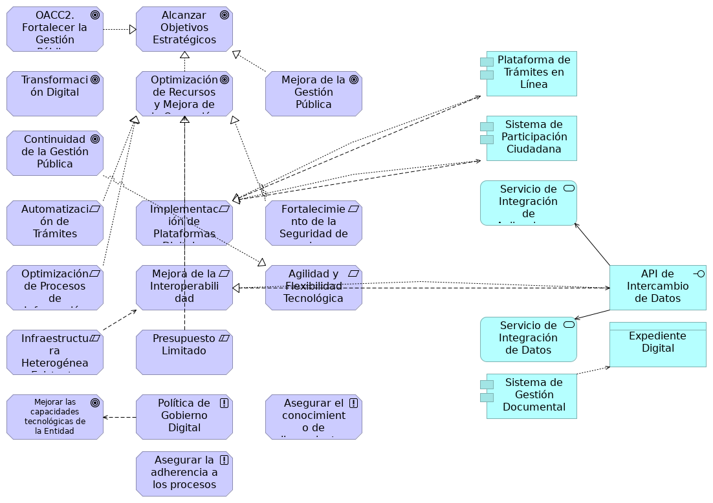

## Necesidades y Aplicaciones

> 

 

{#fig:id-73084877ba5b4f859a7aa197be93b750 width= height=}

### OACC2. Fortalecer la Gestión Pública
Objetivo de TI de alto nivel optimizar (mejorar la eficiencia y eficacia) los procesos y servicios de la administración pública.

### Alcanzar Objetivos Estratégicos
Meta general de la Secretaría General para cumplir con su misión y visión.
### Plataforma de Trámites en Línea
Componente de aplicación que permite la realización de trámites digitales.
### Transformación Digital
Objetivo clave relacionado con la modernización y digitalización de los servicios y operaciones.

La transformación digital es un motor fundamental para alinear las estrategias, procesos y tecnologías de la Secretaría General. Esta transformación busca:

* Cerrar las brechas en la Política de Gobierno Digital, de la cual la Arquitectura Empresarial es un habilitador clave.
* Modernizar la infraestructura tecnológica obsoleta para asegurar su continuidad y disponibilidad.
* Integrar plataformas y ecosistemas digitales y superar la falta de interoperabilidad.
* Automatizar trámites y estandarizar la gestión y gobernanza de datos públicos.
* Adquirir software especializado en análisis de datos para mejorar la toma de decisiones basada en evidencia.
* Generar análisis predictivos y prospectivos de resultados de gestión, que son insumos para la toma de decisiones.
* Aprovechar nuevas tecnologías como la Inteligencia Artificial para mejorar los procesos y la relación con la ciudadanía.
* Fortalecer la ciberseguridad y seguridad de la información para proteger la integridad, disponibilidad y confidencialidad de los datos y prevenir ataques.
* La disponibilidad de personal adecuado para actualizar plataformas tecnológicas es una necesidad identificada para este eje, y los altos costos de la tecnología representan una limitación.
### Optimización de Recursos y Mejora de la Operación
Objetivo de mejorar la eficiencia en el uso de los recursos y la calidad de las operaciones internas.
### Mejora de la Gestión Pública
Objetivo general de elevar la calidad y el impacto de la gestión gubernamental.
### Sistema de Participación Ciudadana
Componente de aplicación para facilitar la interacción y el feedback de los ciudadanos.
### Continuidad de la Gestión Pública
Objetivo de asegurar que los programas y proyectos perduren entre diferentes administraciones.
### Servicio de Integración de Aplicaciones
Servicio de aplicación para la unificación y el intercambio de funcionalidades.
### Automatización de Trámites
Necesidad de digitalizar y automatizar los procesos de interacción con los ciudadanos.
### Implementación de Plataformas Digitales
Requisito para desarrollar o adquirir sistemas para trámites y participación ciudadana.
### Fortalecimiento de la Seguridad de la Información
Necesidad de proteger los datos y sistemas contra amenazas y vulnerabilidades.
### Optimización de Procesos de Información
Requisito para mejorar la eficiencia y calidad en el manejo de la información.
### Mejora de la Interoperabilidad
Necesidad de asegurar la comunicación y el intercambio de datos entre diferentes sistemas.
### Agilidad y Flexibilidad Tecnológica
Requisito para que las soluciones tecnológicas puedan adaptarse rápidamente a nuevos cambios.
### API de Intercambio de Datos
Interfaz de aplicación para permitir la comunicación entre diferentes sistemas.
### Servicio de Integración de Datos
Servicio de aplicación para la unificación y el intercambio de información.
### Expediente Digital
Objeto de datos en la capa de aplicación que representa un expediente electrónico.
### Infraestructura Heterogénea Existente
Restricción derivada de la diversidad de sistemas y tecnologías ya implementadas.
### Presupuesto Limitado
Restricción financiera para la ejecución de iniciativas y proyectos.
### Sistema de Gestión Documental
Componente de aplicación para la gestión electrónica de documentos.
### Mejorar las capacidades tecnológicas de la Entidad
Meta de TI para modernizar y potenciar la infraestructura y habilidades tecnológicas.
### Política de Gobierno Digital
Principios que guiarán el diseño y la evolución de la arquitectura de solución. Son declaraciones de intención de la SG que deben ser cumplidas.
### Asegurar el conocimiento de lineamientos y directrices
Principios de gobernanza interna.
### Asegurar la adherencia a los procesos y procedimientos establecidos
Principios de gobernanza interna.

---
lang: en
titlepage: true
titlepage-rule-color: 360049
todo: aun no está lista
...

