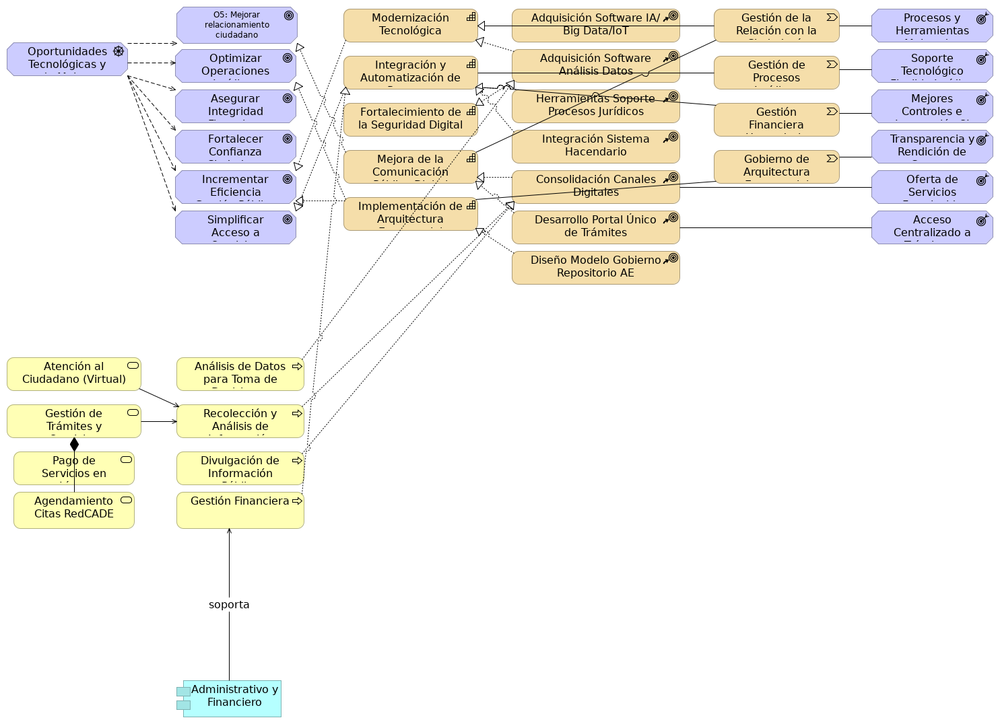

## Oportunidades

> 

 

Esta vista general presenta las relaciones clave entre las oportunidades (drivers), las metas, las capacidades estratégicas, los cursos de acción, los flujos de valor y los resultados, ofreciendo una perspectiva integral de la transformación propuesta.
{#fig:id-e56009668c214a93bf68e32aa5f040ac width= height=}

### Elementos del Modelo

| Nombre  | Tipo | Documentación |
|---------|------|---------------|
| O5: Mejorar relacionamiento ciudadano | Goal | Mejorar el relacionamiento de la ciudadanía con el gobierno distrital a través del fortalecimiento de la oferta institucional, la modernización de los canales de atención y la cualificación del talento humano, contribuyendo al aumento de la confianza y satisfacción ciudadana. |
| Modernización Tecnológica | Capability | Capacidad de incorporar nuevas tecnologías como IA, Big Data e IoT para mejorar procesos y herramientas. |
| Adquisición Software IA/Big Data/IoT | Course Of-Action | Iniciativa para adquirir software especializado que soporte la modernización tecnológica. |
| Gestión de la Relación con la Ciudadanía | Value Stream | Flujo de valor que abarca todas las interacciones y servicios ofrecidos a los ciudadanos. |
| Procesos y Herramientas Mejorados | Outcome | Resultado esperado de la modernización tecnológica y la implementación de IA. |
| Oportunidades Tecnológicas y de Mejora | Driver | Impulsor principal derivado del análisis de las oportunidades para la transformación digital y la eficiencia en la gestión pública. |
| Optimizar Operaciones Jurídicas | Goal | Meta de mejorar la eficiencia y el soporte tecnológico de los procesos jurídicos. |
| Adquisición Software Análisis Datos | Course Of-Action | Iniciativa para adquirir software que permita el análisis de datos para la toma de decisiones. |
| Soporte Tecnológico Flexible Jurídico | Outcome | Resultado de contar con herramientas tecnológicas que se adapten a las operaciones jurídicas. |
| Integración y Automatización de Procesos | Capability | Capacidad para unificar y optimizar flujos de trabajo mediante herramientas tecnológicas. |
| Gestión de Procesos Jurídicos | Value Stream | Flujo de valor relacionado con la gestión y soporte de las operaciones jurídicas. |
| Asegurar Integridad Financiera | Goal | Meta de fortalecer los controles y la integración con el sistema hacendario. |
| Herramientas Soporte Procesos Jurídicos | Course Of-Action | Iniciativa para implementar herramientas tecnológicas para el soporte y evaluación de procesos jurídicos. |
| Mejores Controles e Integración SI | Outcome | Resultado de la integración de sistemas de información con el Sistema Hacendario. |
| Fortalecimiento de la Seguridad Digital | Capability | Capacidad de proteger los activos digitales y la información sensible de la entidad. |
| Gestión Financiera Hacendaria | Value Stream | Flujo de valor que involucra los sistemas y procesos financieros y hacendarios. |
| Fortalecer Confianza Ciudadana | Goal | Meta de aumentar la confianza pública a través de la transparencia y seguridad digital. |
| Integración Sistema Hacendario | Course Of-Action | Iniciativa para mejorar los controles e integración de los sistemas de información con el Sistema Hacendario. |
| Transparencia y Rendición de Cuentas Aumentada | Outcome | Resultado de la estandarización de procesos y sistemas de información gracias a la AE. |
| Mejora de la Comunicación Pública Digital | Capability | Capacidad de interactuar y proveer información a los ciudadanos de forma efectiva a través de medios digitales. |
| Gobierno de Arquitectura Empresarial | Value Stream | Flujo de valor que establece los lineamientos y procesos para la gobernanza de la arquitectura empresarial. |
| Incrementar Eficiencia Gestión Pública | Goal | Meta de optimizar los procesos internos y la prestación de servicios gubernamentales. |
| Consolidación Canales Digitales | Course Of-Action | Iniciativa para consolidar herramientas y canales digitales para fortalecer la oferta y celeridad de servicios. |
| Oferta de Servicios Fortalecida | Outcome | Resultado de la consolidación de canales e información para una mejor oferta de servicios. |
| Implementación de Arquitectura Empresarial | Capability | Capacidad de establecer y gestionar la disciplina de arquitectura empresarial para guiar la transformación digital. |
| Simplificar Acceso a Servicios | Goal | Meta de hacer más accesibles y eficientes los trámites y servicios digitales para la ciudadanía. |
| Desarrollo Portal Único de Trámites | Course Of-Action | Iniciativa para unificar la oferta de trámites y servicios en un portal digital centralizado. |
| Acceso Centralizado a Trámites y Servicios | Outcome | Resultado de la unificación de trámites y servicios en un portal único. |
| Diseño Modelo Gobierno Repositorio AE | Course Of-Action | Iniciativa para crear un modelo de gobernanza para el Repositorio de Arquitectura Empresarial. |
| Atención al Ciudadano (Virtual) | Business Service | Servicio de negocio para la atención a través de canales virtuales como SuperCADE Virtual, chat, chat-Bot y videollamadas. |
| Análisis de Datos para Toma de Decisiones | Business Process | Proceso de negocio que utiliza software especializado para el análisis de datos. |
| Gestión de Trámites y Servicios | Business Service | Servicio de negocio que permite el acceso y realización de trámites y servicios públicos. |
| Recolección y Análisis de Información | Business Process | Proceso de negocio enfocado en la automatización de la recolección y análisis de datos. |
| Pago de Servicios en Línea | Business Service | Sub-servicio de negocio que permite realizar pagos no tributarios en línea. |
| Divulgación de Información Pública | Business Process | Proceso de negocio para la difusión optimizada de información a través de sistemas digitales. |
| Agendamiento Citas RedCADE | Business Service | Sub-servicio de negocio que facilita la programación de citas en la RedCADE desde casa. |

Table: Elementos de la vista. {#tbl:tblelement-06.Negocio.n4.Oportunidades-id}

 

---
lang: en
titlepage: true
titlepage-rule-color: 360049
todo: aun no está lista
...

