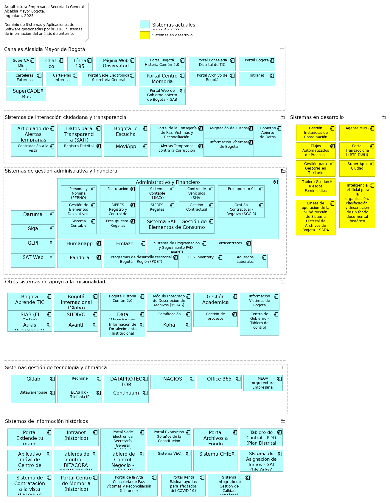
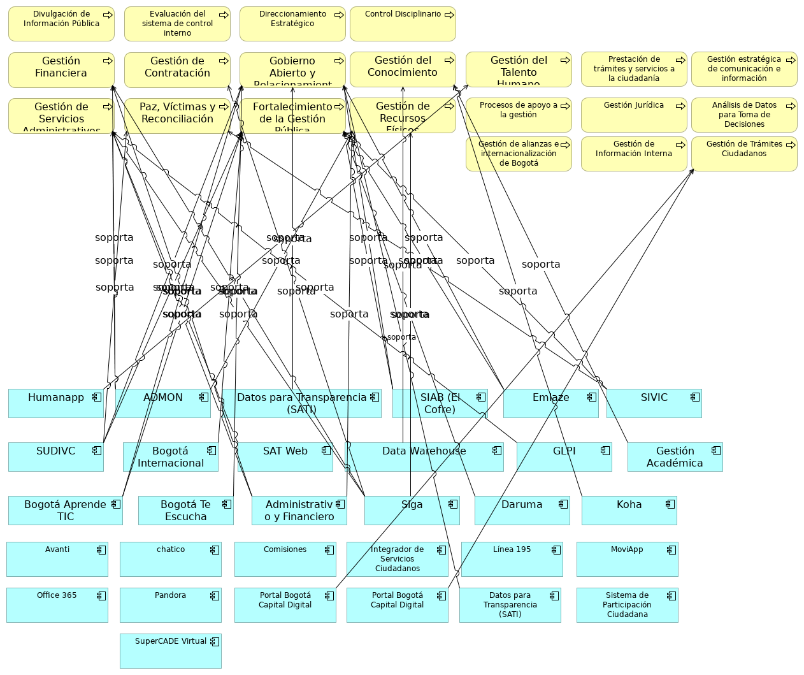

# Documento Entregables de la Visión SI
* [Visión del Dominio de Sistemas de Información SG](#visión-del-dominio-de-sistemas-de-información-sg)
	* [Relación Sistemas de Información Procesos](#relación-sistemas-de-información-procesos)

\newpage

# Visión del Dominio de Sistemas de Información SG

## Visión del Dominio de Sistemas de Información

> 

 

El dominio de sistemas de información es un pilar estructural del proyecto de arquitectura empresarial de la Secretaría General que genera aportes tecnológicos alineados con los objetivos estratégicos de transformación digital. En este dominio abordamos las necesidades de negocio para identificar brechas y soluciones de aplicaciones de software y preparar el terreno para la selección de las soluciones tecnológicas acordes con los objetivos estratégicos de la Secretaría General.

El objetivo principal del trabajo de arquitectura de aplicaciones de este proyecto es desarrollar el conocimiento y la caracterización de los sistemas de información que soportan la arquitectura de negocio de la Secretaría General y que implementan la visión de la arquitectura empresarial.
En términos más específicos, la arquitectura de aplicaciones busca:

* Definir la arquitectura de las aplicaciones necesarias para soportar los procesos de negocio.
* Identificar y caracterizar las aplicaciones de software que soportan las capacidades de negocio de la Secretaría General.
* Identificar las integraciones entre las aplicaciones.
* Considerar aspectos como obsolescencia, mantenimiento, gobierno de aplicaciones, escalabilidad, rendimiento y la seguridad de las aplicaciones.

El trabajo de la arquitectura de aplicaciones opera en conjunto y coordinación con otros dominios y fases de la arquitectura empresarial de la Secretaría General, de la siguiente manera:

* Relación con la visión de la arquitectura: Los sistemas de información toman como entrada principal la visión de este ejercicio de arquitectura, que establece el alcance, los objetivos de alto nivel, los principios de la arquitectura y la visión del negocio con el propósito de alinearse y contribuir a la consecución de esta visión.
* Relación con la arquitectura de negocio: La arquitectura de negocio (procesos de negocio, funciones, organización, etc.) es la entrada principal para este dominio. La arquitectura de sistemas de Información se construye para soportar y habilitar los requisitos definidos en la Arquitectura de Negocio.
* Relación con la arquitectura tecnológica: Este dominio proporciona bases y requisitos para el dominio de tecnología e infraestructura, que servirá a su vez para soportar la operación de las aplicaciones y gestionar los datos.
* Relación con oportunidades y soluciones y hoja de ruta: Las arquitecturas aplicaciones desarrolladas en este dominio son insumos para identificar oportunidades de implementación en la Secretaría General, y para desarrollar la hoja de ruta desde las arquitecturas actuales hacia las arquitecturas objetivo.

### Contexto de Arquitectura de Sistemas de Información SG
Desde el dominio de aplicaciones y sistemas de información del proyecto buscamos adelantar las especificaciones de las arquitecturas objetivo de los sistemas de información de la $CLIENTE (SG) que soporten la arquitectura de negocio y datos, en línea y dentro del alcance de la visión establecida en los entregables de este ejercicio de arquitectura empresarial de la SG.

En particular, y dentro del alcance de la visión de este proyecto, la arquitectura de sistemas de información de la SG se plantea:

* Definir la arquitectura de las aplicaciones (SI) necesarias para soportar los procesos de negocio de la SG.
* Identificar las funciones de negocio que deben ser soportadas por las aplicaciones de la SG.
* Establecer la interacción y el flujo de información entre las diferentes aplicaciones de la SG.
* Considerar aspectos sistémicos como la escalabilidad, el rendimiento, la mantenibilidad y la seguridad de las aplicaciones de SG.
* Listar los capacidades de negocio (servicios de aplicación) relacionadas con las arquitecturas de aplicaciones de la SG.

De esta manera, la arquitectura de sistemas de la SG contribuye a la consecución de la visión de este ejercicio de arquitectura empresarial. En lo específico, este dominio contribuye a los fines de la arquitectura de negocio y tecnológica de la SG, a delinear oportunidades y soluciones, y a soportar la planeación de la migración. Todo lo anterior dentro del alcance consignado en este ejercicio.

#### Alcance
El presente ejercicio de la arquitectura dominio de aplicaciones toma como alcance horizontal las áreas o unidades siguientes de la SG (_fuente: sesiones de levantamiento, entrevistas, y cuestionarios compartidos en el mes de julio del 2025, junto con la recopilación estructurada de las fuentes de información y organigramas_):

Unidades de negocio del alcance del dominio:

* Secretaría Privada
    * Oficina Consejería Distrital de Comunicación. César Augusto Castro Rodríguez
    * Oficina Consejería Distrital de Tecnologías de la Información y las Comunicaciones -TIC. Diana Celis Mora
* Despacho del Secretario General. Miguel Andrés Silva Moyano
    * Oficina de Tecnologías de la Información y las Comunicaciones. Arleth Patricia Saurith Contreras
    * Subsecretaría Distrital de Fortalecimiento Institucional. Alejandra Rodas Gaiter
        * Dirección Distrital de Desarrollo Institucional. Sebastian Estrada Jaramillo
            * Subdirección Técnica de Desarrollo Institucional. Diego Canesco Arenas
    * Subsecretaría de Servicio a la Ciudadanía . Adriana Vargas Tamayo
        * Dirección del Sistema Distrital de Servicio a la Ciudadanía. Enrique Cusba García
    * Subsecretaría Corporativa. Henry Villamarín Serrano
    * Subsecretaría de Servicios Ciudadanos
    * Subsecretaría de Operaciones
    * Subsecretaría de Relaciones Internacionales
    * Subsecretaría de Comunicaciones

En cuanto al alcance vertical, las aplicaciones de software que están consignadas en este ejercicio son las consignadas en el entregable Catálogo de Sistemas de Información, entre las que mencionamos las siguientes:

* Administrativo y Financiero: Soporta la gestión financiera, gestión de servicios administrativos y tecnológicos, y gestión de recursos físicos
* Bogotá Te Escucha: Es fundamental para el proceso de Gobierno abierto y relacionamiento con la ciudadanía. También se menciona como el Sistema Distrital para la Gestión de Peticiones Ciudadanas, a través del cual se evalúa la calidad de las respuestas emitidas a la ciudadanía
* Bogotá Aprende TIC: Apoya los procesos de Gobierno abierto y relacionamiento con la ciudadanía, y Fortalecimiento de la Gestión Pública
* DARUMA: Se utiliza en el proceso de Fortalecimiento de la Gestión Pública. También es el aplicativo donde se encuentran definidas las fichas técnicas de productos y servicios de la Secretaría General y se gestionan los riesgos estratégicos
* SIGA: Interviene en la gestión de contratación, gestión financiera, gestión de servicios administrativos y tecnológicos, y gestión de recursos físicos
* SAT Web: Relacionado con la gestión de servicios administrativos y tecnológicos
* GLOBO: Utilizado en el proceso de Fortalecimiento de la Gestión Pública
* Datos para la Transparencia (SATI): Soporta el proceso de Gobierno abierto y relacionamiento con la ciudadanía
* SUDIVC: Se aplica en los procesos de Gobierno abierto y relacionamiento con la ciudadanía, Paz, víctimas y reconciliación, y Fortalecimiento de la Gestión Pública
* HUMANAPP: Apoya la gestión del talento humano
* SIAB (El COFRE): Utilizado en los procesos de Gobierno abierto y relacionamiento con la ciudadanía, y Fortalecimiento de la Gestión Pública
* KOHA: Relacionado con la Gestión del conocimiento
* SIVIC: Interviene en los procesos de Paz, víctimas y reconciliación, y Fortalecimiento de la Gestión Pública
* Data Warehouse AVANTI: Apoya la Gestión del conocimiento
* Gestión Académica: Relacionado con la Gestión del conocimiento
* EMLAZE: Utilizado en los procesos de Gobierno abierto y relacionamiento con la ciudadanía, y Fortalecimiento de la Gestión Pública
* GLPI: Soporta la gestión de servicios administrativos y tecnológicos
* GitLab: Se relaciona con la Gestión de alianzas e internacionalización de Bogotá

_fuente: Sesiones de levantamiento, entrevistas, y cuestionarios compartidos en el mes de julio del 2025, junto con la recopilación estructurada de las fuentes de información_.

### Vistas y Artefactos del Dominio
Presentamos la lista y descripción de los artefactos y vistas principales del dominio de sistemas de información de $CLIENTE (SG). Estos producto son a la vez entregables del proyecto de arquitectura empresarial.

| Producto                                                                              | Descripción                                                                                                                                                                                                                                                                                                                                                                                                           |
|---------------------------------------------------------------------------------------|-----------------------------------------------------------------------------------------------------------------------------------------------------------------------------------------------------------------------------------------------------------------------------------------------------------------------------------------------------------------------------------------------------------------------|
| Catálogo de sistemas de información                                                   | Caracterización de los sistemas de información y su integración con los catálogos, matrices o diagramas de sistemas de información.                                                                                                                                                                                                                                                                                   |
| Definición de la Arquitectura de Referencia de la Entidad                             | Diagramación de la situación actual del dominio aplicaciones, que contenga el modelo de alto nivel en donde se visualizan los sistemas de información existentes y su interrelación.                                                                                                                                                                                                                                  |
| Arquitecturas de Solución de los proyectos de los sistemas de información de la SG | La arquitectura de solución contiene al catálogo de integraciones o interfaces, las vistas de arquitectura de transición, los lineamientos para cada aplicación en conformidad a la arquitectura de referencia definida en conjunto con la Oficina TIC (OTIC).                                                                                                                                                                               |
| Plan de Implementación y Migración                                                    | El plan de implementación establece como se va a ejecutar la hoja de ruta, que incluya como mínimo los proyectos priorizados, la estimación de requisitos y la disponibilidad de recursos, la evaluación costo/beneficio de los diversos proyectos, la evaluación de riesgos y la hoja de ruta de implementación. (Elementos de la hoja de ruta, iniciativas y proyectos asociados a la arquitectura de aplicaciones) |

Table: Vistas y Artefactos del Dominio Sistemas de Información. {#tbl:tblelement-04.063n.si-vision-sg-id}

A continuación, presentamos una descripción más detallada de los entregables relacionados con la visión del dominio de sistemas de información de la SG.

### Matriz de Sistemas de Información vs Procesos de Negocio
Las matrices del dominio de aplicaciones de software y sistemas de información de la Secretaria General son herramientas para el relacionamiento con otros dominios del ejercicio de arquitectura empresarial. Mediante las matrices se consigue asistir a la toma decisiones de lo que debe ser compartido entre sistemas. Las matrices de este ejercicio sirven además para comunicar el grado de relacionamiento de los elementos.

En resumen:

* Las matrices son cruciales para especificar cómo debe relacionarse la información entre los sistemas y otros dominios
* proporcionan información crítica para los proyectos que involucren a los sistemas de SG.
* Contribuye a la determinación de brechas (gaps) en las necesidades de compartir información (o funciones de los sistemas) ente los elementos de la matriz. 
* La matriz ayuda a definir el nivel de detalle de lo que se comparte.
* Se deben establecer medidas similares para la interoperabilidad de servicios/negocios y la infraestructura (tecnología física).
* Sintetizan la información de las arquitecturas, y son simples para compartir documentos.

Las matrices de este dominio (procesos e interoperabilidad) actúan como una hoja de ruta para la conectividad y el intercambio de información; inician desde una perspectiva de negocio de alto nivel y van hasta una especificación técnica detallada del la interacción con los sistemas. Sirven como herramienta de comunicación para los demás dominios de la arquitectura empresarial de SG, y contribuyen a que las interacciones relevantes entre servicios, canales, y procesos estén definidas y sean compatibles.

### Catálogo de Sistemas de Información
El Catálogo de sistemas de información es un inventario detallado y documentado que actúa como ficha técnica de los sistemas de información de la $CLIENTE (SG). 

Es un producto entregable clave de la fase de este dominio, y de la Fase III de este ejercicio de arquitectura empresarial (AE). Forma parte del Marco de Arquitectura de Referencia del MinTIC (MAE 3.0, Colombia), y del marco de referencia de contenidos de arquitectura de TOGAF.

La construcción del catálogo de aplicaciones lo construimos a partir de las sesiones de levantamiento, entrevistas, y cuestionarios compartidos en el mes de julio, junto con la recopilación estructurada de las fuentes de información sobre cada sistema.

#### Contenido Mínimo del Catálogo

* ID de Aplicación. Código de identificación de la aplicación de software.
* Nombre de la Aplicación. Nombre de identificación de la aplicación de software.
* Descripción. Funcionamiento básico de la aplicación de software.
* Estado: [En producción, en desmantelamiento, en implementación, Inactiva]
* Categoría: [Sistema de apoyo al negocio (misional), herramienta de gestión, Ofimática, Seguridad] 
* Proceso(s) de Negocio Clave(s)
* Capacidad: Capacidades de nivel 2 relacionadas con la aplicación de software.
* Tipo de aplicación: Web, Móvil, Cliente Servidor 
* Método de despliegue: on-premises, cloud SAAS, cloud PAAS, cloud IAAS 
* Tecnología. Aspectos técnicos de la aplicación de software.
* Versión actual de la tecnología
* Responsable técnico en la entidad
* Responsable funcional en la entidad
* Fabricante
* Proveedor de soporte externo
* Fecha de vigencia de soporte externo
* Nombre de servidor. Nombre de red del entorno o nodo contenedor de la aplicación de software. 
* Criticidad de negocio

El entregable catálogo de aplicaciones de $CLIENTE procura beneficios estratégicos y operativos, como:

* Unifica la documentación y la comunicación: es un artefacto clave para documentar, comprender y comunicar el panorama actual y futuro de las aplicaciones.
* Base para la toma de decisiones: sirve como base para la toma de decisiones en la gestión y gobierno de las capacidades de los sistemas de SG, y del portafolio y ciclo de vida de las aplicaciones.
* Facilita la actualización continua: permite la actualización continua de las características y atributos relevantes de los sistemas de información.

### Vista de Sistemas SG
La vista de sistemas de información de la $CLIENTE (SG) presenta el resumen de las aplicaciones y herramientas de software que gestiona la Oficina de Tecnologías (OTIC) de la SG, organizadas por categoría. El diagraman comunica también las relaciones con los otros elementos de este dominio, y resalta la información relevante para la gestión de los sistemas.

### Necesidades del dominio SI de SG
La construcción de lista de necesidades, preocupaciones y oportunidades implican a las sesiones de levantamiento, entrevistas, y cuestionarios compartidos en el mes de julio, junto con la recopilación estructurada de las fuentes de información sobre cada sistema.

#### Necesidades de Transformación Digital y Tecnológica la $CLIENTE
Consideramos que la transformación digital (objetivo estratégico de la SG) es un motor para alinear las estrategias, procesos y tecnologías de la Secretaría General. En este dominio resumimos esta transformación como sigue:

* Impulsar la transformación digital para alinear estrategias, procesos y tecnologías, que resulte en el aumento de eficiencia de la gestión pública.
* Cerrar las brechas en la Política de Gobierno Digital, de la cual la Arquitectura Empresarial es un habilitador clave.
* Modernizar la infraestructura tecnológica que resulte del análisis de obsolescencia para asegurar su continuidad y disponibilidad.
* Integrar plataformas y ecosistemas digitales y superar la falta de interoperabilidad.
* Aumentar la automatización de los trámites digitales.
* Estandarizar la gestión y gobernanza de datos públicos.
* Mejorar el soporte que los sistemas de información (SI) dan a la toma de decisiones basada en evidencia.
* Generar análisis predictivos y prospectivos de resultados de gestión, que son insumos para la toma de decisiones.
* Contar con disponibilidad de personal adecuado para actualizar plataformas tecnológicas y gestionar las cargas de trabajo.
* Aprovechar nuevas tecnologías como la Inteligencia Artificial, la minería de datos, el procesamiento de modelos de lenguaje, en pro de los procesos y la relación con la ciudadanía.
* Fortalecer la ciberseguridad y seguridad de la información para proteger la integridad, disponibilidad y confidencialidad de los datos y prevenir ataques.

#### Necesidades Específicas del Dominio de Sistemas de Información la SG
Este tipo de necesidades refiere al comportamiento de las aplicaciones que apoyan la misionalidad de la Secretaría. Para las aplicaciones de software y sistemas de información de la SG, las necesidades específicas que anotamos son:

1.	Modernizar las plataformas, herramientas, librerías y marcos de trabajo de software que resulten del análisis de obsolescencia, que se realizará en este ejercicio de AE. Esta modernización tiene como fin el asegurar la continuidad y disponibilidad de los sistemas de información.
1.	Incorporar servicios de entrega de información y software especializado de minería de datos, tales que permitan la entrega de información resumida o desagregada a todos los sistemas de información que gestiona la OTIC.
1.	Asociado a la necesidad anterior, se requiere de herramientas de software para la concentración de fuentes de datos diversas, y que permitan además la estandarización y gobernanza de datos públicos.
1.	Mejorar la capacidad interna de las herramientas de software que aumenten el soporte a la toma de decisiones y la gestión pública. Esto requiere la mejora de las funcionalidades y componentes de software actuales asociadas a esta capacidad que busca mejorar el soporte que los sistemas de información de la Secretaría dan a la toma de decisiones basada en evidencia.
1.	Integrar plataformas y sistemas de información, tal que aumenten la exposición de las aplicaciones de software y de los servicios de aplicación, en cumplimiento de los lineamientos del Marco de Referencia de AE, versión 3.0, del MinTIC; la integración de sistemas busca superar los problemas de cruce de información entre las Subsecretarías, y con el distrito.
1.	Para aumentar los índices de calidad de la gestión pública, y de calidad de atención ciudadana, es necesario continuar y aumentar el despliegue de soluciones de automatización de trámites digitales y servicios ciudadanos.

### Preocupaciones del dominio SI de SG
Con base en el estudio de las sesiones de levantamiento, entrevistas, y cuestionarios compartidos en el mes de julio, junto con la recopilación estructurada de las fuentes de información sobre cada sistema, identificamos las siguientes preocupaciones (y debilidades) de la SG relacionadas con el dominio de sistemas de información, dentro del alcance de este ejercicio.

Las preocupaciones tecnológicas respecto de los sistemas de información de la SG que hemos recogido señalan:

* Debilidad en la apropiación del conocimiento en procesos de tecnologías de la información, lo que genera demora en la solución de los servicios de tecnologías de la información.
* Equipos tecnológicos y aplicaciones de software en potencial obsolescencia, que generan dificultad en la ejecución de las actividades que desarrolla la entidad.
* Fallas eventuales en el funcionamiento de la infraestructura de sistemas de información y plataformas tecnológicas de la entidad, que afectan la continuidad del servicio y generan retrasos y reprocesos en la ejecución de las actividades.
* Insuficiencia en la capacidad de las herramientas tecnológicas gestionadas por la Oficina TIC (OTIC) de la SG, que pueden obstaculizar el avance de los iniciativas de las subsecretarías.
* Debilidad en la capacidad de extraer información dinámica que sirva como insumo para la toma de decisiones basado en evidencia.
* Análisis de datos descriptivos aislados, no siempre predictivos y prospectivos de los resultados de la gestión de la entidad, lo que dificulta la toma de decisiones basada en evidencia.
* Falta de personal para actualizar las plataformas tecnológicas, lo que genera retrasos en la operación de la entidad.
* Deficiente conectividad y falta de interoperabilidad de las plataformas tecnológicas.
* Cambios en las plataformas tecnológicas que no interactúan con las anteriores, lo cual expone a la SG a posibles pérdidas de información y reprocesos.
* Procurar reducir más los problemas de inestabilidad de la conectividad, indisponibilidad de servidores de información y vulnerabilidad en la seguridad informática, que no comprometa el trabajo conjunto, datos y metas de las subsecretarías y de la propia SG.

### Oportunidades del dominio SI de SG
La construcción de lista de oportunidades mencionadas implica el estudio de las sesiones de levantamiento, entrevistas, y cuestionarios compartidos en el mes de julio, junto con la recopilación estructurada de las fuentes de información al respecto de cada sistema de la $CLIENTE (SG).

El análisis de alineación tecnológica y las mejoras a los sistemas de información mencionadas arriba se centran en los siguientes oportunidades.

* Modernización de la infraestructura y sistemas tecnológicos
    * Las nuevas tecnologías, especialmente la Inteligencia Artificial (IA), ofrecen la oportunidad de mejorar los procesos y herramientas de relacionamiento con la ciudadanía. La Secretaría General ya ha empezado a incorporar tecnologías como IA, Big Data, pero debe seguir ampliando ese despliegue, así como incorporar otras, como el Internet de las Cosas (IoT), o la minería de datos en la planificación urbana y la prestación de servicios.
    * Una oportunidad es la adquisición y puesta en producción de software especializado en análisis de datos para la toma de decisiones que ya poseen otras entidades.

* Integración y automatización de procesos
    * Se identifican oportunidades para contar con herramientas que evalúen el soporte tecnológico personalizado, flexible y configurable para las operaciones de los procesos jurídicos.
    * Se buscan mejores controles e integración de sistemas distritales con los canales de la Secretaría General.
    * También se necesitan mejores controles e integración de los sistemas de gestión como los sistemas GLOBO (de gestión internacional), el sistema de proyectos GLPI.

* Mejora de la comunicación pública a través de medios digitales
    * Se busca la consolidación de herramientas, canales e información para fortalecer la oferta y celeridad de servicios y la participación ciudadana. Esto incluye el seguimiento a canales de atención virtual como SuperCADE Virtual, chat, chat-Bot y (video) llamadas de la línea 195.
    * Se busca optimizar los procesos de recolección, análisis y divulgación de la información mediante la implementación de sistemas de información que incluyan la automatización de la recolección de datos y el uso de herramientas analíticas.
    * Es destacado que el Distrito unifica en el portal Bogotá su oferta de trámites y servicios, como el realizar pagos en línea (no tributarios) y agendamiento de citas en la RedCADE desde casa; esfuerzo que debe continuar y extenderse a los  más de 1.400 trámites y servicios. Esto representa una mejora significativa en la accesibilidad y eficiencia de los servicios digitales para la ciudadanía.
    * Implementación de la Arquitectura Empresarial como estrategia para impulsar la transformación digital y la eficiencia en la gestión pública de la SG
    * Se espera que la Arquitectura Empresarial fortalezca la transparencia, y aumente la eficiencia de la gestión pública y la rendición de cuentas al estandarizar procesos y sistemas de información. La AE busca realmente impactar el objetivo de aumentar la confianza de la ciudadanía en la Gestión Pública.
    * Es requerido que este ejercicio beneficie a la SG con la entrega de activos como hojas de ruta, catálogos y caracterización de los sistemas de información, matrices de interacción, entre otros.

### Diagnóstico de Debilidades Tecnológicas
Con base en el análisis de las matrices DOFA (Matriz de Evaluación de Factores Internos - MEFI y Matriz de Evaluación de Factores Externos - MEFE), hemos identificado, y corroborado en el levantamiento de información de este proyecto, las siguientes debilidades tecnológicas:

* Sistemas de Información y Datos:
    * Fallas recurrentes en el funcionamiento de los sistemas de información y plataformas tecnológicas, que afectan la continuidad del servicio y generan retrasos y reprocesos.
    * Falta de un sistema de información dedicado a la información dinámica para la toma de decisiones.
    * Se realizan análisis descriptivos, pero no predictivos y prospectivos de los resultados de la gestión, dificultando la toma de decisiones basada en evidencia.
    * Cambios en las plataformas tecnológicas que no interactúan con las anteriores, con impacto en pérdida de información y reprocesos.

* Infraestructura Tecnológica:
    * Equipos tecnológicos obsoletos que dificultan la ejecución de las actividades.
    * Deficiente conectividad y falta de interoperabilidad de las plataformas tecnológicas.
    * Inestabilidad de la conectividad e indisponibilidad de servidores de información, comprometiendo la operatividad y el cumplimiento de metas.
    * Obsolescencia tecnológica generalizada que implica la necesidad de renovación de equipos y dificulta la prestación de servicios.
    * Los altos costos de la tecnología pueden limitar la capacidad para implementar y mantener sistemas avanzados.

* Seguridad Informática:
    * Vulnerabilidad en la seguridad informática, que puede comprometer la integridad de los datos críticos y la continuidad operativa.
    * Vulneración de la inviolabilidad de acceso a cuentas de correo institucionales y aplicativos, afectando la reserva de la información.
    * Materialización de riesgos asociados a ataques cibernéticos, ingeniería social y suplantación de identidad, poniendo en riesgo la seguridad de la información y los documentos (pérdida de confidencialidad, integridad y disponibilidad).

* Gestión del Conocimiento y Capacidades Humanas:
    * Deficiente apropiación del conocimiento en procesos de tecnologías de la información, generando demora en la solución de servicios.
    * Falta de personal para actualizar las plataformas tecnológicas, lo que genera retrasos en la operación.

### Planteamiento de Arquitectura Empresarial
La implementación de un ejercicio de Arquitectura Empresarial es clave para abordar estas debilidades.

* Propósito y Alcance de la AE:
    * Comprender la misión, objetivos y metas estratégicas, y definir el camino para materializar la visión mediante la alineación de estrategias, procesos, talento humano, cultura, información, sistemas de información, tecnologías y seguridad [18].
    * Incluye un diagnóstico del estado actual (línea base), la definición de la arquitectura objetivo (línea destino o meta), el análisis de su brecha y la elaboración de una hoja de ruta [18, 19].
    * La AE es una práctica estratégica que impulsa las transformaciones necesarias para fortalecer la gestión de las entidades y alcanzar sus objetivos [20].

* Dominios Clave que aborda la AE:
    * Arquitectura Institucional: Modelo de capacidades, modelo operativo y catálogo de servicios institucionales [21].
    * Arquitectura de Información: Definición de flujos y arquitectura de información, intercambio de información entre entidades y modelo de información institucional, incluyendo la aplicación de Inteligencia Artificial.
    * Arquitectura de Sistemas de Información: Definición de arquitecturas de referencia para soluciones (SOA), arquitecturas de solución para proyectos de SI y caracterización de sistemas de información existentes [24, 25].
    * Arquitectura de Tecnología: Catálogo de elementos de infraestructura, plataforma de interoperabilidad, continuidad y disponibilidad de infraestructura, y arquitecturas de referencia tecnológica [26-28].
    * Arquitectura de Seguridad: Catálogo de servicios de seguridad de la información y ciberseguridad, análisis de impacto del negocio, arquitectura de seguridad alineada e integrada, y diseño de controles de seguridad informática para la gestión de riesgos [28-30].

---
lang: en
titlepage: true
titlepage-rule-color: 360049
todo: aun no está lista
...

## Análisis de Entorno Sistemas de Información SG

> Arquitectura Empresarial Secretaría General Alcaldía Mayor Bogotá.  Ingenium. 2025  Dominio de Sistemas y Aplicaciones de Software gestionadas por la OTIC. Sistemas de información del análisis de entorno.   

 

La vista de sistemas de información organiza la información del catálogo de aplicaciones de la Oficina de Tecnología (OTIC) en categorías y relaciones para la gestión de los sistemas.

#### Relación con Entorno de la SG

Las relaciones entre los sistemas de información y el análisis de entorno (arquitectura institucional de la Secretaría General) son las siguientes:
•	Sistemas de gestión administrativa y financiera (Administrativo y Financiero, SIGA, SAT Web, GLPI):
–	Estos sistemas soportan los procesos de Gestión financiera, Gestión de servicios administrativos y tecnológicos y Gestión de recursos físicos.
–	Desde estos sistemas se soportan los objetivos de gestión pública más eficiente y transparente, la optimización de recursos y la rendición de cuentas. Estos sistemas son habilitadores directos de estos objetivos.
–	En relación a los desafíos del entorno económico de la Secretaría General, como el déficit fiscal junto con la necesidad de eficiencia en la inversión pública, ambos mencionados en las fuentes oficiales proporcionadas a este ejercicio de arquitectura empresarial, los sistemas administrativos y financieros son fundamentales para una planificación financiera adecuada y una gestión fiscal sostenible.
–	En cuanto a oportunidades potenciales que implican a estos sistemas se encuentran la simplificación administrativa y aumentar la coordinación intersectorial que reduzca las duplicidades de tareas, roles y prácticas de las subsecretarías.

•	Sistemas de interacción ciudadana y transparencia (Bogotá Te Escucha, Datos para la Transparencia (SATI), EMLAZE):
–	Estos sistemas soportan directamente el proceso de Gobierno abierto y Relacionamiento con la ciudadanía.
–	Se relacionan con los objetivos de la Secretaría General, Bogotá confía en su gobierno, que busca ofrecer “servicios amables, ágiles y oportunos”. En este sentido, Bogotá Te Escucha es el sistema clave para la gestión de peticiones ciudadanas y la evaluación de la calidad de las respuestas.
–	Si bien el levantamiento de información dio evidencias de avances en la atención institucional, impulsada principalmente por la Subsecretaría de Servicios Ciudadanos, persisten desafíos en el objetivo de “eficiencia operativa, tiempos de respuesta y digitalización de servicios”. Los sistemas de atención ciudadana son vitales para abordar estas brechas mediante la digitalización de servicios públicos y la automatización de trámites.
–	En cuanto a oportunidades potenciales, Datos para la Transparencia (SATI) es herramienta clave para la política de Transparencia, acceso a la información pública y lucha contra la corrupción. El aumento del apoyo que este grupo de sistemas de información dan a los procesos de interacción ciudadana, como Gobierno Abierto y Relacionamiento con la Ciudadanía, impactaría en el fortalecimiento de la confianza de los ciudadanos.

•	Sistemas de fortalecimiento de capacidades, del conocimiento y datos para la gestión pública (Bogotá Aprende TIC, Gestión Académica, Daruma, Humanapp, SIAB (El Cofre), Koha, SIVIC)
–	Tanto las sesiones de levantamiento de este ejercicio de arquitectura empresarial, como el análisis de entorno tecnológico (Informe Final Análisis de los Entornos) apuntan a que los sistemas Bogotá Aprende TIC y Gestión Académica abordan la necesidad de alfabetización digital y la escasez de talento humano especializado en tecnologías emergentes.
–	Humanapp es fundamental para el proceso Gestión del talento humano, vinculado además a los objetivos de profesionalización del servicio público y el fortalecimiento de capacidades de los servidores públicos, y a los problemas de rotación de los funcionarios y contratistas.
–	Siga, SIAB (El Cofre) y Koha, están relacionados con los procesos Gestión del conocimiento y Gestión documental y soporte archivístico se relacionan de manera directa con la problemática de la pérdida del conocimiento evidenciadas en las sesiones de levantamiento de información y en las fuentes de información proporcionadas a este ejercicio de arquitectura empresarial.
–	SUDIVC y SIVIC apoya al proceso de Paz, víctimas y reconciliación, desde el que se aborda las desigualdades que afectan a las poblaciones vulnerables de la ciudad.

#### Relación con Objetivos

- Bogotá Aprende TIC y Gestión Académica abordan la necesidad de "alfabetización digital" y la escasez de talento humano especializado en tecnologías emergentes, como se menciona en el "Entorno Tecnológico".
- DARUMA es el aplicativo donde se gestionan las fichas técnicas de productos y servicios y los riesgos estratégicos. Esto se alinea con la necesidad de una "Gestión del riesgo" efectiva y el "Fortalecimiento de la Gestión Pública" para la toma de decisiones basada en evidencia.
- HUMANAPP es fundamental para la "Gestión del talento humano". El "Resumen Ejecutivo FASE I.pdf" subraya la importancia de la "profesionalización del servicio público" y el "fortalecimiento de capacidades" de los servidores públicos.
- SIAB (El COFRE), KOHA, Data Warehouse AVANTI son cruciales para la "Gestión del conocimiento" y la "Gestión documental y soporte archivístico". El documento enfatiza el "fortalecimiento de las capacidades de generación, análisis y uso estratégico de información" y la necesidad de "sistemas integrados de datos" para la toma de decisiones basada en evidencia. Data Warehouse AVANTI, en particular, facilita el análisis descriptivo, predictivo y prospectivo de los resultados de la gestión.
- SUDIVC y SIVIC apoyan los procesos de "Paz, víctimas y reconciliación" y "Fortalecimiento de la Gestión Pública", abordando las "profundas desigualdades que afectan de manera desproporcionada a poblaciones vulnerables" y contribuyendo a que Bogotá sea un "territorio de paz y reconciliación".

#### Relación con Oportunidades

- OPORT1. No existe una sistema de información para el desarrollo y colaboración vinculada con la "Gestión de alianzas e internacionalización de Bogotá".
•	OPORT2. De lo constatado en por el levantamiento de información, y también mencionado en el Resumen Ejecutivo FASE I,  Bogotá tienen vocación internacional, profesional, diplomática, y académica y surge la necesidad de “fortalecer la arquitectura Internacional del Distrito”. No existe una herramienta de software para facilitar la colaboración en proyectos y la gestión de información tendientes a estas alianzas.
•	OPORT3. También se alinea con la necesidad de “integración entre plataformas digitales institucionales” y la adopción de nuevas tecnologías para el cumplimiento de los objetivos de transformación digital de la SG.

{#fig:id-097745511d984e7eaf02b5ad5a93e7a8 width= height=}

### Elementos del Modelo

| Nombre  | Tipo | Documentación |
|---------|------|---------------|
| Canales Alcaldía Mayor de Bogotá | Grouping |  |
| SuperCADE Virtual | Application Component | Plataforma digital desarrollada por la Secretaría General de la Alcaldía Mayor de Bogotá que permite a la ciudadanía acceder de manera rápida y segura a más de 200 trámites y servicios en línea, sin necesidad de desplazarse físicamente.  
 |
| Chatico | Application Component | Agente virtual basado en inteligencia artificial que facilita el acceso de la ciudadanía a información sobre trámites, servicios, ayudas distritales y participación ciudadana. Chatico está disponible a través de la página web oficial y por WhatsApp (+57 316 0231524).
 |
| Línea 195 | Application Component | Canal telefónico oficial de atención ciudadana operado por la Secretaría General de la Alcaldía Mayor de Bogotá, creado para ofrecer información clara, veraz y oportuna sobre trámites, servicios, campañas y entidades del Distrito Capital.
 |
| Página Web Observatorio de Víctimas del conflicto Armado | Application Component | Conflicto armado de Bogotá D.C. reportadas por la Oficina Consejería Distrital de Paz, Victimas y Reconciliacion |
| Portal Bogotá Historia Común 2.0 | Application Component | Portal Bogotá Historia Común 2.0	Bogotá historia común 2.0 es un proyecto de la Secretaría General de la Alcaldía Mayor de Bogotá, a través del Archivo de Bogotá, que propone nuevas formas de reconstruir, recuperar y conectar las memorias barriales y vecinales de la ciudad, brindando acceso libre a los testimonios, textos, audios, videos y fotografías que forman parte del patrimonio documental bogotano. https://archivobogota.secretariageneral.gov.co/proyectos-estrategicos/bogota-historia-comun/.
 |
| Portal Consejería Distrital de TIC | Application Component | Sitio web institucional de la Alta Consejería Distrital de TIC. |
| Portal Bogotá | Application Component | Portal de la Alcaldía Mayor de Bogotá orientado a la publicación de la Gestión del alcalde, noticias de entidades y noticias de las localidades.
 |
| Carteleras Externas | Application Component | Portales de visualización pública a la ciudadanía en los sitios de atención. |
| Carteleras Internas | Application Component | Portales de  visualización pública a los funcionarios y contratistas de la Secretaría General. |
| Portal Sede Electrónica Secretaría General | Application Component | Sitio web oficial de la Secretaría General. Se publica información pública y en cumplimiento de obligaciones legales. |
| Portal Centro Memoria | Application Component | Herramienta de información para el fomento de la cultura y los derechos humanos. Publica experiencias vividas para las víctimas del conflicto armado en Colombia. Sitio http://centromemoria.gov.co.
 |
| Portal Archivo de Bogotá | Application Component | Sitio web institucional del Archivo de Bogotá. |
| Intranet | Application Component | Sistema web que presta los servicios para actualizar, administrar, monitorear y optimizar la comunicación interna de la entidad, sirve como como instrumento de divulgación de información vital e importante de la entidad.
 |
| SuperCADE Bus Transaccional | Application Component | Aplicación de software que permite la interoperabilidad de los procesos del Distrito, con el fin de realizar trámites en Línea. Página web que redirige a servicios del Súper CADE.
 |
| Portal Web de Gobierno abierto de Bogotá – GAB | Application Component | Portal que soporta el Gobierno Abierto de Bogotá. Cuenta con distintas secciones: datos destacados de la contratación distrital, datos distritales, datos abiertos, agendas abiertas, entre otros. https://gobiernoabiertobogota.gov.co/.
 |
| Sistemas de interacción ciudadana y transparencia | Grouping |  |
| Articulado de Alertas Tempranas (SAAT) | Application Component | Sistema de apoyo a la estrategia de la Secretaría Distrital de la Mujer (ley Ley 248 de 1995 y Ley 1257 de 2008): identificación del riesgo posible víctima, gestión del riesgo y reducción del riesgo.
 |
| Datos para Transparencia (SATI) | Application Component | Sistema de tableros de control con datos relevantes, actualizados y comprensibles, incluyendo alertas tempranas contra la corrupción para facilitar la interacción y el acercamiento (realimentación) de los ciudadanos. Plataforma que facilita el acceso a datos e información gubernamental. Soporta el proceso de Gobierno abierto y relacionamiento con la ciudadanía.
 |
| Bogotá Te Escucha | Application Component | Sistema para el registro de peticiones, quejas y sugerencias de la ciudadanía |
| Portal de la Consejería de Paz, Víctimas y Reconciliación | Application Component | Portal donde se publican noticias y eventos relacionados con la misionalidad de la  Consejería de Paz, Víctimas y Reconciliación. |
| Asignación de Turnos | Application Component | Sistema de Asignación de Turnos en los puntos de atención de la ciudad (Cades, Súper Cades, puntos de encuentro) |
| Gobierno Abierto de Datos | Application Component | Portal para la publicación de datos abiertos de Distrito con el fin de ser consultados por la Ciudadanía y utilizados en toma de decisiones o análisis de información.
 |
| Información Víctimas de Bogotá | Application Component | Módulo Integrado de Reportes del Sistema. Sistema de Información de Víctimas de Bogotá - Para registrar la gestión de atención integral a las víctimas. Sistema que utiliza el operador externo para realizar entregas de Ayuda Humanitaria Inmediata. |
| Contratación a la vista | Application Component | Sistema de registro de contratos distritales |
| Registro Distrital  | Application Component | Se publican todos los actos administrativos del Distrito, de cara al ciudadano. |
| MoviApp | Application Component | Aplicación móvil para ejercer la movilidad responsable, a través del uso generalizado de la bicicleta entre los funcionarios de las diferentes dependencias de la alcaldía. Aplicativo que permite el uso el registro del uso en bicicleta por parte de los funcionarios de las entidades del Distrito.
 |
| Alertas Tempranas contra la Corrupción | Application Component | Sistema Alertas Tempranas contra la Corrupción |
| Sistemas en desarrollo | Grouping |  |
| Gestión Instancias de Coordinación | Application Component | Aplicación de software para facilitar la interacción y el acercamiento de los ciudadanos.
 |
| Agente MIPG | Application Component | Agente de inteligencia artificial para MIPG y temas institucionales de entidades distritales.
 |
| Flujos Automatizados de Procesos Empleado con TH y Contratistas | Application Component | Flujos automatizados de procesos de empleado con TH y contratistas (ausentismos, permisos comisiones, etc.)
 |
| Portal Transaccional (BTE-DWH) | Application Component | Portal oficial de servicios ciudadanos de la Alcaldía de Bogotá. Consulta pagos pendientes, trámites y servicios en línea. https://bogota.gov.co/servicios/inicio
 |
| Gestión para Gestores en Territorio | Application Component | Aplicación de software para recopilación de información de campo de trabajo de gestores territoriales.
 |
| Super App Ciudad | Application Component | Componente de aplicación para facilitar la interacción y el acercamiento (realimentación) de los ciudadanos.
 |
| Tablero Gestión Riesgos Feminicidios | Application Component | Tablero de control para seguimiento 	de gestión de riesgos de feminicidios en Bogotá. Proyecto sector Bienestar.
 |
| Inteligencia artificial para la organización, clasificación, y descripción de un fondo documental histórico | Application Component | Herramientas de inteligencia artificial para la organización, clasificación, y descripción de un fondo documental histórico del Archivo General de Bogotá.
 |
| Líneas de operación de la Subdirección de Sistema Distrital de Archivos de Bogotá – SSDA | Application Component | Aplicación de software para automatización de los procesos de 4 líneas de operación de la Subdirección de Sistema Distrital de Archivos de Bogotá –SSDA.
 |
| Sistemas de gestión administrativa y financiera | Grouping |  |
| Administrativo y Financiero | Application Component | Grupo de sistema de soporte a la gestión financiera, gestión de servicios administrativos, tecnológicos, y gestión de recursos físicos.
 |
| Personal y Nómina (PERNO) | Application Component | Módulo de Personal y Nómina (PERNO, heredado de SICAPITAL.
 |
| Facturación | Application Component | Sistema de Facturación de la Subdirección de Servicio a la Ciudadanía |
| Sistema Contable (LIMAY) | Application Component | LIMAY, heredado de SICAPITAL. Sistema contable que maneja el libro mayor de la entidad.
 |
| Control de Vehículos (SHV) | Application Component | Sistema de control de hoja de vida vehículos.
 |
| Presupuesto SI | Application Component | Sistema presupuestal de la Entidad |
| Gestión de Elementos Devolutivos  | Application Component | Sistema control de gestión de elementos devolutivos (SAI, heredado de SICAPITAL).
 |
| SIPRES Registro y Control de Presupuesto  | Application Component | Registro y control de la información de presupuesto de la Secretaría General (SIPRES).
 |
| SIPRES Regalías | Application Component | Sistema para manejo y control del presupuesto de regalías (SIPRES REGALIAS).
 |
| Gestión Contractual | Application Component | Sistema de Gestión Contractual |
| Gestión Contractual - Regalías (SGC-R) | Application Component | Sistema de Gestión Contractual, módulo de regalías |
| Sistema Contable | Application Component | Sistema contable maneja el libro mayor de la entidad. |
| Presupuesto-Regalías | Application Component | Sistema SIPRES - de Presupuesto - Regalías |
| Sistema SAE - Gestión de Elementos de Consumo | Application Component | Sistema de control de gestión de elementos de consumo (Heredado SICAPITAL).
 |
| Daruma | Application Component | Sistema institucional de gestión de la calidad utilizado por la Secretaría General para centralizar, automatizar y hacer seguimiento a procesos clave como la administración de documentos, indicadores, auditorías y acciones de mejora.
 |
| Siga | Application Component | Sistema Integrado de Gestión Documental, Archivo y Correspondencia para gesttión de todas la comunicaciones internas de la SG (Memorandos, Circulares, etc), externas y algunas interoperabilidades.
 |
| GLPI | Application Component | Sistema de soporta a la gestión de servicios administrativos y tecnológicos, donde se registran y gestionan las solicitudes de servicios TIC de diferentes categorías de la Secretaría General. Mesa de ayuda (Gestión de solicitudes de atención ante incidentes tecnológicos).
 |
| Humanapp | Application Component | Aplicativo de uso interno de la Secretaría General para generar desprendibles de pago para funcionarios y certificaciones laborales, de seguridad social y de ingresos y retenciones. Utiliza una vista del sistema PERNO. Apoya la gestión del talento humano. Aplicativo de generación de desprendibles de pago para funcionarios y certificaciones laborales, de seguridad social y de ingresos y retenciones.
 |
| Emlaze | Application Component | Sistema para la planeación de recursos empresariales (ERP) de la Imprenta Distrital y control de ejecución y consumo de insumos en el ejercicio de imprenta.
 |
| Sistema de Programación y Seguimiento PAD - AVANTI | Application Component | Sistema de Información para registrar avance de programación y seguimiento de metas plan de desarrollo  de la estidades distritales SDARIV relacionadas con atención integral a las víctimas. |
| Certicontratos | Application Component | Sitio privado interno donde se muestran los contratos de la entidad, ejecutados desde 2015. |
| SAT Web | Application Component | Sistema de Asignación de Turnos en los puntos de atención a la ciudadanía (Red Cade).
 |
| Pandora | Application Component | Implementación de temas precontractual y planeación.
 |
| Programas de desarrollo territorial Bogotá – Región (PDET) | Application Component | Plataforma tecnológica para habilitar los procesos participativos de construcción de paz, con énfasis en la formulación de los programas de desarrollo territorial Bogotá – Región (PDET – BR). |
| OCS Inventory | Application Component | Sistema para gestionar información del inventario de los componentes lógicos de los elementos ofimáticos |
| Acuerdos Laborales | Application Component | Sistema de Información de Acuerdos Laborales - Registro de los acuerdos laborales entre la SG y los sindicatos del Distrito |
| Otros sistemas de apoyo a la misionalidad  | Grouping |  |
| Bogotá Aprende TIC | Application Component | Portal de apoya los procesos de Gobierno abierto y relacionamiento con la ciudadanía, y Fortalecimiento de la Gestión Pública.
 |
| Bogotá Internacional (Globo) | Application Component | Sistema donde se registran las acciones de Cooperación Internacional de Bogotá con otras ciudades e instituciones del mundo.
 |
| Bogotá Historia Común 2.0 | Application Component | Sistema para mostrar infografías de Bogotá. La ciudadanía provee historias cotidianas de su localidad y un grupo de análisis del Archivo de Bogotá determina la pertinencia para su publicación.. |
| Módulo Integrado de Descripción de Archivos (MIDAS) | Application Component | Catalogación y descripción de algunos registros del Archivo de Bogotá |
| Gestión Académica | Application Component | Moodle para capacitación de servidores de la SG en diferentes temas   |
| Información Víctimas de Bogotá | Application Component | Sistema de Información de Víctimas de Bogotá - Para registrar la gestión de atención integral a las víctimas. Sistema que utiliza el operador externo para realizar entregas de Ayuda Humanitaria Inmediata. |
| SIAB (El Cofre) | Application Component | Sistema de Información del Archivo de Bogotá SIAB. Registro del acervo documental de Bogotá (documentos históricos, planos, mapas, transferencias bibliograficas, entre otros). Permite automatizar los procesos archivísticos y técnicos que realiza el Archivo, tales como llevar un registro de los Ingresos Documentales (antes área de acopio), para la descripción y catalogación de la documentación, propios del proceso de Gestión de la Función Archivística y del Patrimonio Documental, para su custodia y conservación permanente. Utilizado en los procesos de Gobierno abierto y relacionamiento con la ciudadanía, y Fortalecimiento de la Gestión Pública. 
 |
| SUDIVC | Application Component | Sistema Unificado Distrital de Inspección, Vigilancia y Control – SUDIVC.
 |
| Data Warehouse | Application Component | Almacenes de datos de trabajo de SG. Bodega de datos con diversas fuentes de información para el análisis y transformación de datos de interés.
 |
| Gamificación | Application Component | Herramienta web para el autoaprendizaje y refuerzo temático para cualificación a servidores públicos  |
| Gestión de procesos | Application Component | Sistema de Gestión de procesos |
| Centro de Gobierno - Tablero de control | Application Component | Esta plataforma permite al alcalde y al equipo de gobierno tener la visión distrital de cada proyecto agilizando la coordinación de acciones estratégicas encaminadas a la gestión del plan de desarrollo distrital de Bogotá 2020-2023.
 |
| Aulas Virtuales CM | Application Component | Portal Aulas virtuales del Centro de Memoria, Paz y Reconciliación.
 |
| Avanti | Application Component | Sistema de Información para registrar avance de programación y seguimiento de metas plan de desarrollo de las entidades distritales SDARIV relacionadas con atención integral a las víctimas.
 |
| Información de Fortalecimiento Institucional | Application Component | Sistema de Información de Fortalecimiento Institucional  |
| Koha | Application Component | Sistema Integrado de Gestión de Bibliotecas. Relacionado con la Gestión del conocimiento.
 |
| Sistemas gestión de tecnología y ofimática | Grouping |  |
| Gitlab | Application Component | Plataforma de desarrollo de software y colaboración.
 |
| Redmine | Application Component | Sistema de documentación técnica de los Sistemas de Información. Portales Web y Aplicativos de la SG |
| DATAPROTECTOR | Application Component | Sistema de Copias de seguridad.
 |
| NAGIOS | Application Component | Sistema de monitoreo de infraestructura y servicio de TI.
 |
| Office 365 | Application Component | Herramientas de ofimática y colaboración SG.
 |
| MEGA Arquitectura Empresarial | Application Component | Herramienta de Arquitectura Empresarial enfocada a los resultados de negocios ayuda a las empresas a gestionar la innovación e iniciativas estratégicas (también llamado MEGA).
 |
| Datawarehouse | Application Component | Bodega de datos con varias fuentes - Analítica de datos |
| ELASTIX - Telefonía IP | Application Component | Aplicación de software para soportar el servicio de telefonía IP.
 |
| Continuum | Application Component | Herramientas de ofimática y colaboración SG.
Sistema de registro y gestión de uso de las tarjetas de proximidad de la entidad.
 |
| Sistemas de información históricos | Grouping |  |
| Portal Extiende tu mano | Application Component | Sistema donde se gestionan ayudas y se realizan donaciones.
 |
| Intranet (histórico) | Application Component | Histórico |
| Portal Sede Electrónica Secretaría General (histórico) | Application Component | Histórico. |
| Portal Exposición 30 años de la Constitución | Application Component | Portal para mostrar infografías con motivo del 30º aniversario de la Constitución Política de Colombia.
 |
| Portal Archivos a Fondo | Application Component | Portal web  con motivo de la celebración del mes del patrimonio para la primera muestra de la Exposición Archivos a Fondo, con la presentación de veintiún fondos, colecciones y series documentales, organizada por la Dirección Distrital de Archivo de Bogotá, de la Secretaría General de la Alcaldía Mayor.
 |
| Tablero de Control - PDD (Plan Distrital de Desarrollo) | Application Component | Portal web que visualiza información sobre ejecución, programas metas del PDD. |
| Aplicativo móvil de Centro de Memoria - CMPR | Application Component | Aplicación móvil para las víctimas del conflicto, busca que los ciudadanos comprendan cómo Bogotá y sus habitantes han sido afectados por el conflicto armado. |
| Tableros de control - BITÁCORA PRODUCCIÓN | Application Component | Página web de uso privado donde se publican los tableros de control de uso frecuente del Secretario General.
 |
| Tablero de Control Negocio - TABLEAU Privado | Application Component | Tablero de Control Alcalde -Tableau controlado con cinco licencias de uso. Análisis visuales interactivos que le permite responder a preguntas de negocios complejas y acceder rápidamente a información que hace crecer su negocio. Impulsado por nuestra tecnología patentada VizQL, Tableau proporciona análisis eficaces para hacer preguntas más detalladas y obtener respuestas más significativas.
 |
| Sistema VEC | Application Component | Sistema donde se registran actividades de mercados campesinos.
 |
| Sistema CHIE | Application Component | Histórico. Gestión de acciones y planes de mejora de la Secretaría General (histórico sólo para consulta).
 |
| Sistema de Asignación de Turnos - SAT (histórico) | Application Component | Sistema de asignación de turnos para los puntos de atención al ciudadano de la Secretaría General.
 |
| Sistema de Contratación a la vista (histórico) CAV2 | Application Component | Histórico. |
| Portal Centro de Memoria (histórico) | Application Component | Histórico. |
| Portal de la Alta Consejería de Paz, Víctimas y Reconciliación (histórico) | Application Component | Histórico. |
| Portal Renta Básica (ayudas para afectados del COVID-19) | Application Component | Sistema de ayudas para los ciudadanos de Bogotá afectados por la cuarentena del coronavirus (COVID-19). |
| Sistema Integrado de Gestión de Calidad (histórico) | Application Component | Histórico. |

Table: Elementos de la vista. {#tbl:tblelement-06.2n2.1a.SIdelAnalisisdeEntorno-id}

 

---
lang: en
titlepage: true
titlepage-rule-color: 360049
todo: aun no está lista
...

## Alineación de aplicaciones de software con los procesos SG

> 

 

$CLIENTE (SG) cuenta con sistemas de información que soportan las actividades gestionadas por los procesos institucionales: misionales, estratégicos, de apoyo y de evaluación y control. Del análisis de las fuentes y el levantamientos de información presentamos la alineación de las aplicaciones de software de SG, con los procesos de negocio y el estado actual de cada una.

| Proceso                                              | Sistema de Información                                                        | Oportunidad de Mejora                                                                                                             |
|------------------------------------------------------|-------------------------------------------------------------------------------|-----------------------------------------------------------------------------------------------------------------------------------|
| Control Disciplinario                                | Gestión Documental - SIGA                                                     | Actualización de la versión de la aplicación y su infraestructura                                                                 |
| Evaluación del Sistema de Control Interno            | Gestión Documental - SIGA                                                     | Actualización de la versión de la aplicación y su infraestructura                                                                 |
| Gestión Jurídica                                     | Gestión Documental - SIGA                                                     | Actualización de la versión de la aplicación y su infraestructura                                                                 |
| Gestión de contratación                              | Administrativo y Financiero (Gestión Contractual)                             | Actualización tecnológica para optimizar el rendimiento y acceso al sistema de información y atención de requerimientos a demanda |
| Gestión Financiera                                   | Administrativo y Financiero (Facturación, LIMAY, Gestión Contractual, SIPRES) | Actualización tecnológica para optimizar el rendimiento y acceso al sistema de información y atención de requerimientos a demanda |
| Gestión de servicios administrativos y tecnológicos  | GitLab, GLPI                                                                  | Atención de requerimientos a demanda                                                                                              |
| Gestión de servicios administrativos y tecnológicos  | Administrativo y Financiero (Inventario, SAI, SAE, Control de vehículos)      | Actualización tecnológica para optimizar el rendimiento y acceso al sistema de información y atención de requerimientos a demanda |
| Gestión de recursos físicos                          | Administrativo y Financiero (Inventario, SAI SAE, Control de vehículos)       | Actualización tecnológica para optimizar el rendimiento y acceso al sistema de información y atención de requerimientos a demanda |
| Gestión del Talento Humano                           | Administrativo y Financiero (PERNO)                                           | Actualización tecnológica para optimizar el rendimiento y acceso al sistema de información y atención de requerimientos a demanda |
| Gestión del Talento Humano                           | HUMANAPP                                                                      | Actualización tecnológica para optimizar el rendimiento y acceso al sistema de información y atención de requerimientos a demanda |
| Gobierno abierto y relacionamiento con la ciudadanía | Bogotá Te Escucha                                                             | Actualización de la versión de la aplicación y su infraestructura                                                                 |
| Gobierno abierto y relacionamiento con la ciudadanía | Data Warehouse                                                                | Vincular más Fuentes de información                                                                                               |
| Gobierno abierto y relacionamiento con la ciudadanía | SAT Web                                                                       | Actualización de su infraestructura                                                                                               |
| Gobierno abierto y relacionamiento con la ciudadanía | SUDIVC                                                                        | Atención de requerimientos a demanda                                                                                              |
| Paz, víctimas y reconciliación                       | SIVIC                                                                         | Atención de requerimientos a demanda                                                                                              |
| Paz, víctimas y reconciliación                       | AVANTI                                                                        | Atención de requerimientos a demanda                                                                                              |
| Fortalecimiento de la Gestión Pública                | SIAB (Cofre)                                                                  | Atención de requerimientos a demanda                                                                                              |
| Fortalecimiento de la Gestión Pública                | KOHA                                                                          | Atención de requerimientos a demanda                                                                                              |
| Fortalecimiento de la Gestión Pública                | Datos para la transparencia (SATI)                                            | Atención de requerimientos a demanda                                                                                              |
| Fortalecimiento de la Gestión Pública                | EMLAZE                                                                        | Atención de requerimientos a demanda y con proveedor externo para el caso de Emlaze                                               |
| Direccionamiento Estratégico                         | DARUMA                                                                        | Atención de requerimientos a demanda con proveedor externo                                                                        |
| Gestión estratégica de comunicación e información    | Gestión Documental - SIGA                                                     | Actualización de la versión de la aplicación y su infraestructura                                                                 |
| Fortalecimiento Institucional                        | Gestión académica                                                             | Atención de requerimientos a demanda                                                                                              |
| Gestión de alianzas e internacionalización de Bogotá | Globo                                                                         | Atención de requerimientos a demanda                                                                                              |
| Gestión del conocimiento                             | Bogotá Aprende TIC                                                            | Atención de requerimientos a demanda                                                                                              |

Table: Aplicaciones y Procesos del dominio de sistemas de información de la SG. {#tbl:tblelement-vision.entregables-id}

Es importante destacar que el sistema Integrado de Gestión de Calidad DARUMA, el Sistema de Gestión de Incidentes y Solicitudes GLPI, y el Sistema de Gestión Documental SIGA, son sistemas transversales que soportan todos los procesos de la Secretaría General de la Alcaldía Mayor de Bogotá D.C.

{#fig:id-7812cd6a3a0d4d5783b00f16f2c5826b width= height=}

### Elementos del Modelo

| Nombre  | Tipo | Documentación |
|---------|------|---------------|
| Divulgación de Información Pública | Business Process | Proceso de negocio para la difusión optimizada de información a través de sistemas digitales.
 |
| Evaluación del sistema de control interno | Business Process | Evaluar de manera independiente y objetiva el Sistema de Control Interno de la Secretaría General de la Alcaldía Mayor de Bogotá, mediante la realización de auditorías internas de gestión, seguimientos e informes regulatorios programados en el Plan de Anual de Auditorías, y la atención a organismos de control, con el propósito de contribuir al mejoramiento continuo de la gestión institucional.
 |
| Direccionamiento Estratégico | Business Process | Formular, implementar, hacer monitoreo y seguimiento a las políticas públicas competencia de la Secretaría General, a los planes institucionales, a los proyectos de inversión, y gestionar el presupuesto de inversión mediante la definición de orientaciones, metodologías, la retroalimentación, acompañamiento y articulación a las dependencias de la entidad con el fin de cumplir el logro de la misión y los objetivos institucionales, en el marco de una cultura de transparencia.
 |
| Control Disciplinario | Business Process |  Adelantar los procesos disciplinarios contra los(as) servidores(as) y exservidores(as) de la Secretaría General de la Alcaldía Mayor de Bogotá D.C., y prevenir las conductas disciplinarias mediante la aplicación de las normas vigentes en materia disciplinaria y el desarrollo de la estrategia preventiva con el fin determinar la posible responsabilidad disciplinaria, y evitar la ocurrencia de faltas disciplinarias por parte de estos.
 |
| Gestión del Conocimiento | Business Process | Gestionar el conocimiento y la innovación de la Secretaría General de la Alcaldía Mayor de Bogotá, mediante la identificación, generación, sistematización, análisis, transferencia y conservación del conocimiento estratégico y la promoción de la innovación, con el fin de fortalecer el aprendizaje, el mejoramiento organizacional y la toma de decisiones basada en evidencias.
 |
| Gestión del Talento Humano | Business Process | Gestionar el capital humano de la Secretaría General, y vincular y administrar el Gabinete distrital y jefatura del talento humano interno mediante el Plan Estratégico de Talento Humano para la Secretaría General y el trámite de situaciones administrativas con el fin de fortalecer el sentido de pertenencia y contribuir a la calidad de vida del talento humano de la entidad.
 |
| Prestación de trámites y servicios a la ciudadanía | Business Process | Proceso central para la interacción con los ciudadanos.
 |
| Gestión estratégica de comunicación e información | Business Process | Mantener informados a los distintos grupos de valor e interés acerca de los programas, proyectos y gestión de la Administración Distrital a través de la formulación y la implementación de estrategias de comunicación pública con el propósito de interactuar y mantener la confianza por parte de la entidad y de la ciudadanía en general.
 |
| Gestión Financiera | Business Process | Gestionar las operaciones financieras con cargo al presupuesto asignado a la entidad, a través del registro de las operaciones económicas en contabilidad para garantizar la elaboración y reporte de los estados financieros a los entes de control en forma comprensible, relevante y confiable, para que sean consultados por los ciudadanos y por los interesados en la información financiera.
 |
| Gestión de Contratación | Business Process | Gestionar la contratación de bienes, servicios y obras, mediante el desarrollo de procesos contractuales transparentes y conforme a la normativa legal vigente para satisfacer las necesidades de contratación de las dependencias de la Secretaría General de la Alcaldía Mayor de Bogotá, y contribuir al cumplimento de sus metas y objetivos.
 |
| Gobierno Abierto y Relacionamiento con la Ciudadanía | Business Process | Fortalecer relación entre la administración distrital y la ciudadanía mediante la formulación de lineamientos, desarrollo de estrategias y proyectos, fortalecimiento de capacidades, seguimiento y evaluación en materia de servicio a la ciudadanía, gobierno abierto y transformación digital de la Secretaría General y de las entidades distritales, para el acceso oportuno, efectivo y de calidad a la oferta institucional de bienes y servicios.
 |
| Gestión de Recursos Físicos | Business Process | Administrar los bienes que legalmente están a cargo de la Secretaría General de la Alcaldía Mayor de Bogotá D.C. mediante su recepción, asignación, mantenimiento, control, baja y/o destinación final con el fin de cubrir las necesidades de recursos físicos de las dependencias.
 |
| Procesos de apoyo a la gestión | Business Process | Procesos internos que facilitan la operación de la entidad.
 |
| Gestión Jurídica | Business Process | Asesorar y representar jurídicamente a la Secretaría General de la Alcaldía Mayor Bogotá D.C. mediante el análisis, trámite, defensa, solución y respuesta de asuntos de carácter jurídico que surjan en el desarrollo de las funciones de acuerdo con la normatividad vigente.
 |
| Análisis de Datos para Toma de Decisiones | Business Process | Proceso de negocio que utiliza software especializado para el análisis de datos.
 |
| Gestión de Servicios Administrativos y Tecnológicos | Business Process | Apoyar la gestión de la Entidad a través de la prestación de los servicios administrativos y tecnológicos, así como, de la gestión documental, con el fin de satisfacer las necesidades de las dependencias en la materia, al igual que conservar y preservar la memoria institucional.
 |
| Paz, Víctimas y Reconciliación | Business Process | Gestionar políticas, programas y estrategias dirigidas a las víctimas, población en proceso de reintegración, reincorporación, comparecientes de fuerza pública y ciudadanía en general por medio de la asistencia, atención, reparación, y acciones de memoria, reconciliación y construcción de paz territorial con el propósito de que Bogotá sea un territorio de paz y reconciliación, donde todos puedan volver a empezar.
 |
| Fortalecimiento de la Gestión Pública | Business Process | Generar capacidades institucionales en las entidades distritales a través del desarrollo de estudios, investigaciones y estrategias relacionadas con el fortalecimiento de la gestión, impresión de artes gráficas y la publicación de la Gaceta Pública en el registro distrital; con el fin, de modernizar y mejorar el desempeño de la administración distrital.
 |
| Gestión de alianzas e internacionalización de Bogotá | Business Process |  Facilitar acciones estratégicas de cooperación, relacionamiento y posicionamiento internacional, mediante la gestión de interacciones con actores nacionales e internacionales, con el fin de movilizar recursos técnicos y financieros, generar alianzas estratégicas y posicionar a Bogotá como un referente global. De esta manera, se contribuirá a la implementación del Plan de Desarrollo Distrital, fortalecerá las políticas públicas y la gestión del Distrito, y se alineará con iniciativas globales como la Agenda 2030.
 |
| Gestión de Información Interna | Business Process | Proceso de recolección, procesamiento y distribución de información dentro de la entidad.
 |
| Gestión de Trámites Ciudadanos | Business Process | Proceso de atención y resolución de solicitudes y gestiones de los ciudadanos.
 |
| Humanapp | Application Component | Aplicativo de uso interno de la Secretaría General para generar desprendibles de pago para funcionarios y certificaciones laborales, de seguridad social y de ingresos y retenciones. Utiliza una vista del sistema PERNO. Apoya la gestión del talento humano. Aplicativo de generación de desprendibles de pago para funcionarios y certificaciones laborales, de seguridad social y de ingresos y retenciones.
 |
| ADMON | Application Component | Se relaciona con la gestión financiera, gestión de servicios administrativos y tecnológicos, y gestión de recursos físicos.
 |
| Datos para Transparencia (SATI) | Application Component | Sistema de tableros de control con datos relevantes, actualizados y comprensibles, incluyendo alertas tempranas contra la corrupción para facilitar la interacción y el acercamiento (realimentación) de los ciudadanos. Plataforma que facilita el acceso a datos e información gubernamental. Soporta el proceso de Gobierno abierto y relacionamiento con la ciudadanía.
 |
| SIAB (El Cofre) | Application Component | Sistema de Información del Archivo de Bogotá SIAB. Registro del acervo documental de Bogotá (documentos históricos, planos, mapas, transferencias bibliograficas, entre otros). Permite automatizar los procesos archivísticos y técnicos que realiza el Archivo, tales como llevar un registro de los Ingresos Documentales (antes área de acopio), para la descripción y catalogación de la documentación, propios del proceso de Gestión de la Función Archivística y del Patrimonio Documental, para su custodia y conservación permanente. Utilizado en los procesos de Gobierno abierto y relacionamiento con la ciudadanía, y Fortalecimiento de la Gestión Pública. 
 |
| Emlaze | Application Component | Sistema para la planeación de recursos empresariales (ERP) de la Imprenta Distrital y control de ejecución y consumo de insumos en el ejercicio de imprenta.
 |
| Aulas Virtuales CM | Application Component | Portal Aulas virtuales del Centro de Memoria, Paz y Reconciliación.
 |
| SUDIVC | Application Component | Sistema Unificado Distrital de Inspección, Vigilancia y Control – SUDIVC.
 |
| Bogotá Internacional (Globo) | Application Component | Sistema donde se registran las acciones de Cooperación Internacional de Bogotá con otras ciudades e instituciones del mundo.
 |
| SAT Web | Application Component | Sistema de Asignación de Turnos en los puntos de atención a la ciudadanía (Red Cade).
 |
| Data Warehouse | Application Component | Almacenes de datos de trabajo de SG. Bodega de datos con diversas fuentes de información para el análisis y transformación de datos de interés.
 |
| GLPI | Application Component | Sistema de soporta a la gestión de servicios administrativos y tecnológicos, donde se registran y gestionan las solicitudes de servicios TIC de diferentes categorías de la Secretaría General. Mesa de ayuda (Gestión de solicitudes de atención ante incidentes tecnológicos).
 |
| Gestión Académica | Application Component | Moodle para capacitación de servidores de la SG en diferentes temas   |
| Bogotá Aprende TIC | Application Component | Portal de apoya los procesos de Gobierno abierto y relacionamiento con la ciudadanía, y Fortalecimiento de la Gestión Pública.
 |
| Bogotá Te Escucha | Application Component | Sistema para el registro de peticiones, quejas y sugerencias de la ciudadanía |
| Administrativo y Financiero | Application Component | Grupo de sistema de soporte a la gestión financiera, gestión de servicios administrativos, tecnológicos, y gestión de recursos físicos.
 |
| Siga | Application Component | Sistema Integrado de Gestión Documental, Archivo y Correspondencia para gesttión de todas la comunicaciones internas de la SG (Memorandos, Circulares, etc), externas y algunas interoperabilidades.
 |
| Daruma | Application Component | Sistema institucional de gestión de la calidad utilizado por la Secretaría General para centralizar, automatizar y hacer seguimiento a procesos clave como la administración de documentos, indicadores, auditorías y acciones de mejora.
 |
| Koha | Application Component | Sistema Integrado de Gestión de Bibliotecas. Relacionado con la Gestión del conocimiento.
 |
| Avanti | Application Component | Sistema de Información para registrar avance de programación y seguimiento de metas plan de desarrollo de las entidades distritales SDARIV relacionadas con atención integral a las víctimas.
 |
| Chatico | Application Component | Agente virtual basado en inteligencia artificial que facilita el acceso de la ciudadanía a información sobre trámites, servicios, ayudas distritales y participación ciudadana. Chatico está disponible a través de la página web oficial y por WhatsApp (+57 316 0231524).
 |
| Comisiones | Application Component | Sesión levantamiento no. 1.
 |
| Integrador de Servicios Ciudadanos | Application Component | Plataforma unificada para acceder a servicios y trámites ciudadanos.
 |
| Línea 195 | Application Component | Canal telefónico oficial de atención ciudadana operado por la Secretaría General de la Alcaldía Mayor de Bogotá, creado para ofrecer información clara, veraz y oportuna sobre trámites, servicios, campañas y entidades del Distrito Capital.
 |
| MoviApp | Application Component | Aplicación móvil para ejercer la movilidad responsable, a través del uso generalizado de la bicicleta entre los funcionarios de las diferentes dependencias de la alcaldía. Aplicativo que permite el uso el registro del uso en bicicleta por parte de los funcionarios de las entidades del Distrito.
 |
| Office 365 | Application Component | Herramientas de ofimática y colaboración SG.
 |
| Pandora | Application Component | Implementación de temas precontractual y planeación.
 |
| Portal Bogotá Capital Digital | Application Component | Plataforma unificada creada por la Secretaría General de la Alcaldía Mayor de Bogotá para facilitar el acceso de la ciudadanía a más de 1.400 trámites y servicios en línea.
 |
| Portal Bogotá Capital Digital | Application Component | Plataforma unificada creada por la Secretaría General de la Alcaldía Mayor de Bogotá para facilitar el acceso de la ciudadanía a más de 1.400 trámites y servicios en línea.
 |
| Datos para Transparencia (SATI) | Application Component | Sistema de tableros de control con datos relevantes, actualizados y comprensibles, incluyendo alertas tempranas contra la corrupción para facilitar la interacción y el acercamiento (realimentación) de los ciudadanos. Plataforma que facilita el acceso a datos e información gubernamental. Soporta el proceso de Gobierno abierto y relacionamiento con la ciudadanía.
 |
| Sistema de Participación Ciudadana | Application Component | Componente de aplicación para facilitar la interacción y el acercamiento (realimentación) de los ciudadanos.
 |
| SuperCADE Virtual | Application Component | Plataforma digital desarrollada por la Secretaría General de la Alcaldía Mayor de Bogotá que permite a la ciudadanía acceder de manera rápida y segura a más de 200 trámites y servicios en línea, sin necesidad de desplazarse físicamente.  
 |

Table: Elementos de la vista. {#tbl:tblelement-06.2n3.a.AplicacionesyProcesos-id}

 

---
lang: en
titlepage: true
titlepage-rule-color: 360049
todo: aun no está lista
...

undefined## Relación Sistemas de Información Procesos

Presentamos la matriz de relación de los sistemas de información en gestión de la Oficina de TI y los procesos institucionales de Secretaría General. La matriz destacan aquellos sistemas que por su mayor nivel de soporte a los procesos institucionales son transversales a la Secretaría.

| Sistema o aplicación               | Control Disciplinario | Evaluación del Sistema de Control Interno | Gestión Jurídica | Gestión de contratación | Gestión Financiera | Gestión de servicios administrativos y tecnológicos | Gestión de recursos físicos | Gestión de Talento Humano | Gobierno abierto y relacionamiento con la ciudadanía | Paz, víctimas y reconciliación | Fortalecimiento de la Gestión Pública | Direccionamiento estratégico | Gestión estratégica de comunicación e información | Fortalecimiento Institucional | Gestión de alianzas e internacionalización de Bogotá | Gestión del conocimiento |
|------------------------------------|-----------------------|-------------------------------------------|------------------|-------------------------|--------------------|-----------------------------------------------------|-----------------------------|---------------------------|------------------------------------------------------|--------------------------------|---------------------------------------|------------------------------|---------------------------------------------------|-------------------------------|------------------------------------------------------|--------------------------|
| Administrativo y Financiero        |                       |                                           |                  | X                       | X                  | X                                                   | X                           | X                         |                                                      |                                |                                       |                              |                                                   |                               | X                                                    |                          |
| Bogotá Te Escucha                  |                       |                                           |                  |                         |                    |                                                     |                             |                           | X                                                    |                                |                                       |                              |                                                   |                               |                                                      |                          |
| Bogotá Aprende TIC                 |                       |                                           |                  |                         |                    |                                                     |                             |                           |                                                      |                                |                                       |                              |                                                   |                               |                                                      | X                        |
| DARUMA                             | X                     | X                                         | X                | X                       | X                  | X                                                   | X                           | X                         |                                                      | X                              | X                                     | X                            | X                                                 | X                             | X                                                    | X                        |
| SIGA                               | X                     | X                                         | X                | X                       | X                  | X                                                   | X                           | X                         |                                                      |                                |                                       |                              | X                                                 |                               |                                                      |                          |
| SAT Web                            |                       |                                           |                  |                         |                    | X                                                   |                             |                           | X                                                    |                                |                                       |                              |                                                   |                               |                                                      |                          |
| GLOBO                              |                       |                                           |                  |                         |                    |                                                     |                             |                           |                                                      |                                |                                       |                              |                                                   |                               | X                                                    |                          |
| Datos para la Transparencia (SATI) |                       |                                           |                  |                         |                    |                                                     |                             |                           | X                                                    |                                | X                                     |                              |                                                   |                               |                                                      | X                        |
| SUDIVC                             |                       |                                           |                  |                         |                    |                                                     |                             |                           | X                                                    |                                |                                       |                              |                                                   |                               |                                                      |                          |
| HUMANAPP                           |                       |                                           |                  |                         |                    |                                                     |                             | X                         |                                                      |                                |                                       |                              |                                                   |                               |                                                      |                          |
| SIAB (El COFRE)                    |                       |                                           |                  |                         |                    |                                                     |                             |                           |                                                      |                                | X                                     |                              |                                                   |                               |                                                      | X                        |
| KOHA                               |                       |                                           |                  |                         |                    |                                                     |                             |                           |                                                      |                                | X                                     |                              |                                                   |                               |                                                      |                          |
| SIVIC                              |                       |                                           |                  |                         |                    |                                                     |                             |                           |                                                      | X                              |                                       |                              |                                                   |                               |                                                      |                          |
| Data Warehouse                     |                       |                                           |                  |                         |                    |                                                     |                             |                           | X                                                    |                                |                                       |                              |                                                   |                               |                                                      |                          |
| AVANTI                             |                       |                                           |                  |                         |                    |                                                     |                             |                           |                                                      | X                              |                                       |                              |                                                   |                               |                                                      |                          |
| Gestión académica                  |                       |                                           |                  |                         |                    |                                                     |                             |                           |                                                      |                                |                                       |                              |                                                   | X                             |                                                      |                          |
| EMLAZE                             |                       |                                           |                  |                         |                    |                                                     |                             |                           |                                                      |                                | X                                     |                              |                                                   |                               |                                                      |                          |
| GLPI                               | X                     | X                                         | X                | X                       | X                  | X                                                   | X                           | X                         |                                                      | X                              | X                                     | X                            | X                                                 | X                             | X                                                    | X                        |
| GitLab                             |                       |                                           |                  |                         |                    | X                                                   |                             |                           |                                                      |                                |                                       |                              |                                                   |                               | X                                                    |                          |

Table: Relación Sistemas de Información y Procesos de la SG. Fuente: información del equipo servicios tecnológicos de la OTIC. {#tbl:tblelement-RelaciónSistemasProcesos-id}
