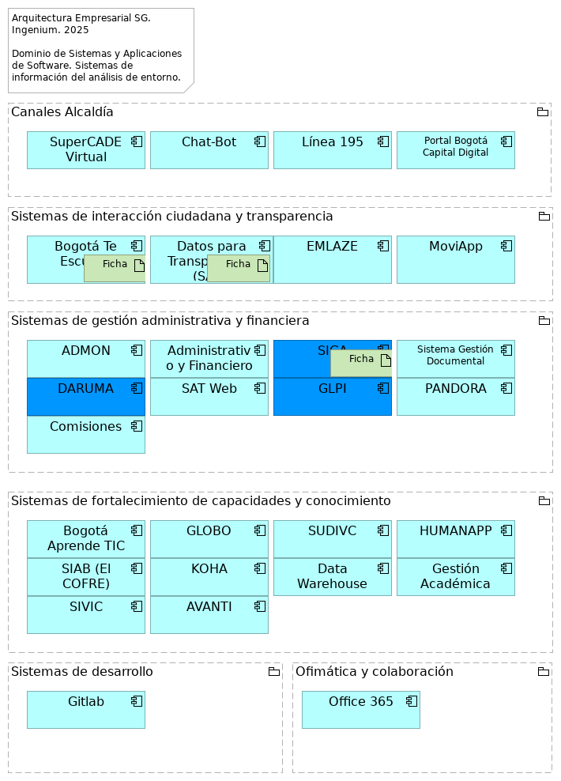

## Caracterización de Sistemas Información SG

> Arquitectura Empresarial SG.  Ingenium. 2025  Dominio de Sistemas y Aplicaciones de Software. Sistemas de información del análisis de entorno.  

 

## Producto Entregable Caracterización de los sistemas de información
Arquitectura de aplicaciones - MAE.LI.ASI.03 Caracterización de los sistemas de información SG.

Inventario de las sistemas de información (o aplicaciones de software) de $CLIENTE y su ficha de características, pertenecientes al alcance del ejercicio actual de arquitectura empresarial objeto del contrato.

Es un inventario detallado y documentado que contiene las fichas técnicas de los sistemas de información de una institución.

## Justificación
El catálogo y caracterización de las aplicaciones de $CLIENTE es un artefacto clave para documentar, comprender, y comunicar el panorama actual y futuro de las aplicaciones de SG. el panorama actual y futuro de las aplicaciones de $CLIENTE. A la vez, es base para la toma de decisiones de la gestión y gobierno de las capacidades de TI, y del portafolio y ciclo de vida de las aplicaciones de $CLIENTE. Sirve además para la actualización continua de las características y atributos relevantes de los sistemas de información.

## Objetivos
1. Documentar y comunicar el panorama actual y futuro de las aplicaciones de SG.
1. Proveer base para la toma de decisiones de la gestión del portafolio y del ciclo de vida de las aplicaciones de SG.
1. Facilitar la actualización de su información. Para el efecto, debe usar medios y formatos accesibles y editables por SG.

## Contenido
1. Catálogo de sistemas de información seleccionadas. El catálogo relaciona datos individuales e importantes de los sistemas. Incluye la descripción, e identificación de cada aplicación, relación con dominio de negocio, información para la gestión y mantenimiento del sistema.
    * ID de Aplicación
    * Nombre de la Aplicación
    * Descripción
    * Tipo de Aplicación
    * Dominio de Negocio
    * Proceso(s) de Negocio Clave(s)
    * Tecnología Clave
    * Proveedor/Desarrollador
    * Versión Actual
    * Estado

1. Caracterización de los sistemas de información del catálogo es la ficha técnica que complementa al catálogo. Incluye datos como actores, subsistemas y componentes candidatos, relaciones base de primer grado, atributos, integraciones candidatas y las acciones o intervenciones a realizar. 
    1. Identificación y Descripción General
    1. Contexto de Negocio: propietario, capacidades o procesos, nivel de criticidad para el negocio.
    1. Aspectos Técnicos y Arquitectónicos
    1. Gestión y Mantenimiento: costos recurrentes, como licencias, uso de plataforma, soporte del proveedor; recursos de personal asignado; percepción del valor de negocio aportado.
    1. Estrategia y Relaciones Clave: alineación con la visión de $CLIENTE, proyectos planificados participantes.

{#fig:id-adad9ef6534c4bf486404fd53431de2a width= height=}

### Canales Alcaldía

### SuperCADE Virtual
Red de canales presenciales de atención a ciudadanía.

### Chat-Bot
Canal web de atención a ciudadanía.

### Línea 195
Canal telefónico de atención a ciudadanía.

### Portal Bogotá Capital Digital
Plataforma de Trámites en línea. Portal Integrador de trámites y servicios ofrecidos a la ciudadanía. Componente de aplicación que permite la realización de trámites digitales.

### Sistemas de interacción ciudadana y transparencia

### Bogotá Te Escucha
Sistema de información para la administración, registro, atención, seguimiento y control de las peticiones, quejas, reclamos, solicitudes de información, denuncias y sugerencias que reciban las entidades del distrito capital por los diferentes canales. Fundamental para el proceso de Gobierno abierto y relacionamiento con la ciudadanía. También se menciona como el Sistema Distrital para la Gestión de Peticiones Ciudadanas, a través del cual se evalúa la calidad de las respuestas emitidas a la ciudadanía.

### Ficha

| **Nombre aplicación**                     | Bogotá Te Escucha                                                                                                                                                                                                                                            |
| ----------------------------------------- | ------------------------------------------------------------------------------------------------------------------------------------------------------------------------------------------------------------------------------------------------------------ |
| **Descripción Funcional**                 | Sistema de información para la administración, registro, atención, seguimiento y control de las peticiones, quejas, reclamos, solicitudes de información, denuncias y sugerencias que reciban las entidades del distrito capital por los diferentes canales. |
| **Tipo de software**                      | Desarrollo Interno                                                                                                                                                                                                                                           |
| **Estado**                                | Productivo                                                                                                                                                                                                                                                   |
| **Esquema de licenciamiento**             | A perpetuidad                                                                                                                                                                                                                                                |
| **Fabricante**                            | Secretaría General de la Alcaldía Mayor de Bogotá D.C.                                                                                                                                                                                                       |
| **Debilidades o hallazgos estructurales** | Ninguna                                                                                                                                                                                                                                                      |

### Datos para Transparencia (SATI)
Sistem de tableros de control con datos relevantes, actualizados y comprensibles, incluyendo alertas tempranas contra la corrupción. Plataforma que facilita el acceso a datos e información gubernamental. Soporta el proceso de Gobierno abierto y relacionamiento con la ciudadanía.

### Ficha

| **Nombre aplicación**                     | Datos para la Transparencia (SATI)                                                                                        |
| ----------------------------------------- | ------------------------------------------------------------------------------------------------------------------------- |
| **Descripción Funcional**                 | Tableros de control con datos relevantes, actualizados y comprensibles, incluyendo alertas tempranas contra la corrupción |
| **Tipo de software**                      | Desarrollo Interno                                                                                                        |
| **Estado**                                | Productivo                                                                                                                |
| **Esquema de licenciamiento**             | A perpetuidad                                                                                                             |
| **Fabricante**                            | Secretaría General de la Alcaldía Mayor de Bogotá D.C.                                                                    |
| **Debilidades o hallazgos estructurales** | Lanzamiento del nuevo diseño de la plataforma de datos para la transparencia.                                             |

### EMLAZE
Sistema para la planeación de recursos empresariales (ERP) de la Imprenta Distrital y control de ejecución y consumo de insumos en el ejercicio de imprenta.

### MoviApp
Canal móvil de atención a ciudadanía. Sesión levantamiento no. 2.

### Sistemas de gestión administrativa y financiera

### ADMON
Se relaciona con la gestión financiera, gestión de servicios administrativos y tecnológicos, y gestión de recursos físicos.

### Administrativo y Financiero
Sistema de soporta la gestión financiera, gestión de servicios administrativos y tecnológicos, y gestión de recursos físicos. Incluye los siguientes módulos/sistemas: Módulo de Personal y Nómina (PERNO, heredado de SICAPITAL), Administración de costos y facturación de los Cades y Supercades (FACTURACIÓN), Libro Mayor (LIMAY, heredado de SICAPITAL), Sistema de control de gestión de elementos de consumo (SAE, heredado de SICAPITAL), Sistema control de gestión de elementos devolutivos (SAI, heredado de SICAPITAL), Registro y control de la información de presupuesto de la Secretaría General (SIPRES), Sistema para manejo y control del presupuesto de regalías (SIPRES REGALIAS), Registro y control de la información contractual de la Secretaría General (CONTRACTUAL), Sistema para manejo de contratos con presupuesto de regalías (CONTRACTUAL REGALIAS).

### SIGA
Sistema Integrado de Gestión Documental, Archivo y Correspondencia.

### Ficha

| **Nombre aplicación**                     | SIGA                                                                |
| ----------------------------------------- | ------------------------------------------------------------------- |
| **Descripción Funcional**                 | Sistema Integrado de Gestión Documental, Archivo y Correspondencia. |
| **Tipo de software**                      | Desarrollo Interno                                                  |
| **Estado**                                | Productivo                                                          |
| **Esquema de licenciamiento**             | A perpetuidad                                                       |
| **Fabricante**                            | Secretaría General de la Alcaldía Mayor de Bogotá D.C.              |
| **Debilidades o hallazgos estructurales** | Ninguna                                                             |

### Sistema Gestión Documental
Componente de aplicación para la gestión electrónica de documentos.

### DARUMA
Sistema para el registro de documentos de procesos, procedimientos, formatos, entre otros, como insumos de la Gestión de Calidad.

### SAT Web
Sistema de Asignación de Turnos en los puntos de atención a la ciudadanía (Red Cade).

### GLPI
Sistema de soporta a la gestión de servicios administrativos y tecnológicos, donde se registran y gestionan las solicitudes de servicios TIC.

### PANDORA
Implementación de temas precontractual y planeación.

### Comisiones
Sesión levantamiento no. 1.

### Sistemas de fortalecimiento de capacidades y conocimiento

### Bogotá Aprende TIC
Portal de apoya los procesos de Gobierno abierto y relacionamiento con la ciudadanía, y Fortalecimiento de la Gestión Pública.

### GLOBO
Registro de acciones de cooperación internacional. Utilizado en el proceso de Fortalecimiento de la Gestión Pública.

### SUDIVC
Sistema Unificado Distrital de Inspección, Vigilancia y Control – SUDIVC.

### HUMANAPP
Apoya la gestión del talento humano. Aplicativo de generación de desprendibles de pago para funcionarios y certificaciones laborales, de seguridad social y de ingresos y retenciones.

### SIAB (El COFRE)
Sistema de Información del Archivo de Bogotá SIAB. Permite automatizar los procesos archivísticos y técnicos que realiza el Archivo, tales como llevar un registro de los Ingresos Documentales (antes área de acopio), para la descripción y catalogación de la documentación, propios del proceso de Gestión de la Función Archivística y del Patrimonio Documental, para su custodia y conservación permanente. Utilizado en los procesos de Gobierno abierto y relacionamiento con la ciudadanía, y Fortalecimiento de la Gestión Pública.

### KOHA
Sistema Integrado de Gestión de Bibliotecas. Relacionado con la Gestión del conocimiento.

### Data Warehouse
Almacenes de datos de trabajo de SG. Bodega de datos con diversas fuentes de información para el análisis y transformación de datos de interés.

### Gestión Académica
Moodle para capacitación de servidores de la Entidad en diferentes temas. Relacionado con la Gestión del conocimiento.

### SIVIC
Sistema de Información de Víctimas de Bogotá para registrar la gestión de atención integral a las víctimas. Interviene en los procesos de Paz, víctimas y reconciliación, y Fortalecimiento de la Gestión Pública. Interviene en los procesos de Paz, víctimas y reconciliación, y Fortalecimiento de la Gestión Pública.

### AVANTI
Sistema de Información para registrar avance de programación y seguimiento de metas plan de desarrollo de las entidades distritales SDARIV relacionadas con atención integral a las víctimas.

### Sistemas de desarrollo

### Gitlab
Plataforma de desarrollo de software y colaboración.

### Ofimática y colaboración

### Office 365
Herramientas de ofimática y colaboración SG.

---
lang: en
titlepage: true
titlepage-rule-color: 360049
todo: aun no está lista
...

