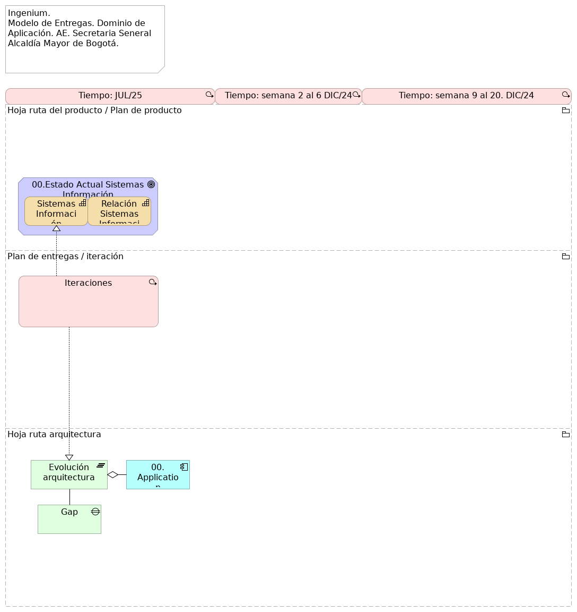

\newpage

# Servicios de Ingeniería $APP $CLIENTE

## 03.ENTRG.1n. Modelo de Entregas

> Ingenium.  Modelo de Entregas. Dominio de Aplicación. AE. Secretaria Seneral Alcaldía Mayor de Bogotá.   

 

{#fig:id-b7aa07be1bf34794b7ab18f800fd4d63 width=5in height=}

### Elementos del Modelo

| Nombre  | Tipo | Documentación |
|---------|------|---------------|
| Hoja ruta del producto / Plan de producto | Grouping |  |
| Ciclo. Entrega 3 | Value | Versión 2.1. Solución integración JEP. |
| Ciclo. Entrega 3 | Value | Versión 1.1. Solución integración JEP. |
| Plan de entregas / iteración | Grouping |  |
| Deliverable 1 | Deliverable | Definición de la Arquitectura de Referencia de la Entidad (situación actual del dominio aplicaciones, referencia cero). |
| Deliverable 2 [ver i+1] | Deliverable | (...) que contenga el modelo de alto nivel, en el cual se visualicen sistemas de información existentes y su interrelación. |
| Hoja ruta arquitectura | Grouping |  |

Table: Elementos de la vista. {#tbl:tblelement-03.ENTRG.1n.ModelodeEntregas-id}

 

---
lang: en
titlepage: true
titlepage-rule-color: 360049
todo: aun no está lista
...

