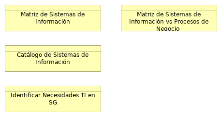

## Entregables Fase I de la Visión AE de SG

> 

 

{#fig:id-0993b3b264144f84abe5c7031666fede width= height=}

### Visión

### Contexto de Arquitectura de Sistemas de Información SG
Desde el dominio de aplicaciones y sistemas de información de la Secretaría General, llamada en adelante “la arquitectura de sistemas de Información de SG”, buscamos adelantar las especificaciones de las arquitecturas objetivo de los sistemas de información de $CLIENTE que soporten la arquitectura de negocio y datos, en línea y dentro del alcance de la visión establecida en el primer entregable de este ejercicio de arquitectura empresarial de SG (AESG).

En particular, la arquitectura de sistemas de información de SG se plantea, dentro del alcance de la visión del ejercicio:

* Definir la arquitectura de las aplicaciones (SI) necesarias para soportar los procesos de negocio de SG.
* Identificar las funciones de negocio que deben ser soportadas por las aplicaciones de SG.
* Establecer la interacción y el flujo de información entre las diferentes aplicaciones de SG.
* Considerar aspectos sistémicos como la escalabilidad, el rendimiento, la mantenibilidad y la seguridad de las aplicaciones de SG.
* Listar los capacidades de negocio (servicios de aplicación) relacionadas con las arquitecturas de aplicaciones de SG.

De esta manera, la arquitectura de sistemas de SG contribuye a la consecución de la visión de este ejercicio de arquitectura empresarial SG (AESG); y en lo específico, contribuye a los fines de la arquitectura de negocio y tecnológica de SG, a delinear oportunidades y soluciones, y a soportar la planeación de la migración. Todo lo anterior dentro del alcance consignado en este ejercicio.

#### Alcance
El presente ejercicio de la arquitectura dominio de aplicaciones toma como alcance horizontal las áreas o unidades siguientes de la SG (_fuente: sesiones de levantamiento, entrevistas, y cuestionarios compartidos en el mes de julio del 2025, junto con la recopilación estructurada de las fuentes de información y organigramas_):

Unidades de negocio del alcance del dominio:

* Secretaría Privada
    * Oficina Consejería Distrital de Comunicación. César Augusto Castro Rodríguez
    * Oficina Consejería Distrital de Tecnologías de la Información y las Comunicaciones -TIC. Diana Celis Mora
* Despacho del Secretario General. Miguel Andrés Silva Moyano
    * Oficina de Tecnologías de la Información y las Comunicaciones. Arleth Patricia Saurith Contreras
    * Subsecretaría Distrital de Fortalecimiento Institucional. Alejandra Rodas Gaiter
        * Dirección Distrital de Desarrollo Institucional. Sebastian Estrada Jaramillo
            * Subdirección Técnica de Desarrollo Institucional. Diego Canesco Arenas
    * Subsecretaría de Servicio a la Ciudadanía . Adriana Vargas Tamayo
        * Dirección del Sistema Distrital de Servicio a la Ciudadanía. Enrique Cusba García
    * Subsecretaría Corporativa. Henry Villamarín Serrano

En cuanto al alcance vertical, las aplicaciones de software que están consignadas en este ejercicio son las siguientes (_fuente: sesiones de levantamiento, entrevistas, y cuestionarios compartidos en el mes de julio del 2025, junto con la recopilación estructurada de las fuentes de información_):

* ADMON: Se relaciona con la gestión financiera, gestión de servicios administrativos y tecnológicos, y gestión de recursos físicos45.
* Administrativo y Financiero: Soporta la gestión financiera, gestión de servicios administrativos y tecnológicos, y gestión de recursos físicos
* Bogotá Te Escucha: Es fundamental para el proceso de Gobierno abierto y relacionamiento con la ciudadanía5. También se menciona como el Sistema Distrital para la Gestión de Peticiones Ciudadanas, a través del cual se evalúa la calidad de las respuestas emitidas a la ciudadanía
* Bogotá Aprende TIC: Apoya los procesos de Gobierno abierto y relacionamiento con la ciudadanía, y Fortalecimiento de la Gestión Pública
* DARUMA: Se utiliza en el proceso de Fortalecimiento de la Gestión Pública5. También es el aplicativo donde se encuentran definidas las fichas técnicas de productos y servicios de la Secretaría General8 y se gestionan los riesgos estratégicos
* SIGA: Interviene en la gestión de contratación, gestión financiera, gestión de servicios administrativos y tecnológicos, y gestión de recursos físicos
* SAT Web: Relacionado con la gestión de servicios administrativos y tecnológicos
* GLOBO: Utilizado en el proceso de Fortalecimiento de la Gestión Pública
* Datos para la Transparencia (SATI): Soporta el proceso de Gobierno abierto y relacionamiento con la ciudadanía
* SUDIVC: Se aplica en los procesos de Gobierno abierto y relacionamiento con la ciudadanía, Paz, víctimas y reconciliación, y Fortalecimiento de la Gestión Pública
* HUMANAPP: Apoya la gestión del talento humano
* SIAB (El COFRE): Utilizado en los procesos de Gobierno abierto y relacionamiento con la ciudadanía, y Fortalecimiento de la Gestión Pública
* KOHA: Relacionado con la Gestión del conocimiento
* SIVIC: Interviene en los procesos de Paz, víctimas y reconciliación, y Fortalecimiento de la Gestión Pública
* Data Warehouse AVANTI: Apoya la Gestión del conocimiento
* Gestión Académica: Relacionado con la Gestión del conocimiento
* EMLAZE: Utilizado en los procesos de Gobierno abierto y relacionamiento con la ciudadanía, y Fortalecimiento de la Gestión Pública
* GLPI: Soporta la gestión de servicios administrativos y tecnológicos
* GitLab: Se relaciona con la Gestión de alianzas e internacionalización de Bogotá

### Matriz de Sistemas de Información vs Procesos de Negocio
Las matrices del dominio de aplicaciones de software y sistemas de información (SI) de SG son herramientas para el relacionamiento con otros dominios del ejercicio de arquitectura empresarial de SG. Con esto conseguimos soportar la toma decisiones de lo que debe ser compartido de los SI dentro de la Secretaría, y entre sus aplicaciones de software. Las matrices de este ejercicio sirven además para comunicar el grado de relacionamiento de los elementos.

En resumen,

* Las matrices son cruciales para especificar cómo debe relacionarse la información entre los sistemas y otros dominios
* proporcionan información crítica para los proyectos que involucren a los sistemas de SG.
* Contribuye a la determinación de brechas (gaps) en las necesidades de compartir información (o funciones de los sistemas) ente los elementos de la matriz. 
* La matriz ayuda a definir el nivel de detalle de lo que se comparte.
* Se deben establecer medidas similares para la interoperabilidad de servicios/negocios y la infraestructura (tecnología física).
* Sintetizan la información de las arquitecturas, y son simples para compartir documentos.

Las matrices de este dominio (procesos e interoperabilidad) actúan como una hoja de ruta para la conectividad y el intercambio de información; inician desde una perspectiva de negocio de alto nivel y van hasta una especificación técnica detallada del la interacción con los sistemas. Sirven como herramienta de comunicación para los demás dominios de la arquitectura empresarial de SG, y contribuyen a que las interacciones relevantes entre servicios, canales, y procesos estén definidas y sean compatibles.

### Catálogo de Sistemas de Información
En el contexto de TOGAF, El Catálogo de sistemas de información es un inventario detallado y documentado que actúa como ficha técnica de los sistemas de información o aplicaciones de software de SG. 

Es un producto entregable clave de la fase de Arquitectura de Aplicaciones dentro de la Fase 3 de este ejercicio de arquitectura empresarial (AE). Forma parte del Marco de Referencia del Contenido Arquitectónico de TOGAF y del Marco de Arquitectura de Referencia del MinTIC (MAE 3.0, Colombia).

La construcción del catálogo de aplicaciones implican a las sesiones de levantamiento, entrevistas, y cuestionarios compartidos en el mes de julio, junto con la recopilación estructurada de las fuentes de información sobre cada sistema.

#### Contenido Mínimo del Catálogo

* ID de Aplicación. Código de identificación de la aplicación de software.
* Nombre de la Aplicación. Nombre de identificación de la aplicación de software.
* Descripción. Funcionamiento básico de la aplicación de software.
* Estado: [En producción, en desmantelamiento, en implementación, Inactiva]
* Categoría: [Sistema de apoyo al negocio (misional), herramienta de gestión, Ofimática, Seguridad] 
* Proceso(s) de Negocio Clave(s)
* Capacidad: Capacidades de nivel 2 relacionadas con la aplicación de software.
* Tipo de aplicación: Web, Móvil, Cliente Servidor 
* Método de despliegue: on-premises, cloud SAAS, cloud PAAS, cloud IAAS 
* Tecnología. Aspectos técnicos de la aplicación de software.
* Versión actual de la tecnología
* Responsable técnico en la entidad
* Responsable funcional en la entidad
* Fabricante
* Proveedor de soporte externo
* Fecha de vigencia de soporte externo
* Nombre de servidor. Nombre de red del entorno o nodo contenedor de la aplicación de software. 
* Criticidad de negocio

El Catálogo de aplicaciones de SG procura beneficios estratégicos y operativos:

* Unifica la documentación y la comunicación: Es un artefacto clave para documentar, comprender y comunicar el panorama actual y futuro de las aplicaciones.
* Base para la toma de decisiones: Sirve como base para la toma de decisiones en la gestión y gobierno de las capacidades de los sistemas de SG, y del portafolio y ciclo de vida de las aplicaciones.
* Facilita la actualización continua: Permite la actualización continua de las características y atributos relevantes de los sistemas de información.

### Necesidades SI de SG
La construcción de lista de necesidades, preocupaciones y oportunidades implican a las sesiones de levantamiento, entrevistas, y cuestionarios compartidos en el mes de julio, junto con la recopilación estructurada de las fuentes de información sobre cada sistema.

Necesidades de Transformación Digital y Tecnológica
La transformación digital (objetivo estratégico de SG)  es un motor fundamental para alinear las estrategias, procesos y tecnologías de la Secretaría General. Esta transformación busca:

* Impulsar la transformación digital para alinear estrategias, procesos y tecnologías
* (Necesidad) la Modernización y Eficiencia Pública (Driver)
* Cerrar las brechas en la Política de Gobierno Digital, de la cual la Arquitectura Empresarial es un habilitador clave.
* Modernizar la infraestructura tecnológica obsoleta para asegurar su continuidad y disponibilidad.
* Integrar plataformas y ecosistemas digitales y superar la falta de interoperabilidad.
* Automatizar trámites y estandarizar la gestión y gobernanza de datos públicos.
* Adquirir software especializado en análisis de datos para mejorar la toma de decisiones basada en evidencia.
* Generar análisis predictivos y prospectivos de resultados de gestión, que son insumos para la toma de decisiones.
* Contar con disponibilidad de personal adecuado para actualizar plataformas tecnológicas y la gestión de las cargas de trabajo es una necesidad identificada para este eje.
* Aprovechar nuevas tecnologías como la Inteligencia Artificial, la minería de datos, el procesamiento del lenguaje, para mejorar los procesos y la relación con la ciudadanía.

* Abordar los altos costos de la tecnología que limitan la implementación de sistemas avanzados. (??)
* Fortalecer la ciberseguridad y seguridad de la información para proteger la integridad, disponibilidad y confidencialidad de los datos y prevenir ataques.

Necesidades Específicas del Dominio de Aplicaciones de software
Esta capa se refiere al comportamiento de las aplicaciones que apoyan el negocio, la estructura de esas aplicaciones y su relación con los objetos de datos que utilizan.

Para los Componentes de Aplicación (Application Component) y Servicios de Aplicación (Application Service) de SG:

* Adquirir software especializado en análisis de datos: implica la necesidad de incorporar de nuevos componentes de aplicación (Application Component).
* Integrar plataformas y ecosistemas digitales :requiere reforzar la relación entre componentes de aplicación y la exposición de servicios de aplicación (Application Service), y clicar los lineamientos del Marco de Referencia de AE, versión 3.0 al momento, del MinTIC.
* Mejorar la capacidad de las herramientas tecnológicas para el soporte a la toma de decisiones y la gestión: requiere la mejora de las Funcionalidad (Application Function) y Componentes de Aplicación actuales asociadas a esta capacidad.

### Preocupaciones SI de SG
Con base en el estudio de las sesiones de levantamiento, entrevistas, y cuestionarios compartidos en el mes de julio, junto con la recopilación estructurada de las fuentes de información sobre cada sistema, identificamos las siguientes preocupaciones (y debilidades) de SG relacionadas con el dominio de sistemas de información, dentro del alcance de este ejercicio.

1. Deficiente apropiación del conocimiento en procesos de tecnologías de la información, lo que genera demora en la solución de los servicios de tecnologías de la información [2].
2. Equipos tecnológicos obsoletos que generan dificultad en la ejecución de las actividades que desarrolla la entidad [3].
3. Fallas recurrentes en el funcionamiento de los sistemas de información y plataformas tecnológicas de la entidad, que afectan la continuidad del servicio y generan retrasos y reprocesos en la ejecución de las actividades [4].
4. Insuficiencia en la capacidad de las herramientas tecnológicas de la entidad que pueden obstaculizar la obtención y descarga de material probatorio relevante para el adelantamiento de procesos disciplinarios [5].
5. Falta de un software que le permita a la entidad extraer una información dinámica que sirva como insumo para la toma de decisiones [6].
6. Se realizan análisis descriptivos, pero no predictivos y prospectivos de los resultados de la gestión de la entidad, lo que dificulta la toma de decisiones basada en evidencia [7].
7. Falta de personal para actualizar las plataformas tecnológicas, lo que genera retrasos en la operación de la entidad [8].
8. Deficiente conectividad y falta de interoperabilidad de las plataformas tecnológicas [8].
9. Cambios en las plataformas tecnológicas que no interactúan con las anteriores, generando posibles pérdidas de información y reprocesos [9].
10. La inestabilidad de la conectividad, indisponibilidad de servidores de información y vulnerabilidad en la seguridad informática, lo que puede comprometer la operatividad, la integridad de los datos críticos de la entidad y el cumplimiento de las metas [10].
11. La vulneración de la inviolabilidad de acceso a cuentas de correo institucionales y aplicativos, lo que afecta la reserva de la información relacionada con el trámite de procesos disciplinarios [10].
12. Obsolescencia tecnológica que implica la necesidad de renovación de los equipos y dificulta la prestación de los servicios de la entidad [11].
13. Los altos costos de la tecnología pueden limitar la capacidad de la entidad para implementar y mantener sistemas avanzados y eficientes [11].
14. Materialización de riesgos asociados a ataques cibernéticos, e ingeniería social, suplantación de identidad, entre otros, que ponen en riesgo la seguridad de la información y los documentos (pérdida de la confidencialidad, integridad y disponibilidad de la información) y afectan la continuidad operativa [12].
15. Estas debilidades resaltan la necesidad de modernizar la infraestructura y sistemas tecnológicos, mejorar la gestión de datos para análisis predictivos, fortalecer la ciberseguridad, y asegurar la capacitación y el personal adecuado para la gestión tecnológica [2-12].

### Oportunidades SI de SG
La construcción de lista de oportunidades mencionadas implica el estudio de las sesiones de levantamiento, entrevistas, y cuestionarios compartidos en el mes de julio, junto con la recopilación estructurada de las fuentes de información al respecto de cada sistema de SG.

Fuente: Sección "10.15.1 Resultado de la gestión de las oportunidades vigencia 2023" del documento "contexto_estrategico_-4202000-ot-066-_v05.pdf" [1-13], 

Las oportunidades tecnológicas y de mejora de sistemas de información mencionadas indicadas en estas fuentes se centran en:

* Modernización de la infraestructura y sistemas tecnológicos,
    * Las nuevas tecnologías, especialmente la Inteligencia Artificial (IA), ofrecen la oportunidad de mejorar los procesos y herramientas de relacionamiento con la ciudadanía [15]. Bogotá ya ha empezado a incorporar tecnologías como IA, Big Data e Internet de las Cosas (IoT) en la planificación urbana y la prestación de servicios [16].
    * Una oportunidad es la adquisición de software especializado en análisis de datos para la toma de decisiones que ya poseen otras entidades [17].

* Integración y automatización de procesos, 
    * Se identifican oportunidades para tener herramientas que evalúen el soporte tecnológico personalizado, flexible y configurable para las operaciones de los procesos jurídicos [26].
    * Se buscan mejores controles e integración del sistema de régimen legal de la Secretaría Jurídica [27].
    * También se necesitan mejores controles e integración de los sistemas de información como, los sistemas GLOBO (de gestión internacional), el sistema de proyectos GLPI, entre otros

* Fortalecimiento de la seguridad digital, 
    * Una oportunidad es la adquisición de software especializado en análisis de datos para la toma de decisiones que ya poseen otras entidades [17].

* Mejora de la comunicación pública a través de medios digitales, 
    * Se busca la consolidación de herramientas, canales e información para fortalecer la oferta y celeridad de servicios y la participación ciudadana [11]. Esto incluye el seguimiento a canales de atención virtual como SuperCADE Virtual, chat, chat-Bot y videollamadas de la línea 195 [11].
    * Se busca optimizar los procesos de recolección, análisis y divulgación de la información mediante la implementación de sistemas de información que contengan la automatización de la recolección de datos y el uso de herramientas analíticas [15].
    * Una noticia reciente destaca que el Distrito unifica en el portal Bogotá su oferta de trámites y servicios, el cual permite acceder a más de 1.400 trámites y servicios y realizar pagos en línea (no tributarios) y agendamiento de citas en la RedCADE desde casa [40]. Esto representa una mejora significativa en la accesibilidad y eficiencia de los servicios digitales para la ciudadanía.

* Capacitación en nuevas tecnologías (...).

* Implementación de la Arquitectura Empresarial como estrategia para impulsar la transformación digital y la eficiencia en la gestión pública de la SG.
    * Se espera que la Arquitectura Empresarial fortalezca la transparencia y rendición de cuentas al estandarizar procesos y sistemas de información, aumentando la confianza de la ciudadanía en la Gestión Pública [25].
    * Es requerido que este ejercicio beneficie a la SG con la entrega de activos como hojas de ruta, catálogos y caracterización de los sistemas de información, matrices de interacción, entre otros.

---
lang: en
titlepage: true
titlepage-rule-color: 360049
todo: aun no está lista
...

