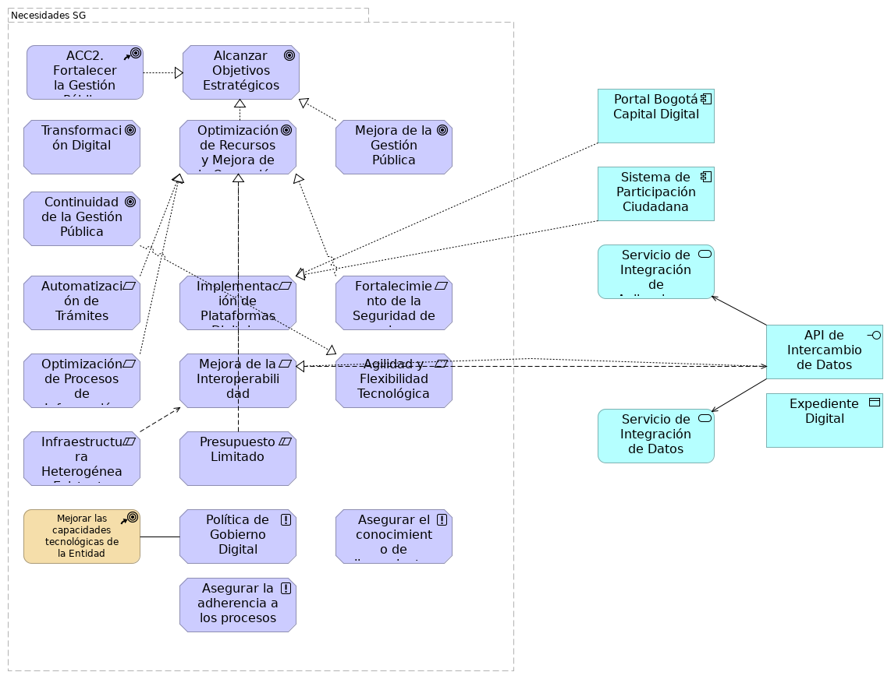

# Situación Actual Sistemas Información SG (view)
* [Situación Actual. Sistemas de Información SG](#situación-actual.-sistemas-de-información-sg)
	* [Planteamiento de Arquitectura Empresarial](#planteamiento-de-arquitectura-empresarial)
	* [Diagnóstico de Debilidades Tecnológicas](#diagnóstico-de-debilidades-tecnológicas)
	* [Brechas TIC SG](#brechas-tic-sg)
	* [1. Introducción y Contexto Estratégico](#1.-introducción-y-contexto-estratégico)

\newpage

# Situación Actual. Sistemas de Información SG

## Necesidades y Aplicaciones

> 

 

La Secretaría General de la Alcaldía Mayor de Bogotá D.C. está impulsando un ejercicio de Arquitectura Empresarial (AE) con el propósito de fortalecer su gestión pública y alcanzar sus objetivos estratégicos.

{#fig:id-73084877ba5b4f859a7aa197be93b750 width= height=}

### Necesidades SG

### ACC2. Fortalecer la Gestión Pública
Objetivo de TI de alto nivel optimizar (mejorar la eficiencia y eficacia) los procesos y servicios de la administración pública.

### Alcanzar Objetivos Estratégicos
Meta general de la Secretaría General para cumplir con su misión y visión.
### Transformación Digital
Objetivo clave relacionado con la modernización y digitalización de los servicios y operaciones.

La transformación digital es un motor fundamental para alinear las estrategias, procesos y tecnologías de la Secretaría General. Esta transformación busca:

* Cerrar las brechas en la Política de Gobierno Digital, de la cual la Arquitectura Empresarial es un habilitador clave.
* Modernizar la infraestructura tecnológica obsoleta para asegurar su continuidad y disponibilidad.
* Integrar plataformas y ecosistemas digitales y superar la falta de interoperabilidad.
* Automatizar trámites y estandarizar la gestión y gobernanza de datos públicos.
* Adquirir software especializado en análisis de datos para mejorar la toma de decisiones basada en evidencia.
* Generar análisis predictivos y prospectivos de resultados de gestión, que son insumos para la toma de decisiones.
* Aprovechar nuevas tecnologías como la Inteligencia Artificial para mejorar los procesos y la relación con la ciudadanía.
* Fortalecer la ciberseguridad y seguridad de la información para proteger la integridad, disponibilidad y confidencialidad de los datos y prevenir ataques.
* La disponibilidad de personal adecuado para actualizar plataformas tecnológicas es una necesidad identificada para este eje, y los altos costos de la tecnología representan una limitación.
### Optimización de Recursos y Mejora de la Operación
Objetivo de mejorar la eficiencia en el uso de los recursos y la calidad de las operaciones internas.
### Mejora de la Gestión Pública
Objetivo general de elevar la calidad y el impacto de la gestión gubernamental.
### Continuidad de la Gestión Pública
Objetivo de asegurar que los programas y proyectos perduren entre diferentes administraciones.
### Automatización de Trámites
Necesidad de digitalizar y automatizar los procesos de interacción con los ciudadanos.
### Implementación de Plataformas Digitales
Requisito para desarrollar o adquirir sistemas para trámites y participación ciudadana.
### Fortalecimiento de la Seguridad de la Información
Necesidad de proteger los datos y sistemas contra amenazas y vulnerabilidades.
### Optimización de Procesos de Información
Requisito para mejorar la eficiencia y calidad en el manejo de la información.
### Mejora de la Interoperabilidad
Necesidad de asegurar la comunicación y el intercambio de datos entre diferentes sistemas.
### Agilidad y Flexibilidad Tecnológica
Requisito para que las soluciones tecnológicas puedan adaptarse rápidamente a nuevos cambios.
### Infraestructura Heterogénea Existente
Restricción derivada de la diversidad de sistemas y tecnologías ya implementadas.
### Presupuesto Limitado
Restricción financiera para la ejecución de iniciativas y proyectos.
### Mejorar las capacidades tecnológicas de la Entidad
Meta de TI para modernizar y potenciar la infraestructura y habilidades tecnológicas.
### Política de Gobierno Digital
Principios que guiarán el diseño y la evolución de la arquitectura de solución. Son declaraciones de intención de la SG que deben ser cumplidas.
### Asegurar el conocimiento de lineamientos y directrices
Principios de gobernanza interna.
### Asegurar la adherencia a los procesos y procedimientos establecidos
Principios de gobernanza interna.
### Portal Bogotá Capital Digital
Plataforma unificada creada por la Secretaría General de la Alcaldía Mayor de Bogotá para facilitar el acceso de la ciudadanía a más de 1.400 trámites y servicios en línea.

### Sistema de Participación Ciudadana
Componente de aplicación para facilitar la interacción y el acercamiento (realimentación) de los ciudadanos.

### Servicio de Integración de Aplicaciones
Servicio de aplicación para la unificación y el intercambio de funcionalidades.
### API de Intercambio de Datos
Interfaz de aplicación para permitir la comunicación entre diferentes sistemas.
### Expediente Digital
Objeto de datos en la capa de aplicación que representa un expediente electrónico.
### Servicio de Integración de Datos
Servicio de aplicación para la unificación y el intercambio de información.

---
lang: en
titlepage: true
titlepage-rule-color: 360049
todo: aun no está lista
...

## Diagnóstico de Sistemas de Información SG (análisis de entorno)

> Arquitectura Empresarial Secretaría General Alcaldía Mayor Bogotá.  Ingenium. 2025  Dominio de Sistemas y Aplicaciones de Software gestionadas por la OTIC. Sistemas de información del análisis de entorno.   

 

Basado en el análisis de las matrices DOFA (Matriz de Evaluación de Factores Internos - MEFI y Matriz de Evaluación de Factores Externos - MEFE), se han identificado las siguientes debilidades tecnológicas:

* Sistemas de Información y Datos
      * Fallas recurrentes en el funcionamiento de los sistemas de información y plataformas tecnológicas, que afectan la continuidad del servicio y generan retrasos y reprocesos.
      * Insuficiencia en la capacidad de las herramientas tecnológicas para la obtención y descarga de material probatorio relevante [8].
      * Falta de un software que permita extraer información dinámica para la toma de decisiones [9].
      * Se realizan análisis descriptivos, pero no predictivos y prospectivos de los resultados de la gestión, dificultando la toma de decisiones basada en evidencia [10].
      * Cambios en las plataformas tecnológicas que no interactúan con las anteriores, generando posibles pérdidas de información y reprocesos [11].

* Infraestructura Tecnológica
      * Equipos tecnológicos obsoletos que dificultan la ejecución de las actividades [12].
      * Deficiente conectividad y falta de interoperabilidad de las plataformas tecnológicas [13].
      * Inestabilidad de la conectividad e indisponibilidad de servidores de información, comprometiendo la operatividad y el cumplimiento de metas [14].
      * Obsolescencia tecnológica generalizada que implica la necesidad de renovación de equipos y dificulta la prestación de servicios [15].
      * Los altos costos de la tecnología pueden limitar la capacidad para implementar y mantener sistemas avanzados.

* Seguridad Informática
      * Vulnerabilidad en la seguridad informática, que puede comprometer la integridad de los datos críticos y la continuidad operativa.
      * Vulneración de la inviolabilidad de acceso a cuentas de correo institucionales y aplicativos, afectando la reserva de la información.
      * Materialización de riesgos asociados a ataques cibernéticos, ingeniería social y suplantación de identidad, poniendo en riesgo la seguridad de la información y los documentos (pérdida de confidencialidad, integridad y disponibilidad).

* Gestión del Conocimiento y Capacidades Humanas:
      * Deficiente apropiación del conocimiento en procesos de tecnologías de la información, generando demora en la solución de servicios.
      * Falta de personal para actualizar las plataformas tecnológicas, lo que genera retrasos en la operación.

* Un objetivo clave de la transformación digital es la integración de sistemas de información entre entidades públicas y privadas: busca mejorar la eficiencia en la operación y el uso de datos de manera colaborativa y con calidad. 
* La estandarización de procesos y sistemas de información también contribuye a la transparencia y rendición de cuentas, fortaleciendo la confianza ciudadana en la Gestión Pública.
* El Plan Nacional de Desarrollo "2022-2026 Colombia, potencia Mundial de la vida" busca fortalecer el Gobierno Digital para una relación más eficiente entre el Estado y el ciudadano, utilizando datos y tecnologías digitales para mejorar la calidad de vida. 
* El Plan Distrital de Desarrollo "Bogotá Camina Segura 2024-2027" también busca incrementar el Índice de Gobierno Digital y elevar el Índice de Calidad del Servicio y el Índice de Gestión Pública Distrital, con la Arquitectura Empresarial jugando un papel habilitador fundamental para la política de Gobierno Digital.

Es importante destacar que el proveedor seleccionado deberá realizar la transferencia de conocimiento sobre el manejo técnico y funcional de la Herramienta de Arquitectura Empresarial (Repositorio) con la que cuente la Entidad. Esta herramienta se utilizará para cargar toda la documentación, modelos, artefactos y demás componentes actualizados resultantes de los ejercicios de AE.

{#fig:id-8de5bdda7a914cf9b23955213301db39 width= height=}

### Elementos del Modelo

| Nombre  | Tipo | Documentación |
|---------|------|---------------|
| Canales Alcaldía Mayor de Bogotá | Grouping |  |
| SuperCADE Virtual | Application Component | Plataforma digital desarrollada por la Secretaría General de la Alcaldía Mayor de Bogotá que permite a la ciudadanía acceder de manera rápida y segura a más de 200 trámites y servicios en línea, sin necesidad de desplazarse físicamente.  
 |
| Chatico | Application Component | Agente virtual basado en inteligencia artificial que facilita el acceso de la ciudadanía a información sobre trámites, servicios, ayudas distritales y participación ciudadana. Chatico está disponible a través de la página web oficial y por WhatsApp (+57 316 0231524).
 |
| Línea 195 | Application Component | Canal telefónico oficial de atención ciudadana operado por la Secretaría General de la Alcaldía Mayor de Bogotá. creado para ofrecer información clara, veraz y oportuna sobre trámites, servicios, campañas y entidades del Distrito Capital.
 |
| Página Web Observatorio de Víctimas del conflicto Armado | Application Component | Conflicto armado de Bogotá D.C. reportadas por la Oficina Consejería Distrital de Paz, Victimas y Reconciliacion |
| Portal Bogotá Historia Común 2.0 | Application Component | Portal Bogotá Historia Común 2.0	Bogotá historia común 2.0 es un proyecto de la Secretaría General de la Alcaldía Mayor de Bogotá, a través del Archivo de Bogotá, que propone nuevas formas de reconstruir, recuperar y conectar las memorias barriales y vecinales de la ciudad, brindando acceso libre a los testimonios, textos, audios, videos y fotografías que forman parte del patrimonio documental bogotano. https://archivobogota.secretariageneral.gov.co/proyectos-estrategicos/bogota-historia-comun/.
 |
| Portal Consejería Distrital de TIC | Application Component | Sitio web institucional de la Alta Consejería Distrital de TIC. |
| Portal Bogotá | Application Component | Portal de la Alcaldía Mayor de Bogotá orientado a la publicación de la Gestión del alcalde, noticias de entidades y noticias de las localidades.
 |
| Carteleras Externas | Application Component | Portales de visualización pública a la ciudadanía en los sitios de atención. |
| Carteleras Internas | Application Component | Portales de  visualización pública a los funcionarios y contratistas de la Secretaría General. |
| Portal Sede Electrónica Secretaría General | Application Component | Sitio web oficial de la Secretaría General. Se publica información pública y en cumplimiento de obligaciones legales. |
| Portal Centro Memoria | Application Component | Herramienta de información para el fomento de la cultura y los derechos humanos. Publica experiencias vividas para las víctimas del conflicto armado en Colombia. Sitio http://centromemoria.gov.co.
 |
| Portal Archivo de Bogotá | Application Component | Sitio web institucional del Archivo de Bogotá. |
| Intranet | Application Component | Sistema web que presta los servicios para actualizar, administrar, monitorear y optimizar la comunicación interna de la entidad, sirve como como instrumento de divulgación de información vital e importante de la entidad.
 |
| SuperCADE Bus Transaccional | Application Component | Aplicación de software que permite la interoperabilidad de los procesos del Distrito, con el fin de realizar trámites en Línea. Página web que redirige a servicios del Súper CADE.
 |
| Portal Web de Gobierno abierto de Bogotá - GAB | Application Component | Portal que soporta el Gobierno Abierto de Bogotá. Cuenta con distintas secciones: datos destacados de la contratación distrital, datos distritales, datos abiertos, agendas abiertas, entre otros. https://gobiernoabiertobogota.gov.co/.
 |
| Sistemas de interacción ciudadana y transparencia | Grouping |  |
| Articulado de Alertas Tempranas (SAAT) | Application Component | Sistema de apoyo a la estrategia de la Secretaría Distrital de la Mujer (ley Ley 248 de 1995 y Ley 1257 de 2008): identificación del riesgo posible víctima, gestión del riesgo y reducción del riesgo.
 |
| Datos para Transparencia (SATI) | Application Component | Sistema de tableros de control con datos relevantes, actualizados y comprensibles. Incluye alertas tempranas contra la corrupción para facilitar la interacción y el acercamiento (realimentación) de los ciudadanos. Plataforma que facilita el acceso a datos e información gubernamental. Soporta al proceso de Gobierno abierto y relacionamiento con la ciudadanía.
 |
| Bogotá Te Escucha | Application Component | Sistema para el registro de peticiones, quejas y sugerencias de la ciudadanía |
| Portal de la Consejería de Paz, Víctimas y Reconciliación | Application Component | Portal donde se publican noticias y eventos relacionados con la misionalidad de la  Consejería de Paz, Víctimas y Reconciliación. |
| Información Víctimas de Bogotá | Application Component | Módulo Integrado de Reportes del Sistema. Sistema de Información de Víctimas de Bogotá - Para registrar la gestión de atención integral a las víctimas. Sistema que utiliza el operador externo para realizar entregas de Ayuda Humanitaria Inmediata. |
| Gobierno Abierto de Datos | Application Component | Portal para la publicación de datos abiertos de Distrito con el fin de ser consultados por la Ciudadanía y utilizados en toma de decisiones o análisis de información.
 |
| Contratación a la vista | Application Component | Sistema de registro de contratos distritales |
| Registro Distrital  | Application Component | Se publican todos los actos administrativos del Distrito, de cara al ciudadano. |
| MoviApp | Application Component | Aplicación móvil para ejercer la movilidad responsable, a través del uso generalizado de la bicicleta entre los funcionarios de las diferentes dependencias de la alcaldía. Aplicativo que permite el uso el registro del uso en bicicleta por parte de los funcionarios de las entidades del Distrito.
 |
| Alertas Tempranas contra la Corrupción | Application Component | Sistema Alertas Tempranas contra la Corrupción |
| Asignación de Turnos | Application Component | Sistema de Asignación de Turnos en los puntos de atención de la ciudad (Cades, Súper Cades, puntos de encuentro) |
| Sistemas en desarrollo | Grouping |  |
| Gestión Instancias de Coordinación | Application Component | Aplicación de software para facilitar la interacción y el acercamiento de los ciudadanos.
 |
| Agente MIPG | Application Component | Agente de inteligencia artificial para MIPG y temas institucionales de entidades distritales.
 |
| Flujos Automatizados de Procesos Empleado con TH y Contratistas | Application Component | Flujos automatizados de procesos de empleado con TH y contratistas (ausentismos, permisos comisiones, etc.)
 |
| Portal Transaccional (BTE-DWH) | Application Component | Portal oficial de servicios ciudadanos de la Alcaldía de Bogotá. Consulta pagos pendientes, trámites y servicios en línea. https://bogota.gov.co/servicios/inicio
 |
| Gestión para Gestores en Territorio | Application Component | Aplicación de software para recopilación de información de campo de trabajo de gestores territoriales.
 |
| Super App Ciudad | Application Component | Componente de aplicación para facilitar la interacción y el acercamiento (realimentación) de los ciudadanos.
 |
| Tablero Gestión Riesgos Feminicidios | Application Component | Tablero de control para seguimiento de gestión de riesgos de feminicidios en Bogotá. Proyecto sector Bienestar.
 |
| Inteligencia artificial para la organización, clasificación, y descripción de un fondo documental histórico | Application Component | Herramientas de inteligencia artificial para la organización, clasificación, y descripción de un fondo documental histórico del Archivo General de Bogotá.
 |
| Líneas de operación de la Subdirección de Sistema Distrital de Archivos de Bogotá – SSDA | Application Component | Aplicación de software para automatización de los procesos de 4 líneas de operación de la Subdirección de Sistema Distrital de Archivos de Bogotá - SSDA.
 |
| Sistemas de gestión administrativa y financiera | Grouping |  |
| Administrativo y Financiero | Application Component | Grupo de sistema de soporte a la gestión financiera, gestión de servicios administrativos, tecnológicos, y gestión de recursos físicos.
 |
| Personal y Nómina (PERNO) | Application Component | Módulo de Personal y Nómina (PERNO, heredado de SICAPITAL.
 |
| Facturación | Application Component | Sistema de Facturación de la Subdirección de Servicio a la Ciudadanía |
| Sistema Contable (LIMAY) | Application Component | LIMAY, heredado de SICAPITAL. Sistema contable que maneja el libro mayor de la entidad.
 |
| Control de Vehículos (SHV) | Application Component | Sistema de control de hoja de vida vehículos.
 |
| Presupuesto SI | Application Component | Sistema presupuestal de la Entidad |
| Gestión de Elementos Devolutivos  | Application Component | Sistema control de gestión de elementos devolutivos (SAI, heredado de SICAPITAL).
 |
| SIPRES Registro y Control de Presupuesto  | Application Component | Registro y control de la información de presupuesto de la Secretaría General (SIPRES).
 |
| SIPRES Regalías | Application Component | Sistema para manejo y control del presupuesto de regalías (SIPRES REGALIAS).
 |
| Gestión Contractual | Application Component | Sistema de Gestión Contractual |
| Gestión Contractual - Regalías (SGC-R) | Application Component | Sistema de Gestión Contractual, módulo de regalías |
| Sistema Contable | Application Component | Sistema contable maneja el libro mayor de la entidad. |
| Presupuesto-Regalías | Application Component | Sistema SIPRES - de Presupuesto - Regalías |
| Sistema SAE - Gestión de Elementos de Consumo | Application Component | Sistema de control de gestión de elementos de consumo (Heredado SICAPITAL).
 |
| Daruma | Application Component | Sistema institucional de gestión de la calidad utilizado por la Secretaría General para centralizar, automatizar y hacer seguimiento a procesos clave como la administración de documentos, indicadores, auditorías y acciones de mejora.
 |
| Siga | Application Component | Sistema Integrado de Gestión Documental, Archivo y Correspondencia para gestión de todas la comunicaciones internas de la SG (Memorandos, Circulares, etc), externas y algunas interoperabilidades.
 |
| GLPI | Application Component | Sistema de soporta a la gestión de servicios administrativos y tecnológicos, donde se registran y gestionan las solicitudes de servicios TIC de diferentes categorías de la Secretaría General. Mesa de ayuda (Gestión de solicitudes de atención ante incidentes tecnológicos).
 |
| Humanapp | Application Component | Aplicativo de uso interno de la Secretaría General para generar desprendibles de pago para funcionarios y certificaciones laborales, de seguridad social y de ingresos y retenciones. Utiliza una vista del sistema PERNO. Apoya la gestión del talento humano. Aplicativo de generación de desprendibles de pago para funcionarios y certificaciones laborales, de seguridad social y de ingresos y retenciones.
 |
| Emlaze | Application Component | Sistema para la planeación de recursos empresariales (ERP) de la Imprenta Distrital y control de ejecución y consumo de insumos en el ejercicio de imprenta.
 |
| Sistema de Programación y Seguimiento PAD - AVANTI | Application Component | Sistema de Información para registrar avance de programación y seguimiento de metas plan de desarrollo  de la entidades distritales SDARIV relacionadas con atención integral a las víctimas. |
| Certicontratos | Application Component | Sitio privado interno donde se muestran los contratos de la entidad, ejecutados desde 2015. |
| SAT Web | Application Component | Sistema de Asignación de Turnos en los puntos de atención a la ciudadanía (Red Cade).
 |
| Pandora | Application Component | Implementación de temas precontractual y planeación.
 |
| Programas de desarrollo territorial Bogotá – Región (PDET) | Application Component | Plataforma tecnológica para habilitar los procesos participativos de construcción de paz, con énfasis en la formulación de los programas de desarrollo territorial Bogotá - Región (PDET - BR). |
| OCS Inventory | Application Component | Sistema para gestionar información del inventario de los componentes lógicos de los elementos ofimáticos |
| Acuerdos Laborales | Application Component | Sistema de Información de Acuerdos Laborales - Registro de los acuerdos laborales entre la SG y los sindicatos del Distrito |
| Otros sistemas de apoyo a la misionalidad  | Grouping |  |
| Bogotá Aprende TIC | Application Component | Portal de apoya los procesos de Gobierno abierto y relacionamiento con la ciudadanía, y Fortalecimiento de la Gestión Pública.
 |
| Bogotá Internacional (Globo) | Application Component | Sistema donde se registran las acciones de Cooperación Internacional de Bogotá con otras ciudades e instituciones del mundo.
 |
| Bogotá Historia Común 2.0 | Application Component | Sistema para mostrar infografías de Bogotá. La ciudadanía provee historias cotidianas de su localidad y un grupo de análisis del Archivo de Bogotá determina la pertinencia para su publicación.. |
| Módulo Integrado de Descripción de Archivos (MIDAS) | Application Component | Catalogación y descripción de algunos registros del Archivo de Bogotá |
| Gestión Académica | Application Component | Moodle para capacitación de servidores de la SG en diferentes temas   |
| Información Víctimas de Bogotá | Application Component | Sistema de Información de Víctimas de Bogotá - Para registrar la gestión de atención integral a las víctimas. Sistema que utiliza el operador externo para realizar entregas de Ayuda Humanitaria Inmediata. |
| SIAB (El Cofre) | Application Component | Sistema de Información del Archivo de Bogotá SIAB. Registro del acervo documental de Bogotá (documentos históricos, planos, mapas, transferencias bibliograficas, entre otros). Permite automatizar los procesos archivísticos y técnicos que realiza el Archivo, tales como llevar un registro de los Ingresos Documentales (antes área de acopio), para la descripción y catalogación de la documentación, propios del proceso de Gestión de la Función Archivística y del Patrimonio Documental, para su custodia y conservación permanente. Utilizado en los procesos de Gobierno abierto y relacionamiento con la ciudadanía, y Fortalecimiento de la Gestión Pública. 
 |
| SUDIVC | Application Component | Sistema Unificado Distrital de Inspección, Vigilancia y Control - SUDIVC.
 |
| Data Warehouse | Application Component | Almacenes de datos de trabajo de SG. Bodega de datos con diversas fuentes de información para el análisis y transformación de datos de interés.
 |
| Gamificación | Application Component | Herramienta web para el autoaprendizaje y refuerzo temático para cualificación a servidores públicos  |
| Gestión de procesos | Application Component | Sistema de Gestión de procesos |
| Centro de Gobierno - Tablero de control | Application Component | Esta plataforma permite al alcalde y al equipo de gobierno tener la visión distrital de cada proyecto agilizando la coordinación de acciones estratégicas encaminadas a la gestión del plan de desarrollo distrital de Bogotá 2020-2023.
 |
| Aulas Virtuales CM | Application Component | Portal Aulas virtuales del Centro de Memoria, Paz y Reconciliación.
 |
| Avanti | Application Component | Sistema de Información para registrar avance de programación y seguimiento de metas plan de desarrollo de las entidades distritales SDARIV relacionadas con atención integral a las víctimas.
 |
| Información de Fortalecimiento Institucional | Application Component | Sistema de Información de Fortalecimiento Institucional  |
| Koha | Application Component | Sistema Integrado de Gestión de Bibliotecas. Relacionado con la Gestión del conocimiento.
 |
| Sistemas gestión de tecnología y ofimática | Grouping |  |
| Gitlab | Application Component | Plataforma de desarrollo de software y colaboración.
 |
| Redmine | Application Component | Sistema de documentación técnica de los Sistemas de Información. Portales Web y Aplicativos de la SG |
| DATAPROTECTOR | Application Component | Sistema de Copias de seguridad.
 |
| NAGIOS | Application Component | Sistema de monitoreo de infraestructura y servicio de TI.
 |
| Office 365 | Application Component | Herramientas de ofimática y colaboración SG.
 |
| MEGA Arquitectura Empresarial | Application Component | Herramienta de Arquitectura Empresarial enfocada a los resultados de negocios ayuda a las empresas a gestionar la innovación e iniciativas estratégicas (también llamado MEGA).
 |
| Datawarehouse | Application Component | Bodega de datos con varias fuentes - Analítica de datos |
| ELASTIX - Telefonía IP | Application Component | Aplicación de software para soportar el servicio de telefonía IP.
 |
| Continuum | Application Component | Herramientas de ofimática y colaboración SG.
Sistema de registro y gestión de uso de las tarjetas de proximidad de la entidad.
 |
| Sistemas de información históricos | Grouping |  |
| Portal Extiende tu mano | Application Component | Sistema donde se gestionan ayudas y se realizan donaciones.
 |
| Intranet (histórico) | Application Component | Histórico |
| Portal Sede Electrónica Secretaría General (histórico) | Application Component | Histórico. |
| Portal Exposición 30 años de la Constitución | Application Component | Portal para mostrar infografías con motivo del 30º aniversario de la Constitución Política de Colombia.
 |
| Portal Archivos a Fondo | Application Component | Portal web  con motivo de la celebración del mes del patrimonio para la primera muestra de la Exposición Archivos a Fondo, con la presentación de veintiún fondos, colecciones y series documentales, organizada por la Dirección Distrital de Archivo de Bogotá, de la Secretaría General de la Alcaldía Mayor.
 |
| Tablero de Control - PDD (Plan Distrital de Desarrollo) | Application Component | Portal web que visualiza información sobre ejecución, programas metas del PDD. |
| Aplicativo móvil de Centro de Memoria - CMPR | Application Component | Aplicación móvil para las víctimas del conflicto, busca que los ciudadanos comprendan cómo Bogotá y sus habitantes han sido afectados por el conflicto armado. |
| Tableros de control - BITÁCORA PRODUCCIÓN | Application Component | Página web de uso privado donde se publican los tableros de control de uso frecuente del Secretario General.
 |
| Tablero de Control Negocio - TABLEAU Privado | Application Component | Tablero de Control Alcalde -Tableau controlado con cinco licencias de uso. Análisis visuales interactivos que le permite responder a preguntas de negocios complejas y acceder rápidamente a información que hace crecer su negocio. Impulsado por nuestra tecnología patentada VizQL, Tableau proporciona análisis eficaces para hacer preguntas más detalladas y obtener respuestas más significativas.
 |
| Sistema VEC | Application Component | Sistema donde se registran actividades de mercados campesinos.
 |
| Sistema CHIE | Application Component | Histórico. Gestión de acciones y planes de mejora de la Secretaría General (histórico sólo para consulta).
 |
| Sistema de Asignación de Turnos - SAT (histórico) | Application Component | Sistema de asignación de turnos para los puntos de atención al ciudadano de la Secretaría General.
 |
| Sistema de Contratación a la vista (histórico) CAV2 | Application Component | Histórico. |
| Portal Centro de Memoria (histórico) | Application Component | Histórico. |
| Portal de la Alta Consejería de Paz, Víctimas y Reconciliación (histórico) | Application Component | Histórico. |
| Portal Renta Básica (ayudas para afectados del COVID-19) | Application Component | Sistema de ayudas para los ciudadanos de Bogotá afectados por la cuarentena del coronavirus (COVID-19). |
| Sistema Integrado de Gestión de Calidad (histórico) | Application Component | Histórico. |

Table: Elementos de la vista. {#tbl:tblelement-06.2n2.1b.DiagnósticoSI-id}

 

---
lang: en
titlepage: true
titlepage-rule-color: 360049
todo: aun no está lista
...

undefined## Planteamiento de Arquitectura Empresarial

La implementación de un ejercicio de Arquitectura Empresarial es clave para abordar estas debilidades.

* Propósito y Alcance de la AE:
    * Comprender la misión, objetivos y metas estratégicas, y definir el camino para materializar la visión mediante la alineación de estrategias, procesos, talento humano, cultura, información, sistemas de información, tecnologías y seguridad [18].
    * Incluye un diagnóstico del estado actual (línea base), la definición de la arquitectura objetivo (línea destino o meta), el análisis de su brecha y la elaboración de una hoja de ruta [18, 19].
    * La AE es una práctica estratégica que impulsa las transformaciones necesarias para fortalecer la gestión de las entidades y alcanzar sus objetivos [20].

* Dominios Clave que aborda la AE:
    * Arquitectura Institucional: Modelo de capacidades, modelo operativo y catálogo de servicios institucionales [21].
    * Arquitectura de Información: Definición de flujos y arquitectura de información, intercambio de información entre entidades y modelo de información institucional, incluyendo la aplicación de Inteligencia Artificial.
    * Arquitectura de Sistemas de Información: Definición de arquitecturas de referencia para soluciones (SOA), arquitecturas de solución para proyectos de SI y caracterización de sistemas de información existentes [24, 25].
    * Arquitectura de Tecnología: Catálogo de elementos de infraestructura, plataforma de interoperabilidad, continuidad y disponibilidad de infraestructura, y arquitecturas de referencia tecnológica [26-28].
    * Arquitectura de Seguridad: Catálogo de servicios de seguridad de la información y ciberseguridad, análisis de impacto del negocio, arquitectura de seguridad alineada e integrada, y diseño de controles de seguridad informática para la gestión de riesgos [28-30].undefined## Diagnóstico de Debilidades Tecnológicas

Con base en el análisis de las matrices DOFA (Matriz de Evaluación de Factores Internos - MEFI y Matriz de Evaluación de Factores Externos - MEFE), hemos identificado, y corroborado en el levantamiento de información de este proyecto, las siguientes debilidades tecnológicas:

* Sistemas de Información y Datos:
    * Fallas recurrentes en el funcionamiento de los sistemas de información y plataformas tecnológicas, que afectan la continuidad del servicio y generan retrasos y reprocesos.
    * Falta de un sistema de información dedicado a la información dinámica para la toma de decisiones.
    * Se realizan análisis descriptivos, pero no predictivos y prospectivos de los resultados de la gestión, dificultando la toma de decisiones basada en evidencia.
    * Cambios en las plataformas tecnológicas que no interactúan con las anteriores, con impacto en pérdida de información y reprocesos.

undefined## Brechas TIC SG

* Infraestructura Tecnológica:
    * Equipos tecnológicos obsoletos que dificultan la ejecución de las actividades.
    * Deficiente conectividad y falta de interoperabilidad de las plataformas tecnológicas.
    * Inestabilidad de la conectividad e indisponibilidad de servidores de información, comprometiendo la operatividad y el cumplimiento de metas.
    * Obsolescencia tecnológica generalizada que implica la necesidad de renovación de equipos y dificulta la prestación de servicios.
    * Los altos costos de la tecnología pueden limitar la capacidad para implementar y mantener sistemas avanzados.

* Seguridad Informática:
    * Vulnerabilidad en la seguridad informática, que puede comprometer la integridad de los datos críticos y la continuidad operativa.
    * Vulneración de la inviolabilidad de acceso a cuentas de correo institucionales y aplicativos, afectando la reserva de la información.
    * Materialización de riesgos asociados a ataques cibernéticos, ingeniería social y suplantación de identidad, poniendo en riesgo la seguridad de la información y los documentos (pérdida de confidencialidad, integridad y disponibilidad).

* Gestión del Conocimiento y Capacidades Humanas:
    * Deficiente apropiación del conocimiento en procesos de tecnologías de la información, generando demora en la solución de servicios.
    * Falta de personal para actualizar las plataformas tecnológicas, lo que genera retrasos en la operación.
undefined## 1. Introducción y Contexto Estratégico

* La Secretaría General de la Alcaldía Mayor de Bogotá D.C. busca optimizar su gestión institucional y cumplir sus objetivos estratégicos en un entorno dinámico.
* La transformación digital es un pilar fundamental para el desarrollo territorial, alineada con el Plan Nacional de Desarrollo 2022–2026 y el Plan Distrital de Desarrollo “Bogotá Camina Segura 2024-2027”.
* El objetivo del ejercicio de Arquitectura Empresarial es fortalecer la alineación de sus estrategias, procesos y tecnologías, impulsar la transformación digital y promover una gestión pública más eficiente y transparente.
