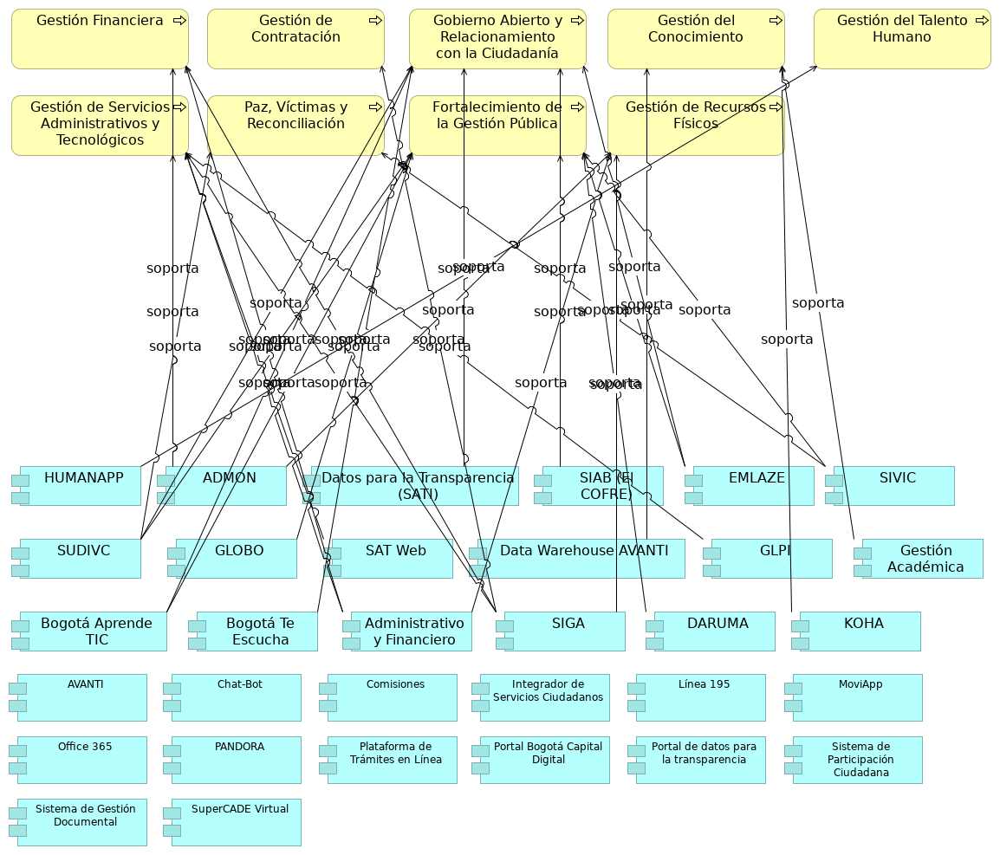

## 06.1nb. Aplicacion. Aplc y Procesos

> 

 

{#fig:id-7812cd6a3a0d4d5783b00f16f2c5826b width= height=}

### Elementos del Modelo

| Nombre  | Tipo | Documentación |
|---------|------|---------------|
| SIAB (El COFRE) | Application Component | Sistema de Información del Archivo de Bogotá SIAB. Permite automatizar los procesos archivísticos y técnicos que realiza el Archivo, tales como llevar un registro de los Ingresos Documentales (antes área de acopio), para la descripción y catalogación de la documentación, propios del proceso de Gestión de la Función Archivística y del Patrimonio Documental, para su custodia y conservación permanente. |
| AVANTI | Application Component | Apoya la Gestión del conocimiento.
 |
| Comisiones | Application Component | Sesión levantamiento no. 1.
 |
| Integrador de Servicios Ciudadanos | Application Component | Plataforma unificada para acceder a diversos servicios y trámites ciudadanos. |
| MoviApp | Application Component | Sesión levantamiento no. 2. |
| PANDORA | Application Component | Implementación de temas precontractual y planeación. |
| Plataforma de Trámites en Línea | Application Component | Componente de aplicación que permite la realización de trámites digitales. |
| Portal Bogotá Capital Digital | Application Component | Portal Integrador de trámites y servicios ofrecidos a la ciudadanía. |
| Portal de datos para la transparencia | Application Component | Plataforma que facilita el acceso público a datos e información gubernamental. |
| Sistema de Participación Ciudadana | Application Component | Componente de aplicación para facilitar la interacción y el feedback de los ciudadanos. |
| Sistema de Gestión Documental | Application Component | Componente de aplicación para la gestión electrónica de documentos. |

Table: Elementos de la vista. {#tbl:tblelement-06.1nb.Aplicacion.AplcyProcesos-id}

 

---
lang: en
titlepage: true
titlepage-rule-color: 360049
todo: aun no está lista
...

