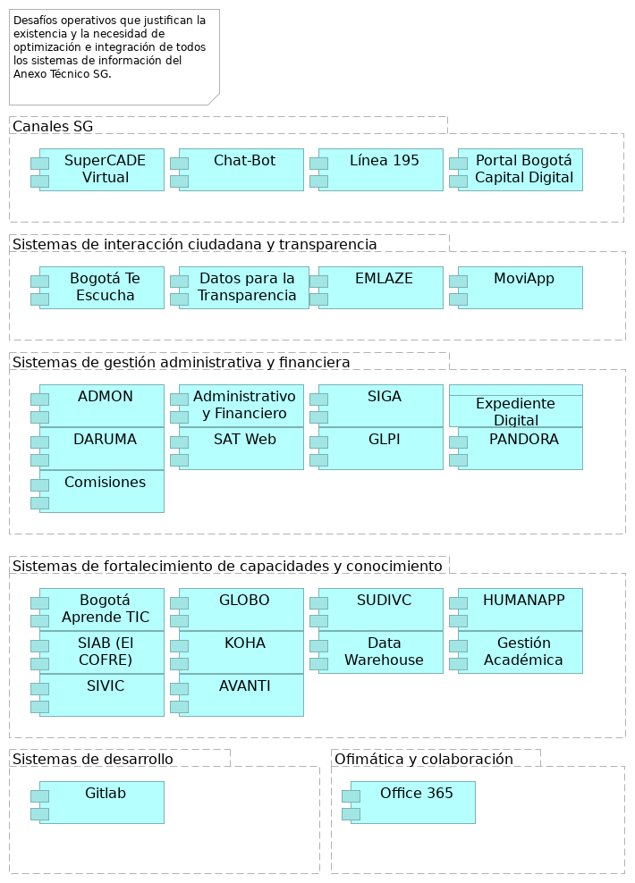

\newpage

# grp-dominio-aplicaciones

## SI del Análisis de Entorno

> Desafíos operativos que justifican la existencia y la necesidad de optimización e integración de todos los sistemas de información del Anexo Técnico SG.  

 

El "Anexo Técnico ADENDA.pdf" detalla la consultoría para implementar la Arquitectura Empresarial, que busca fortalecer la alineación de estrategias, procesos y tecnologías, así como impulsar la transformación digital y una gestión pública más eficiente. Esta iniciativa se enmarca en la necesidad de mejorar la satisfacción de los grupos de interés internos y externos.

El "Resumen Ejecutivo FASE I.pdf" contextualiza estos esfuerzos al analizar el entorno de la gestión pública distrital, identificando brechas, tendencias y oportunidades a través de factores político-institucionales, económicos, sociales, tecnológicos, ecológicos y legales. 

Las relaciones entre los sistemas de información mencionados en el Anexo Técnico y el contexto del Análisis de Entorno (Resumen Ejecutivo FASE I.pdf) son las siguientes:

* Sistemas de gestión administrativa y financiera (ADMON, Administrativo y Financiero, SIGA, SAT Web, GLPI):
    - Estos sistemas son cruciales para la "Gestión financiera", "Gestión de servicios administrativos y tecnológicos" y "Gestión de recursos físicos".
    - Relación con objetivos: El "Resumen Ejecutivo FASE I.pdf" aborda la necesidad de una gestión pública más eficiente y transparente, la optimización de recursos y la rendición de cuentas. Estos sistemas son habilitadores directos de dichas metas.
    - Relación con problemas: El documento también señala desafíos en el "Entorno Económico" como el déficit fiscal y la necesidad de eficiencia en la inversión pública. Los sistemas administrativos y financieros son fundamentales para una planificación financiera adecuada y una gestión fiscal sostenible.
    - Relación con oportunidades: La recomendación de "simplificación administrativa y coordinación intersectorial" implica la mejora de estos sistemas para reducir duplicidades y estandarizar prácticas, lo que contribuye a una "arquitectura institucional más coherente y eficiente".

* Sistemas de interacción ciudadana y transparencia (Bogotá Te Escucha, Datos para la Transparencia (SATI), EMLAZE):
    - Estos sistemas soportan directamente el proceso de "Gobierno abierto y relacionamiento con la ciudadanía".
    - Objetivos: El "Resumen Ejecutivo FASE I.pdf" destaca el objetivo estratégico "Bogotá confía en su gobierno", que busca ofrecer "servicios amables, ágiles y oportunos". Bogotá Te Escucha es el sistema distrital clave para la gestión de peticiones ciudadanas y la evaluación de la calidad de las respuestas.
    - Problemas: Se reconoce que, si bien hay avances en la atención institucional, persisten desafíos en la "eficiencia operativa, tiempos de respuesta y digitalización de servicios". Estos sistemas son vitales para abordar estas brechas mediante la digitalización de servicios públicos y la automatización de trámites.
    - Oportunidad: "Datos para la Transparencia (SATI)" es clave para la política de "Transparencia, acceso a la información pública y lucha contra la corrupción". La estandarización de procesos y sistemas de información a través de estos sistemas fortalece la confianza ciudadana.

* Sistemas de fortalecimiento de capacidades y conocimiento (Bogotá Aprende TIC, DARUMA, GLOBO, SUDIVC, HUMANAPP, SIAB (El COFRE), KOHA, SIVIC, Data Warehouse AVANTI, Gestión Académica):

#### Relación con Objetivos

    - Bogotá Aprende TIC y Gestión Académica abordan la necesidad de "alfabetización digital" y la escasez de talento humano especializado en tecnologías emergentes, como se menciona en el "Entorno Tecnológico".
    - DARUMA es el aplicativo donde se gestionan las fichas técnicas de productos y servicios y los riesgos estratégicos. Esto se alinea con la necesidad de una "Gestión del riesgo" efectiva y el "Fortalecimiento de la Gestión Pública" para la toma de decisiones basada en evidencia.
    - HUMANAPP es fundamental para la "Gestión del talento humano". El "Resumen Ejecutivo FASE I.pdf" subraya la importancia de la "profesionalización del servicio público" y el "fortalecimiento de capacidades" de los servidores públicos.
    - SIAB (El COFRE), KOHA, Data Warehouse AVANTI son cruciales para la "Gestión del conocimiento" y la "Gestión documental y soporte archivístico". El documento enfatiza el "fortalecimiento de las capacidades de generación, análisis y uso estratégico de información" y la necesidad de "sistemas integrados de datos" para la toma de decisiones basada en evidencia. Data Warehouse AVANTI, en particular, facilita el análisis descriptivo, predictivo y prospectivo de los resultados de la gestión.
    - SUDIVC y SIVIC apoyan los procesos de "Paz, víctimas y reconciliación" y "Fortalecimiento de la Gestión Pública", abordando las "profundas desigualdades que afectan de manera desproporcionada a poblaciones vulnerables" y contribuyendo a que Bogotá sea un "territorio de paz y reconciliación".

* Sistemas de desarrollo y colaboración (GitLab):

#### Relación con Oportunidades

    - GitLab, siendo una plataforma de desarrollo y colaboración, está vinculada con la "Gestión de alianzas e internacionalización de Bogotá".
    - El "Resumen Ejecutivo FASE I.pdf" menciona la consolidación de Bogotá como una ciudad con "vocación internacional, atrayendo a profesionales, diplomáticos, académicos y organizaciones" y la necesidad de "fortalecer la arquitectura Internacional del Distrito". GitLab puede ser una herramienta para facilitar la colaboración en proyectos y la gestión de información en el marco de estas alianzas.
    - También se alinea con la necesidad de "integración entre plataformas digitales institucionales" y la adopción de nuevas tecnologías para la "transformación digital".

En síntesis, el "Resumen Ejecutivo FASE I.pdf" proporciona el marco estratégico y los desafíos operativos que justifican la existencia y la necesidad de optimización e integración de todos los sistemas de información mencionados en el "Anexo Técnico ADENDA.pdf". El ejercicio de Arquitectura Empresarial busca cerrar las brechas identificadas y avanzar hacia una gestión pública más eficiente, transparente, digital y centrada en el ciudadano, aprovechando al máximo sus sistemas y tecnologías.

{#fig:id-097745511d984e7eaf02b5ad5a93e7a8 width= height=}

### Canales SG

### Portal Bogotá Capital Digital
Portal Integrador de trámites y servicios ofrecidos a la ciudadanía.
### Sistemas de interacción ciudadana y transparencia

### MoviApp
Sesión levantamiento no. 2.
### Sistemas de gestión administrativa y financiera

### Expediente Digital
Objeto de datos en la capa de aplicación que representa un expediente electrónico.
### PANDORA
Implementación de temas precontractual y planeación.
### Comisiones
Sesión levantamiento no. 1.

### Sistemas de fortalecimiento de capacidades y conocimiento

### SIAB (El COFRE)
Sistema de Información del Archivo de Bogotá SIAB. Permite automatizar los procesos archivísticos y técnicos que realiza el Archivo, tales como llevar un registro de los Ingresos Documentales (antes área de acopio), para la descripción y catalogación de la documentación, propios del proceso de Gestión de la Función Archivística y del Patrimonio Documental, para su custodia y conservación permanente.
### AVANTI
Apoya la Gestión del conocimiento.

### Sistemas de desarrollo

### Ofimática y colaboración

---
lang: en
titlepage: true
titlepage-rule-color: 360049
todo: aun no está lista
...

