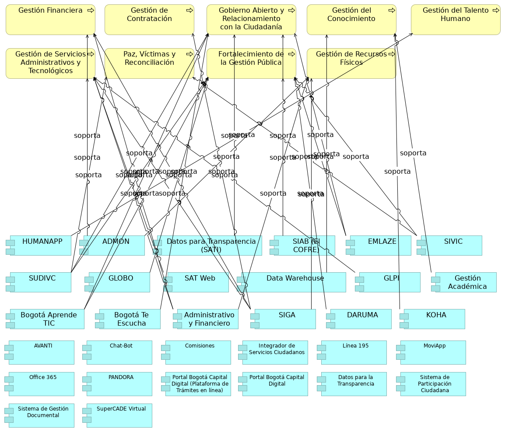

## Aplicaciones y Procesos SG

> 

 

{#fig:id-7812cd6a3a0d4d5783b00f16f2c5826b width= height=}

### SIAB (El COFRE)
Sistema de Información del Archivo de Bogotá SIAB. Permite automatizar los procesos archivísticos y técnicos que realiza el Archivo, tales como llevar un registro de los Ingresos Documentales (antes área de acopio), para la descripción y catalogación de la documentación, propios del proceso de Gestión de la Función Archivística y del Patrimonio Documental, para su custodia y conservación permanente.
### AVANTI
Apoya la Gestión del conocimiento.

### Comisiones
Sesión levantamiento no. 1.

### Integrador de Servicios Ciudadanos
Plataforma unificada para acceder a diversos servicios y trámites ciudadanos.
### MoviApp
Sesión levantamiento no. 2.
### PANDORA
Implementación de temas precontractual y planeación.
### Plataforma de Trámites en Línea
Componente de aplicación que permite la realización de trámites digitales.
### Portal Bogotá Capital Digital
Portal Integrador de trámites y servicios ofrecidos a la ciudadanía.
### Portal de datos para la transparencia
Plataforma que facilita el acceso público a datos e información gubernamental.
### Sistema de Participación Ciudadana
Componente de aplicación para facilitar la interacción y el feedback de los ciudadanos.
### Sistema de Gestión Documental
Componente de aplicación para la gestión electrónica de documentos.

---
lang: en
titlepage: true
titlepage-rule-color: 360049
todo: aun no está lista
...

