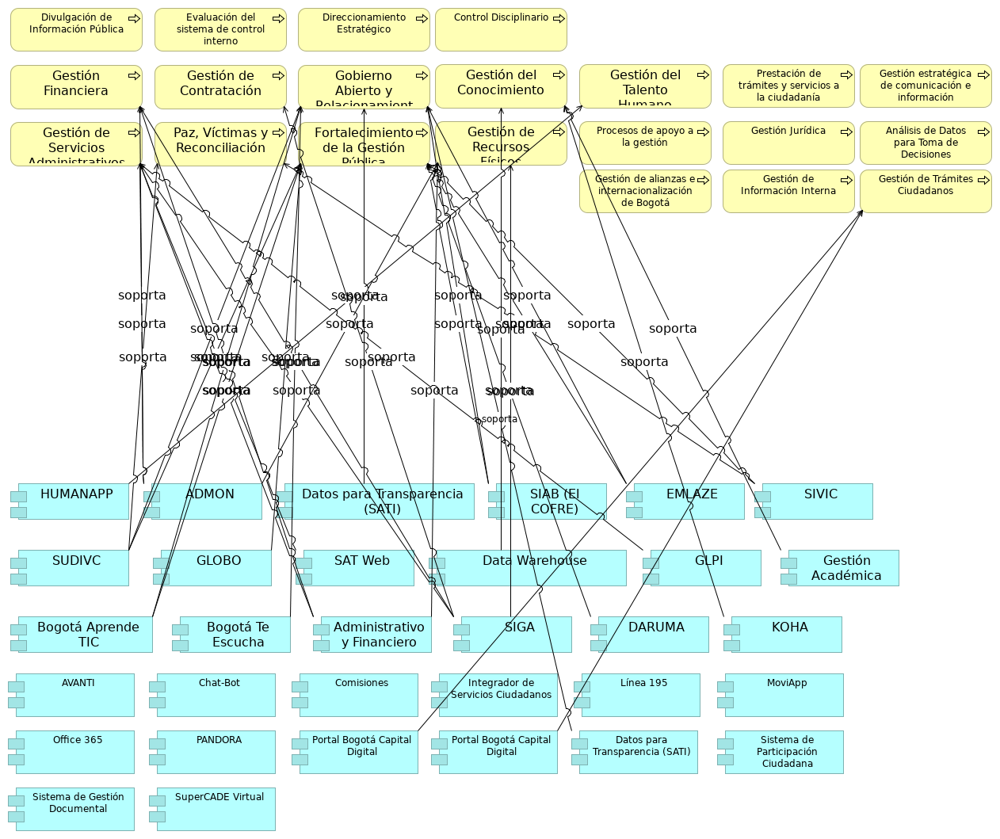

## Aplicaciones y Procesos SG

> 

 

{#fig:id-7812cd6a3a0d4d5783b00f16f2c5826b width= height=}

### Divulgación de Información Pública
Proceso de negocio para la difusión optimizada de información a través de sistemas digitales.

### Evaluación del sistema de control interno
Evaluar de manera independiente y objetiva el Sistema de Control Interno de la Secretaría General de la Alcaldía Mayor de Bogotá, mediante la realización de auditorías internas de gestión, seguimientos e informes regulatorios programados en el Plan de Anual de Auditorías, y la atención a organismos de control, con el propósito de contribuir al mejoramiento continuo de la gestión institucional.

### Direccionamiento Estratégico
Formular, implementar, hacer monitoreo y seguimiento a las políticas públicas competencia de la Secretaría General, a los planes institucionales, a los proyectos de inversión, y gestionar el presupuesto de inversión mediante la definición de orientaciones, metodologías, la retroalimentación, acompañamiento y articulación a las dependencias de la entidad con el fin de cumplir el logro de la misión y los objetivos institucionales, en el marco de una cultura de transparencia.

### Control Disciplinario
 Adelantar los procesos disciplinarios contra los(as) servidores(as) y exservidores(as) de la Secretaría General de la Alcaldía Mayor de Bogotá D.C., y prevenir las conductas disciplinarias mediante la aplicación de las normas vigentes en materia disciplinaria y el desarrollo de la estrategia preventiva con el fin determinar la posible responsabilidad disciplinaria, y evitar la ocurrencia de faltas disciplinarias por parte de estos.

### Gestión del Conocimiento
Gestionar el conocimiento y la innovación de la Secretaría General de la Alcaldía Mayor de Bogotá, mediante la identificación, generación, sistematización, análisis, transferencia y conservación del conocimiento estratégico y la promoción de la innovación, con el fin de fortalecer el aprendizaje, el mejoramiento organizacional y la toma de decisiones basada en evidencias.

### Gestión del Talento Humano
Gestionar el capital humano de la Secretaría General, y vincular y administrar el Gabinete distrital y jefatura del talento humano interno mediante el Plan Estratégico de Talento Humano para la Secretaría General y el trámite de situaciones administrativas con el fin de fortalecer el sentido de pertenencia y contribuir a la calidad de vida del talento humano de la entidad.

### Prestación de trámites y servicios a la ciudadanía
Proceso central para la interacción con los ciudadanos.

### Gestión estratégica de comunicación e información
Mantener informados a los distintos grupos de valor e interés acerca de los programas, proyectos y gestión de la Administración Distrital a través de la formulación y la implementación de estrategias de comunicación pública con el propósito de interactuar y mantener la confianza por parte de la entidad y de la ciudadanía en general.

### Gestión Financiera
Gestionar las operaciones financieras con cargo al presupuesto asignado a la entidad, a través del registro de las operaciones económicas en contabilidad para garantizar la elaboración y reporte de los estados financieros a los entes de control en forma comprensible, relevante y confiable, para que sean consultados por los ciudadanos y por los interesados en la información financiera.

### Gestión de Contratación
Gestionar la contratación de bienes, servicios y obras, mediante el desarrollo de procesos contractuales transparentes y conforme a la normativa legal vigente para satisfacer las necesidades de contratación de las dependencias de la Secretaría General de la Alcaldía Mayor de Bogotá, y contribuir al cumplimento de sus metas y objetivos.

### Gobierno Abierto y Relacionamiento con la Ciudadanía
Fortalecer relación entre la administración distrital y la ciudadanía mediante la formulación de lineamientos, desarrollo de estrategias y proyectos, fortalecimiento de capacidades, seguimiento y evaluación en materia de servicio a la ciudadanía, gobierno abierto y transformación digital de la Secretaría General y de las entidades distritales, para el acceso oportuno, efectivo y de calidad a la oferta institucional de bienes y servicios.

### Gestión de Recursos Físicos
Administrar los bienes que legalmente están a cargo de la Secretaría General de la Alcaldía Mayor de Bogotá D.C. mediante su recepción, asignación, mantenimiento, control, baja y/o destinación final con el fin de cubrir las necesidades de recursos físicos de las dependencias.

### Procesos de apoyo a la gestión
Procesos internos que facilitan la operación de la entidad.

### Gestión Jurídica
Asesorar y representar jurídicamente a la Secretaría General de la Alcaldía Mayor Bogotá D.C. mediante el análisis, trámite, defensa, solución y respuesta de asuntos de carácter jurídico que surjan en el desarrollo de las funciones de acuerdo con la normatividad vigente.

### Análisis de Datos para Toma de Decisiones
Proceso de negocio que utiliza software especializado para el análisis de datos.

### Gestión de Servicios Administrativos y Tecnológicos
Apoyar la gestión de la Entidad a través de la prestación de los servicios administrativos y tecnológicos, así como, de la gestión documental, con el fin de satisfacer las necesidades de las dependencias en la materia, al igual que conservar y preservar la memoria institucional.

### Paz, Víctimas y Reconciliación
Gestionar políticas, programas y estrategias dirigidas a las víctimas, población en proceso de reintegración, reincorporación, comparecientes de fuerza pública y ciudadanía en general por medio de la asistencia, atención, reparación, y acciones de memoria, reconciliación y construcción de paz territorial con el propósito de que Bogotá sea un territorio de paz y reconciliación, donde todos puedan volver a empezar.

### Fortalecimiento de la Gestión Pública
Generar capacidades institucionales en las entidades distritales a través del desarrollo de estudios, investigaciones y estrategias relacionadas con el fortalecimiento de la gestión, impresión de artes gráficas y la publicación de la Gaceta Pública en el registro distrital; con el fin, de modernizar y mejorar el desempeño de la administración distrital.

### Gestión de alianzas e internacionalización de Bogotá
 Facilitar acciones estratégicas de cooperación, relacionamiento y posicionamiento internacional, mediante la gestión de interacciones con actores nacionales e internacionales, con el fin de movilizar recursos técnicos y financieros, generar alianzas estratégicas y posicionar a Bogotá como un referente global. De esta manera, se contribuirá a la implementación del Plan de Desarrollo Distrital, fortalecerá las políticas públicas y la gestión del Distrito, y se alineará con iniciativas globales como la Agenda 2030.

### Gestión de Información Interna
Proceso de recolección, procesamiento y distribución de información dentro de la entidad.

### Gestión de Trámites Ciudadanos
Proceso de atención y resolución de solicitudes y gestiones de los ciudadanos.

### HUMANAPP
Apoya la gestión del talento humano.

### ADMON
Se relaciona con la gestión financiera, gestión de servicios administrativos y tecnológicos, y gestión de recursos físicos.

### Datos para Transparencia (SATI)
Plataforma que facilita el acceso público a datos e información gubernamental. Soporta el proceso de Gobierno abierto y relacionamiento con la ciudadanía.

### SIAB (El COFRE)
Sistema de Información del Archivo de Bogotá SIAB. Permite automatizar los procesos archivísticos y técnicos que realiza el Archivo, tales como llevar un registro de los Ingresos Documentales (antes área de acopio), para la descripción y catalogación de la documentación, propios del proceso de Gestión de la Función Archivística y del Patrimonio Documental, para su custodia y conservación permanente. Utilizado en los procesos de Gobierno abierto y relacionamiento con la ciudadanía, y Fortalecimiento de la Gestión Pública.

### EMLAZE
Utilizado en los procesos de Gobierno abierto y relacionamiento con la ciudadanía, y Fortalecimiento de la Gestión Pública.

### SIVIC
Interviene en los procesos de Paz, víctimas y reconciliación, y Fortalecimiento de la Gestión Pública.

### SUDIVC
Se aplica en los procesos de Gobierno abierto y relacionamiento con la ciudadanía, Paz, víctimas y reconciliación, y Fortalecimiento de la Gestión Pública.

### GLOBO
Utilizado en el proceso de Fortalecimiento de la Gestión Pública.

### SAT Web
Relacionado con la gestión de servicios administrativos y tecnológicos.

### Data Warehouse
Almacenes de datos de trabajo de SG.

### GLPI
Soporta la gestión de servicios administrativos y tecnológicos.

### Gestión Académica
Relacionado con la Gestión del conocimiento.

### Bogotá Aprende TIC
Apoya los procesos de Gobierno abierto y relacionamiento con la ciudadanía, y Fortalecimiento de la Gestión Pública.

### Bogotá Te Escucha
Es fundamental para el proceso de Gobierno abierto y relacionamiento con la ciudadanía. También se menciona como el Sistema Distrital para la Gestión de Peticiones Ciudadanas, a través del cual se evalúa la calidad de las respuestas emitidas a la ciudadanía.

### Administrativo y Financiero
Soporta la gestión financiera, gestión de servicios administrativos y tecnológicos, y gestión de recursos físicos.

### SIGA
Interviene en la gestión de contratación, gestión financiera, gestión de servicios administrativos y tecnológicos, y gestión de recursos físicos.

### DARUMA
Se utiliza en el proceso de Fortalecimiento de la Gestión Pública. También es el aplicativo donde se encuentran definidas las fichas técnicas de productos y servicios de la Secretaría General y se gestionan los riesgos estratégicos.

### KOHA
Relacionado con la Gestión del conocimiento.

### AVANTI
Apoya la Gestión del conocimiento.

### Chat-Bot
Canal web de atención a ciudadanía.

### Comisiones
Sesión levantamiento no. 1.

### Integrador de Servicios Ciudadanos
Plataforma unificada para acceder a servicios y trámites ciudadanos.

### Línea 195
Canal telefónico de atención a ciudadanía.

### MoviApp
Canal movil de atención a ciudadanía. Sesión levantamiento no. 2.

### Office 365
Ofimática y colaboración SG.

### PANDORA
Implementación de temas precontractual y planeación.

### Portal Bogotá Capital Digital
Plataforma de Trámites en línea. Portal Integrador de trámites y servicios ofrecidos a la ciudadanía. Componente de aplicación que permite la realización de trámites digitales.

### Portal Bogotá Capital Digital
Plataforma de Trámites en línea. Portal Integrador de trámites y servicios ofrecidos a la ciudadanía. Componente de aplicación que permite la realización de trámites digitales.

### Datos para Transparencia (SATI)
Plataforma que facilita el acceso público a datos e información gubernamental. Soporta el proceso de Gobierno abierto y relacionamiento con la ciudadanía.

### Sistema de Participación Ciudadana
Componente de aplicación para facilitar la interacción y el acercamiento (realimentación) de los ciudadanos.

### Sistema Gestión Documental
Componente de aplicación para la gestión electrónica de documentos.

### SuperCADE Virtual
Red de canales presenciales de atención a ciudadanía.

---
lang: en
titlepage: true
titlepage-rule-color: 360049
todo: aun no está lista
...

