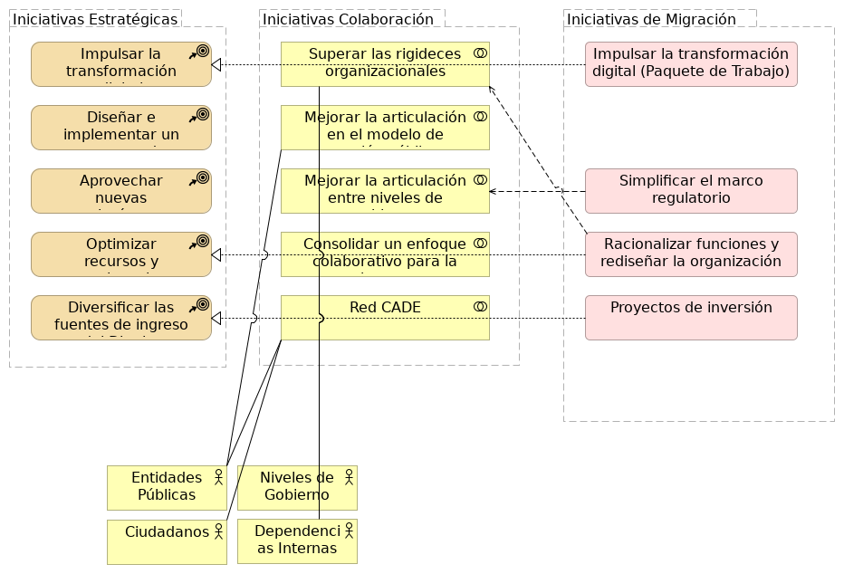

## Iniciativas

> 

 

El modelo de diagrama ArchiMate denominado "06.Estrategia. Iniciativas" se posiciona como un componente clave para visualizar y comunicar la transformación estratégica de la organización. Su propósito central es ilustrar cómo los objetivos de alto nivel se desglosan en planes de acción concretos o "iniciativas", conectando así la visión estratégica con la ejecución. Este tipo de diagrama es fundamental para alinear los esfuerzos y las inversiones empresariales, asegurando que cada proyecto y programa contribuya directamente a la consecución de las metas corporativas.

Un modelo de "Estrategia. Iniciativas" bien estructurado es un activo invaluable para la gestión del portafolio de proyectos, la toma de decisiones informadas sobre la asignación de recursos y la comunicación efectiva de la hoja de ruta estratégica a todos los niveles de la empresa, impulsando la coherencia y el éxito en la implementación.

{#fig:id-cc506af7ae2e4eadbe0ef317bcdce54d width= height=}

### Iniciativas Estratégicas

### Impulsar la transformación digital
Enfoque estratégico para la modernización de los procesos y servicios mediante tecnologías digitales.
### Diseñar e implementar un esquema de gobernanza de territorio inteligente
Define las directrices y estructuras para la gestión de un ecosistema urbano inteligente.
### Aprovechar nuevas tecnologías como la Inteligencia Artificial
Estrategia para integrar y explotar tecnologías emergentes en beneficio de la gestión pública.
### Optimizar recursos y mejorar la operación
Enfoque para maximizar la eficiencia en el uso de los recursos disponibles y mejorar el rendimiento operativo.
### Diversificar las fuentes de ingreso del Distrito
Estrategia para explorar y desarrollar nuevas vías de financiación para el Distrito.
### Iniciativas Colaboración

### Superar las rigideces organizacionales
Colaboración orientada a eliminar barreras estructurales que impiden la agilidad y eficiencia de la entidad.
### Mejorar la articulación en el modelo de gestión pública
Colaboración para integrar y coordinar mejor las diferentes áreas y procesos de la gestión pública.
### Mejorar la articulación entre niveles de gobierno
Colaboración enfocada en una mayor coordinación y cooperación entre los distintos niveles de la administración pública.
### Consolidar un enfoque colaborativo para la gobernanza metropolitana
Colaboración para establecer una visión y gestión unificada de los asuntos metropolitanos.
### Red CADE
Red de colaboración entre entidades para la prestación de servicios de atención presencial a ciudadanos.
### Iniciativas de Migración

### Impulsar la transformación digital (Paquete de Trabajo)
Conjunto de actividades para iniciar y desarrollar la transformación digital de la entidad.
### Simplificar el marco regulatorio
Paquete de trabajo enfocado en la revisión y simplificación de las normativas vigentes.
### Racionalizar funciones y rediseñar la organización
Paquete de trabajo para optimizar la estructura funcional y organizacional de la entidad.
### Proyectos de inversión
Paquete de trabajo general que engloba todas las iniciativas de inversión para mejoras.
### Entidades Públicas
Actores organizacionales que participan en las colaboraciones y ofrecen servicios.
### Niveles de Gobierno
Diferentes estamentos gubernamentales (nacional, distrital, local) que requieren articulación.
### Dependencias Internas
Unidades organizacionales internas de la Secretaría General o la Alcaldía Mayor.
### Ciudadanos
Beneficiarios finales de los servicios y actores involucrados en la interacción con la administración.

---
lang: en
titlepage: true
titlepage-rule-color: 360049
todo: aun no está lista
...

