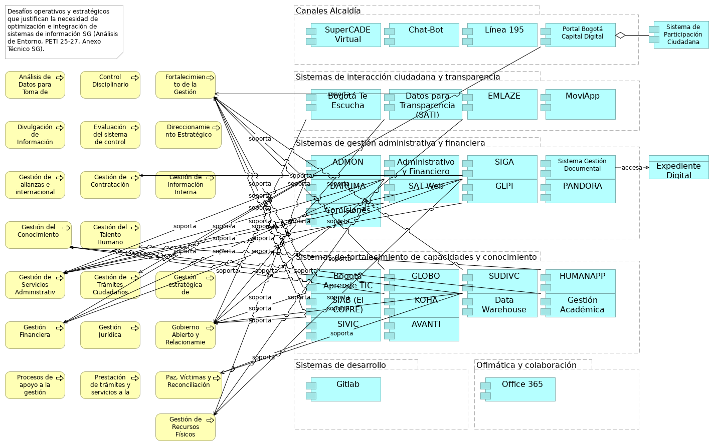

## Análisis de Entorno Sistemas de Información SG

> Desafíos operativos y estratégicos que justifican la necesidad de optimización e integración de sistemas de información SG (Análisis de Entorno, PETI 25-27, Anexo Técnico SG).  

 

La consultoría de Arquitectura Empresarial busca fortalecer la alineación de estrategias, procesos y tecnologías, así como impulsar la transformación digital y una gestión pública más eficiente. Esta iniciativa se enmarca en la necesidad de mejorar la satisfacción de los grupos de interés internos y externos.

Las relaciones entre los sistemas de información (Anexo Técnico) y el contexto del Análisis de Entorno (Resumen Ejecutivo FASE I.pdf) son las siguientes:

* Sistemas de gestión administrativa y financiera (ADMON, Administrativo y Financiero, SIGA, SAT Web, GLPI):
    - Estos sistemas son cruciales para la "Gestión financiera", "Gestión de servicios administrativos y tecnológicos" y "Gestión de recursos físicos".
    - Relación con objetivos: El "Resumen Ejecutivo FASE I.pdf" aborda la necesidad de una gestión pública más eficiente y transparente, la optimización de recursos y la rendición de cuentas. Estos sistemas son habilitadores directos de dichas metas.
    - Relación con problemas: El documento también señala desafíos en el "Entorno Económico" como el déficit fiscal y la necesidad de eficiencia en la inversión pública. Los sistemas administrativos y financieros son fundamentales para una planificación financiera adecuada y una gestión fiscal sostenible.
    - Relación con oportunidades: La recomendación de "simplificación administrativa y coordinación intersectorial" implica la mejora de estos sistemas para reducir duplicidades y estandarizar prácticas, lo que contribuye a una "arquitectura institucional más coherente y eficiente".

* Sistemas de interacción ciudadana y transparencia (Bogotá Te Escucha, Datos para la Transparencia (SATI), EMLAZE):
    - Estos sistemas soportan directamente el proceso de "Gobierno abierto y relacionamiento con la ciudadanía".
    - Objetivos: El "Resumen Ejecutivo FASE I.pdf" destaca el objetivo estratégico "Bogotá confía en su gobierno", que busca ofrecer "servicios amables, ágiles y oportunos". Bogotá Te Escucha es el sistema distrital clave para la gestión de peticiones ciudadanas y la evaluación de la calidad de las respuestas.
    - Problemas: Se reconoce que, si bien hay avances en la atención institucional, persisten desafíos en la "eficiencia operativa, tiempos de respuesta y digitalización de servicios". Estos sistemas son vitales para abordar estas brechas mediante la digitalización de servicios públicos y la automatización de trámites.
    - Oportunidad: "Datos para la Transparencia (SATI)" es clave para la política de "Transparencia, acceso a la información pública y lucha contra la corrupción". La estandarización de procesos y sistemas de información a través de estos sistemas fortalece la confianza ciudadana.

* Sistemas de fortalecimiento de capacidades y conocimiento (Bogotá Aprende TIC, DARUMA, GLOBO, SUDIVC, HUMANAPP, SIAB (El COFRE), KOHA, SIVIC, Data Warehouse AVANTI, Gestión Académica):

#### Relación con Objetivos

- Bogotá Aprende TIC y Gestión Académica abordan la necesidad de "alfabetización digital" y la escasez de talento humano especializado en tecnologías emergentes, como se menciona en el "Entorno Tecnológico".
- DARUMA es el aplicativo donde se gestionan las fichas técnicas de productos y servicios y los riesgos estratégicos. Esto se alinea con la necesidad de una "Gestión del riesgo" efectiva y el "Fortalecimiento de la Gestión Pública" para la toma de decisiones basada en evidencia.
- HUMANAPP es fundamental para la "Gestión del talento humano". El "Resumen Ejecutivo FASE I.pdf" subraya la importancia de la "profesionalización del servicio público" y el "fortalecimiento de capacidades" de los servidores públicos.
- SIAB (El COFRE), KOHA, Data Warehouse AVANTI son cruciales para la "Gestión del conocimiento" y la "Gestión documental y soporte archivístico". El documento enfatiza el "fortalecimiento de las capacidades de generación, análisis y uso estratégico de información" y la necesidad de "sistemas integrados de datos" para la toma de decisiones basada en evidencia. Data Warehouse AVANTI, en particular, facilita el análisis descriptivo, predictivo y prospectivo de los resultados de la gestión.
- SUDIVC y SIVIC apoyan los procesos de "Paz, víctimas y reconciliación" y "Fortalecimiento de la Gestión Pública", abordando las "profundas desigualdades que afectan de manera desproporcionada a poblaciones vulnerables" y contribuyendo a que Bogotá sea un "territorio de paz y reconciliación".

#### Relación con Oportunidades

- GitLab, siendo una plataforma de desarrollo y colaboración, está vinculada con la "Gestión de alianzas e internacionalización de Bogotá".
- El "Resumen Ejecutivo FASE I.pdf" menciona la consolidación de Bogotá como una ciudad con "vocación internacional, atrayendo a profesionales, diplomáticos, académicos y organizaciones" y la necesidad de "fortalecer la arquitectura Internacional del Distrito". GitLab puede ser una herramienta para facilitar la colaboración en proyectos y la gestión de información en el marco de estas alianzas.
- También se alinea con la necesidad de "integración entre plataformas digitales institucionales" y la adopción de nuevas tecnologías para la "transformación digital".

{#fig:id-4097f24d07b94ff0b5b81fc551670f57 width= height=}

### Elementos del Modelo

| Nombre  | Tipo | Documentación |
|---------|------|---------------|
| Canales Alcaldía | Grouping |  |
| SuperCADE Virtual | Application Component | Red de canales presenciales de atención a ciudadanía.
 |
| Chat-Bot | Application Component | Canal web de atención a ciudadanía.
 |
| Línea 195 | Application Component | Canal telefónico de atención a ciudadanía.
 |
| Portal Bogotá Capital Digital | Application Component | Plataforma de Trámites en línea. Portal Integrador de trámites y servicios ofrecidos a la ciudadanía. Componente de aplicación que permite la realización de trámites digitales.
 |
| Sistema de Participación Ciudadana | Application Component | Componente de aplicación para facilitar la interacción y el acercamiento (realimentación) de los ciudadanos.
 |
| Análisis de Datos para Toma de Decisiones | Business Process | Proceso de negocio que utiliza software especializado para el análisis de datos.
 |
| Control Disciplinario | Business Process |  Adelantar los procesos disciplinarios contra los(as) servidores(as) y exservidores(as) de la Secretaría General de la Alcaldía Mayor de Bogotá D.C., y prevenir las conductas disciplinarias mediante la aplicación de las normas vigentes en materia disciplinaria y el desarrollo de la estrategia preventiva con el fin determinar la posible responsabilidad disciplinaria, y evitar la ocurrencia de faltas disciplinarias por parte de estos.
 |
| Fortalecimiento de la Gestión Pública | Business Process | Generar capacidades institucionales en las entidades distritales a través del desarrollo de estudios, investigaciones y estrategias relacionadas con el fortalecimiento de la gestión, impresión de artes gráficas y la publicación de la Gaceta Pública en el registro distrital; con el fin, de modernizar y mejorar el desempeño de la administración distrital.
 |
| Sistemas de interacción ciudadana y transparencia | Grouping |  |
| Bogotá Te Escucha | Application Component | Es fundamental para el proceso de Gobierno abierto y relacionamiento con la ciudadanía. También se menciona como el Sistema Distrital para la Gestión de Peticiones Ciudadanas, a través del cual se evalúa la calidad de las respuestas emitidas a la ciudadanía.
 |
| Datos para Transparencia (SATI) | Application Component | Plataforma que facilita el acceso público a datos e información gubernamental. Soporta el proceso de Gobierno abierto y relacionamiento con la ciudadanía.
 |
| EMLAZE | Application Component | Utilizado en los procesos de Gobierno abierto y relacionamiento con la ciudadanía, y Fortalecimiento de la Gestión Pública.
 |
| MoviApp | Application Component | Canal movil de atención a ciudadanía. Sesión levantamiento no. 2.
 |
| Divulgación de Información Pública | Business Process | Proceso de negocio para la difusión optimizada de información a través de sistemas digitales.
 |
| Evaluación del sistema de control interno | Business Process | Evaluar de manera independiente y objetiva el Sistema de Control Interno de la Secretaría General de la Alcaldía Mayor de Bogotá, mediante la realización de auditorías internas de gestión, seguimientos e informes regulatorios programados en el Plan de Anual de Auditorías, y la atención a organismos de control, con el propósito de contribuir al mejoramiento continuo de la gestión institucional.
 |
| Direccionamiento Estratégico | Business Process | Formular, implementar, hacer monitoreo y seguimiento a las políticas públicas competencia de la Secretaría General, a los planes institucionales, a los proyectos de inversión, y gestionar el presupuesto de inversión mediante la definición de orientaciones, metodologías, la retroalimentación, acompañamiento y articulación a las dependencias de la entidad con el fin de cumplir el logro de la misión y los objetivos institucionales, en el marco de una cultura de transparencia.
 |
| Sistemas de gestión administrativa y financiera | Grouping |  |
| ADMON | Application Component | Se relaciona con la gestión financiera, gestión de servicios administrativos y tecnológicos, y gestión de recursos físicos.
 |
| Administrativo y Financiero | Application Component | Soporta la gestión financiera, gestión de servicios administrativos y tecnológicos, y gestión de recursos físicos.
 |
| SIGA | Application Component | Interviene en la gestión de contratación, gestión financiera, gestión de servicios administrativos y tecnológicos, y gestión de recursos físicos.
 |
| Sistema Gestión Documental | Application Component | Componente de aplicación para la gestión electrónica de documentos.
 |
| DARUMA | Application Component | Se utiliza en el proceso de Fortalecimiento de la Gestión Pública. También es el aplicativo donde se encuentran definidas las fichas técnicas de productos y servicios de la Secretaría General y se gestionan los riesgos estratégicos.
 |
| SAT Web | Application Component | Relacionado con la gestión de servicios administrativos y tecnológicos.
 |
| GLPI | Application Component | Soporta la gestión de servicios administrativos y tecnológicos.
 |
| PANDORA | Application Component | Implementación de temas precontractual y planeación.
 |
| Comisiones | Application Component | Sesión levantamiento no. 1.
 |
| Expediente Digital | Data Object | Objeto de datos en la capa de aplicación que representa un expediente electrónico. |
| Gestión de alianzas e internacionalización de Bogotá | Business Process |  Facilitar acciones estratégicas de cooperación, relacionamiento y posicionamiento internacional, mediante la gestión de interacciones con actores nacionales e internacionales, con el fin de movilizar recursos técnicos y financieros, generar alianzas estratégicas y posicionar a Bogotá como un referente global. De esta manera, se contribuirá a la implementación del Plan de Desarrollo Distrital, fortalecerá las políticas públicas y la gestión del Distrito, y se alineará con iniciativas globales como la Agenda 2030.
 |
| Gestión de Contratación | Business Process | Gestionar la contratación de bienes, servicios y obras, mediante el desarrollo de procesos contractuales transparentes y conforme a la normativa legal vigente para satisfacer las necesidades de contratación de las dependencias de la Secretaría General de la Alcaldía Mayor de Bogotá, y contribuir al cumplimento de sus metas y objetivos.
 |
| Gestión de Información Interna | Business Process | Proceso de recolección, procesamiento y distribución de información dentro de la entidad.
 |
| Gestión del Conocimiento | Business Process | Gestionar el conocimiento y la innovación de la Secretaría General de la Alcaldía Mayor de Bogotá, mediante la identificación, generación, sistematización, análisis, transferencia y conservación del conocimiento estratégico y la promoción de la innovación, con el fin de fortalecer el aprendizaje, el mejoramiento organizacional y la toma de decisiones basada en evidencias.
 |
| Gestión del Talento Humano | Business Process | Gestionar el capital humano de la Secretaría General, y vincular y administrar el Gabinete distrital y jefatura del talento humano interno mediante el Plan Estratégico de Talento Humano para la Secretaría General y el trámite de situaciones administrativas con el fin de fortalecer el sentido de pertenencia y contribuir a la calidad de vida del talento humano de la entidad.
 |
| Sistemas de fortalecimiento de capacidades y conocimiento | Grouping |  |
| Bogotá Aprende TIC | Application Component | Apoya los procesos de Gobierno abierto y relacionamiento con la ciudadanía, y Fortalecimiento de la Gestión Pública.
 |
| GLOBO | Application Component | Utilizado en el proceso de Fortalecimiento de la Gestión Pública.
 |
| SUDIVC | Application Component | Se aplica en los procesos de Gobierno abierto y relacionamiento con la ciudadanía, Paz, víctimas y reconciliación, y Fortalecimiento de la Gestión Pública.
 |
| HUMANAPP | Application Component | Apoya la gestión del talento humano.
 |
| SIAB (El COFRE) | Application Component | Sistema de Información del Archivo de Bogotá SIAB. Permite automatizar los procesos archivísticos y técnicos que realiza el Archivo, tales como llevar un registro de los Ingresos Documentales (antes área de acopio), para la descripción y catalogación de la documentación, propios del proceso de Gestión de la Función Archivística y del Patrimonio Documental, para su custodia y conservación permanente. Utilizado en los procesos de Gobierno abierto y relacionamiento con la ciudadanía, y Fortalecimiento de la Gestión Pública.
 |
| KOHA | Application Component | Relacionado con la Gestión del conocimiento.
 |
| Data Warehouse | Application Component | Almacenes de datos de trabajo de SG.
 |
| Gestión Académica | Application Component | Relacionado con la Gestión del conocimiento.
 |
| SIVIC | Application Component | Interviene en los procesos de Paz, víctimas y reconciliación, y Fortalecimiento de la Gestión Pública.
 |
| AVANTI | Application Component | Apoya la Gestión del conocimiento.
 |
| Gestión de Servicios Administrativos y Tecnológicos | Business Process | Apoyar la gestión de la Entidad a través de la prestación de los servicios administrativos y tecnológicos, así como, de la gestión documental, con el fin de satisfacer las necesidades de las dependencias en la materia, al igual que conservar y preservar la memoria institucional.
 |
| Gestión de Trámites Ciudadanos | Business Process | Proceso de atención y resolución de solicitudes y gestiones de los ciudadanos.
 |
| Gestión estratégica de comunicación e información | Business Process | Mantener informados a los distintos grupos de valor e interés acerca de los programas, proyectos y gestión de la Administración Distrital a través de la formulación y la implementación de estrategias de comunicación pública con el propósito de interactuar y mantener la confianza por parte de la entidad y de la ciudadanía en general.
 |
| Gestión Financiera | Business Process | Gestionar las operaciones financieras con cargo al presupuesto asignado a la entidad, a través del registro de las operaciones económicas en contabilidad para garantizar la elaboración y reporte de los estados financieros a los entes de control en forma comprensible, relevante y confiable, para que sean consultados por los ciudadanos y por los interesados en la información financiera.
 |
| Gestión Jurídica | Business Process | Asesorar y representar jurídicamente a la Secretaría General de la Alcaldía Mayor Bogotá D.C. mediante el análisis, trámite, defensa, solución y respuesta de asuntos de carácter jurídico que surjan en el desarrollo de las funciones de acuerdo con la normatividad vigente.
 |
| Gobierno Abierto y Relacionamiento con la Ciudadanía | Business Process | Fortalecer relación entre la administración distrital y la ciudadanía mediante la formulación de lineamientos, desarrollo de estrategias y proyectos, fortalecimiento de capacidades, seguimiento y evaluación en materia de servicio a la ciudadanía, gobierno abierto y transformación digital de la Secretaría General y de las entidades distritales, para el acceso oportuno, efectivo y de calidad a la oferta institucional de bienes y servicios.
 |
| Sistemas de desarrollo | Grouping |  |
| Gitlab | Application Component | Plataforma de desarrollo de software y colaboración.
 |
| Ofimática y colaboración | Grouping |  |
| Office 365 | Application Component | Ofimática y colaboración SG.
 |
| Procesos de apoyo a la gestión | Business Process | Procesos internos que facilitan la operación de la entidad.
 |
| Prestación de trámites y servicios a la ciudadanía | Business Process | Proceso central para la interacción con los ciudadanos.
 |
| Paz, Víctimas y Reconciliación | Business Process | Gestionar políticas, programas y estrategias dirigidas a las víctimas, población en proceso de reintegración, reincorporación, comparecientes de fuerza pública y ciudadanía en general por medio de la asistencia, atención, reparación, y acciones de memoria, reconciliación y construcción de paz territorial con el propósito de que Bogotá sea un territorio de paz y reconciliación, donde todos puedan volver a empezar.
 |
| Gestión de Recursos Físicos | Business Process | Administrar los bienes que legalmente están a cargo de la Secretaría General de la Alcaldía Mayor de Bogotá D.C. mediante su recepción, asignación, mantenimiento, control, baja y/o destinación final con el fin de cubrir las necesidades de recursos físicos de las dependencias.
 |

Table: Elementos de la vista. {#tbl:tblelement-07.2n3.b.AplicacionesyProcesos-id}

 

---
lang: en
titlepage: true
titlepage-rule-color: 360049
todo: aun no está lista
...

